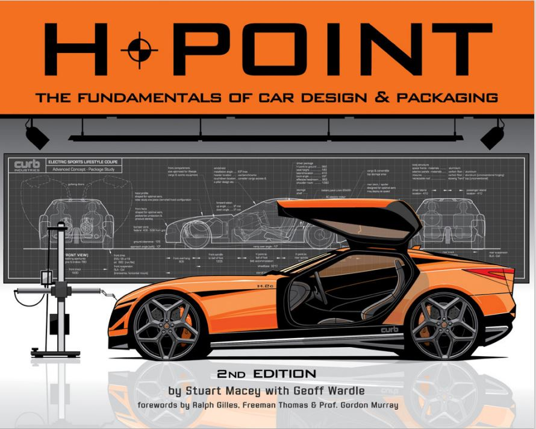

# 关于本站 ABOUT THIS SITE

## 介绍

本站是一个内部网站，用于分享汽车设计相关的基础流程及工程基础。

首期内容主要源自Art Center的经典教材——

**H-POINT THE FUNDAMENTAL OF CAR DESIGN & PACKAGING**

## 起因

工作中有非常多设计师甚至是造型工程师，对汽车设计相关的工程知识了解的有限，主要表现在：

1. 年轻设计师因经验不足，本身就不了解工程约束；
2. 部分有经验的设计师虽在项目中接触过一些工程约束，但对部分所谓“硬点”可能有一定程度的误解；
3. 多数造型工程师（studio engineer）多从某一个工程领域转入设计部门，也缺少对其他工程领域的了解；
4. 即使稍有经验的造型工程师的专业知识多为在项目中解决问题（openissue）获得，缺乏体系化的了解
5. 造型工程师对设计本身要点、流程、逻辑也缺少成体系的了解，可能会导致在某些阶段对设计风险的判断存在偏差（低估或高估某个工程问题所引起的改动对设计的影响）

目前，国内无论是设计院校还是工程院校，都缺少一本能够横跨造型设计与工程的基础课程或书籍。

H-POINT 作为世界顶级设计院校 Art Center College of Design 针对交通工具设计Transportation Design 的学生编制的教材，能很好地弥补上述问题。在业内也是广受好评。

遗憾的是该书并未正式引入国内院校，也无官方中文译本，英文原版实体书籍不便于内容分享。因此，希望通过本网站，将其内容电子化，方便分享。

## 说明

关于本网站的使用，有几点需要说明：

1. 本网站内容完全来自原版教材，将教材扫描后通过人工智能中的OCR技术（PaddleOCR）对每页的文字、图片进行的提取，稍作排版后形成，可能存在部分识别错误；
2. 网站主要采用vuepress进行搭建并生成静态网页，后通过github action部署在github page上。由于github网站在国内访问较不稳定，可能会出线网站打不开的情况，可以稍等5-10分钟后再访问；
3. **本网站并没得到H-POINT作者的正式授权，仅作内部交流使用。**

## 后续计划

* [X] 完成英文原版内容上线
* [ ] 通过大语言模型（LLM）对内容进行勘误（erniebot3.5/gpt3.5）
* [ ] 通过LLM对每章内容进行总结，并提供教学大纲（erniebot3.5/gpt3.5）
* [ ] 通过LLM对内容进行翻译（erniebot3.5/gpt3.5）
* [ ] 迁移至国内访问更快速的服务器（Azure、阿里云等）

另外两个更大的计划，可能涉及服务器资源（主要是钱）以及时间，后续根据情况开发

* [ ] 将文本内容转化为向量数据库，通过LLM实现对文档的问答
* [ ] 参考H-POINT目录框架及项目经验，自编中文版本
