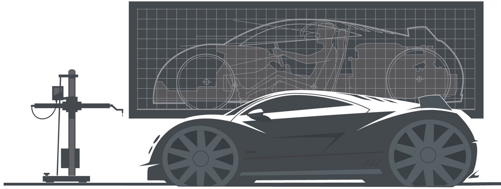
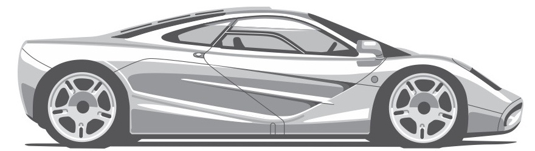

# Introduction

This book was primarily written for transportation design students, providing them with a broad overview of vehicle architecture and a generic vehicle packaging process . It is based on notes created for the Vehicle Architecture class taught at Art Center College of Design in Pasadena, California

Packaging, or setting up the vehicle architecture, has always been a fundamental element in the creation of a successful product, which is why the main objective here is to empower designers to be part of the package development process from day one helping them to design from the ground up.

History is full of vehicles with ground-breaking designs which were driven by an innovative package. Cars like the Chrysler Airflow, VW Beetle, Jeep Wrangler, BMC Mini and the McLarer. F1, for example, all pushed automotive design forward in their. own way and still influence car design today..

The biggest challenge for the authors was to edit the. information down to a level that most students can digest. Fortunately, advanced concepts only require the designers to study the basic elements that influence the overall proportions and these are the main focus of this book.

# ABOUT THE AUTHORS

Stuart Macey's career in the automotive industry has spanned three decades,. designing cars & trucks for over thirty brands in five countries. It began in 1979 with Pressed Steel Fisher, the body. division of British Leyland. He moved overseas in 1981 as the British car. industry slid into a rapid decline, working. in Germany on contract for Daimler-Benz and Audi, then moved to Detroit, working for Chevrolet.

Returning to Europe in 1983, Stuart workedtor International Automotive Design consulting with numerous clients such as. Porsche, Volvo, Honda,Renault, Kia, Opel, Mazda,Ford, Daf trucks & Freight Rover. The experience gained from working in studios. across Europe was priceless, helping him to understand that although every brand has its own perspective on design and the. process, the basic principles are the same everywhere.

In 1991 he returned to the USA, to work with the Chrysler Design Office in Auburn Hills and their Pacifica Advanced Design Center in California until it closed in 2008.

In 2002, Art Center College of Design invited Stuart to develop a new syllabus for their new vehicle architecture class.He currently teaches the class at Art Center part time, works as a studio engineer for a major auto manufacturer in Southern California and is president of Curb Industries LLC.

Geoff Wardle initially studied ehicle engineering at Hatfield Polytechnic and followed that up. with a degree in Transportation. Design at the Royal College of Art, London, graduating in 1977 le worked as a designer at British Leyland, Chrysler, Peugeot, Saab, Tatra, Ford of Australia, and TVS motors.

In 1993,Geoff was invited to become the Chair of Transportation Design at the Swiss campus of Art Center (Europe), before moving to their Pasadena campus in. California where he is now Executive Director of the Graduate Transportation Design program.

Geoff believes that in any successful design team, a variety of designers and studio engineers are needed who contribute different skills or viewpoints to a program. There is no doubt that his combination of engineering and design has set him in good stead during his design career, allowing him to push really hard for technical solutions that enabled some of his design proposals to be successfully executed. He and Stuart taught the Vehicle Architecture class togethe for several years and the notes they developed have been compiled for this book.

He and Stuart taught the Vehicle Architecture class togethe for several years and the notes they developed have been compiled for this book.

# Acknowledgements

It is impossible to acknowledge everyone who has provided encouragement and helped develop the knowledge to complete this book. Here are some of them: the Transportation design department at Art Center College of Design in Pasadena, past and present, specifically Ken Okuyama, Stewart Reed and John Krsteski. Special thanks to Geoff. Wardle for his support on this project and to the trans students who have been a huge inspiration..

The Design Office team at Chrysler in Detroit and Southern California, past and present.With special thanks to: Phil Gavie, Doug Stafford, The Viper Team, Ernie Barry, Bob Hubbach, Mike Castiglione,Akino Tsuchiya, Mark Moushegiar Alan Barrington, Ron Kicinski, Skip Farley, Ivo Milosavlevski, Jordan Meadows, Bryan Nesbitt, FreemanThomas and Ralph Gilles

design and engineering teams at Porsche in Weissach, Daf Trucks in Eindhoven, Volvo in Gothenberg and IAD in and. Also to the guys at Vosper Thorneycroft in Portsmouth, especially Alan Cornish.

cial thanks also to the Society of Automotive Engineers (SAE) and their associates for developing the tools and nods that we use every day to package cars and trucks

A huge thanks to my family: Gillian, Alan, Victoria, Haley and Shirley for your patience and support.

Finally, the great vehicle architects, inventors and industrialists who have created the design icons that we know and love, namely: Gottlieb Daimler, Carl Benz, Ferdinand and Ferry Porsche, Erwin Komenda, Henry Ford, Ettore and Jean Bugatti, Paul Jaray, Gerald Palmer, Sir Alec Issigonis, Dante Giacosa, Rudolf Hruska, Colin Chapman, Sir William Lyons, Enzo Ferrari, Jim Hall and Gordon Murray to name just a few.

This book is dedicated to Alf & Steve Macey

# Forewords

Ihe first time T metStuart his legs were sticking out from under a prototype Minivan.He was literally underneath th van looking for a way to make the seats fold into the floor Such is his curiosity and deep dedication to problem solving. Stu is the kind of packaging engineer that has an exceptional respect for design. Being an accomplished designer himself he has always recognized that the art of packaging is the great facilitator and ultimately, in the hands of the skilled designer, it is the great differentiator.

As a designer T am a firm believer that proportions are 'everything." They are also deeply rooted in nature and our psyche. Much like how a child responds to a cute stuffed animal we respond to well sorted designs. Appealing designs are the direct bi-product of great proportions. Great proportions are the results of judicious packaging work. However, there is no such thing as the perfect car as every car is a compromise in some way. Great package work aims to minimize that compromise and allows the visionary designer and engineers as much freedom of design as possible..

Each vehicle design has its mission, whether to maximize interio. volume for occupants or to achieve exceptional on-track performance or perhaps even to cheat the wind to achieve the best fuel economy possible. Artful packaging is the calculated rationing of these distinctive compromises. Great designers can manipulate this balance of compromises in their favor to create designs that provoke and titillate the senses, often creating an iconic product that punctuates the epoch in the process.What enables these iconic designs is indeed the true mastery of packaging. As most vehicles are commercial products that must be relevant to the masses, great packaging can give a vehicle a much deeper well of greatness.A vehicle with thoughtful and practical solutions will always have greater staying power. It is up to the astute leadership of the firm and the design visionary to tune this balance of art, business and the forces of the practical consumer. Design can be a victim of flawed packaging as easily as it can be glorified by it. Needless to say, the art of automotive design has momentarily matured. Most packages are being regurgitated over multiple decades and the realities of physics and the wind tunnels are pushing design into a collective corner.

The savior comes within our times.We are on the brink of a brave new world of design where once again the components beneath the skin are changing in dramatic ways. With the fundamental change in system components comes the promi of new proportions enabled by creative packaging to be penned. We are an ever evolving species, yet our core needs and instincts remain somewhat constant in the end.As far as the business end of design is concerned, humans will always respond to provocative yet sensibly executed designs.This balance of the sensible and the provocative is what the art of packaging enables

This book is a lifelong dream of Stu's and the direct by-product of his passion for the automobile and the fascinating process of its creation. He manages to demystify the design process in a. way that will allow aspiring designers to benefit immediately. from what amounts to a career's worth of knowledge.Not only is the book artfully done, it is truly substantive and gives the student designer unprecedented access to the inner sanctum o vehicle design.

This book is full of extremely helpful insights that help the aspiring designer grasp the fundamentals of good design. This exceptional amount of information comes together to become an essential tool in the toolbox of an aspiring designer. In other words, it is the decisive bible of automobile packaging.

New propulsion systems components will allow us newfound design freedom that will certainly have a profound effect on the style of automobiles yet to be penned. We are an ever evolving species, yet our core needs and instincts remain somewhat constant in the end. As far as the business end of design is concerned humans will always respond to provocative yet sensibly executed designs.This balance of the sensible and the provocative is what the art of packaging enables

**Ralph Gilles**
Ralph Gilles Vice President of Design and CEO SRT, Chrysler Motors.

---

Vehicle design is not pragmatic, it is an art, a rebellious act that must also work and function.Stuart and Geoff have created "the guide"to help every designer and engineer find "the magic' that makes each vehicle design and architecture unique, and come alive in the studio. Certain vehicles have a stance, a look and proportions that tell an aspiring story that creates desirability and an identity. It's the "mojo that no one seems to be able to explain! Read every word and every page of H-POINT, The Fundamentals of Car Design & Packaging and I guarantee it will give you the secrets to finding the magic!

**Freeman Thomas**
VP Advanced Design Ford Motor Co.and designer of the Audi TT.

---

"I really can't remember exactlyhow many yearsThavebeen preaching that automobile design IS packaging! This book is Iong overdue and will be a fantastic reference and inspiration. to designers and students throughout our industry. Vehicle styling can be good on its own but it is only worthwhile when it has been integrated into the design process along with packaging, engineering, homologation and aerodynamics Macey & Wardle have given us something which will undoubtedly help produce better vehicle design in our automotive future.

**Prof Gordon Murray**
Vehicle Architect & Designer, Gordon Murray Design LTD and architect of the Mclaren F1

H-POINT, The Fundamentals of Car Design & Packaging

Copyright 2013 by Curb Industries LLC

All illustrations in this book copyright O2013 by Curb Industries LLC unless otherwise noted.

All rights reserved. No part otthis publication may be reproduced stored in a retrieval system or transmitted in any form or by any means electronic, mechanical, photocopying, recording or otherwise, without. the prior written permission of the publisher, Curb Industries LLC..

Art Center College of Design 1700 Lida Street Pasadena, CA 91103

www.designstudiopress.com
