# Chapter 2 Getting Started

## Section 2.1 Segments & Systems

At some point early in the design process, it should be decidec which market segment the concept will be designed for. Quite. frequently, a multi-functional concept is designed and will. crossover to more than one segment.The market segment or vehicle type is often determined before the project is started

helping to focus the design team in a specific direction. Fo 'blue sky" project, the customer requirements may be the only consideration during the ideation phase and a market segment associated later. The latter approach can help to break paradigms associated with certain vehicle types.

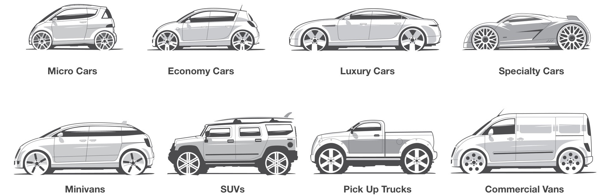

### THE SYSTEMS

Every package is comprised of the same group of systems (illustrated below).Each of these systems will vary greatly according to the functional objectives of the vehicle. Also, note that each of the. components that make up the different systems is packaged within a spatial envelope, which allows for motion, manufacturing tolerances, clearances, heat insulation, maintenance and assembly.

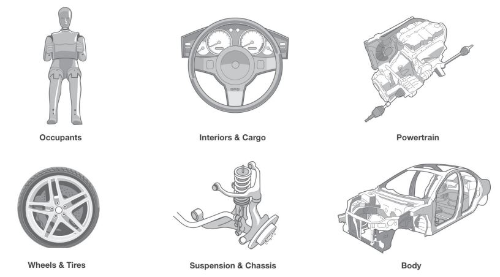

### ANATOMY OF THE PASSENGER CAR PACKAGE
The elements in the package will vary from concept to concept, but the items shown in these illustrations feature in most vehicles.Each of these elements will need to be studied by the studio engineering team during the development of the project to provide a high level of confidence in the vehicle's design..

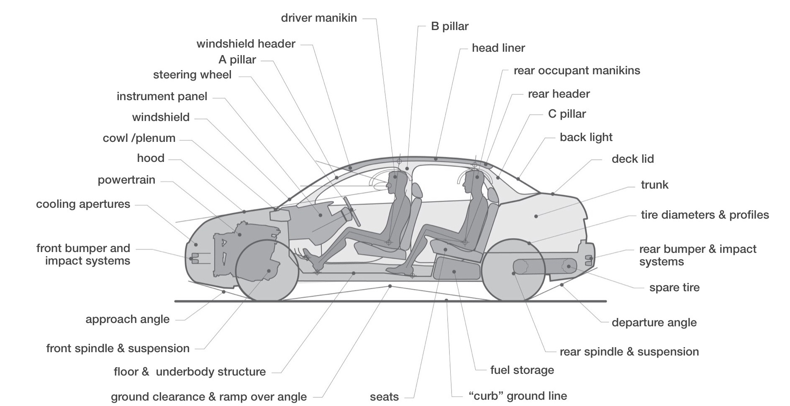

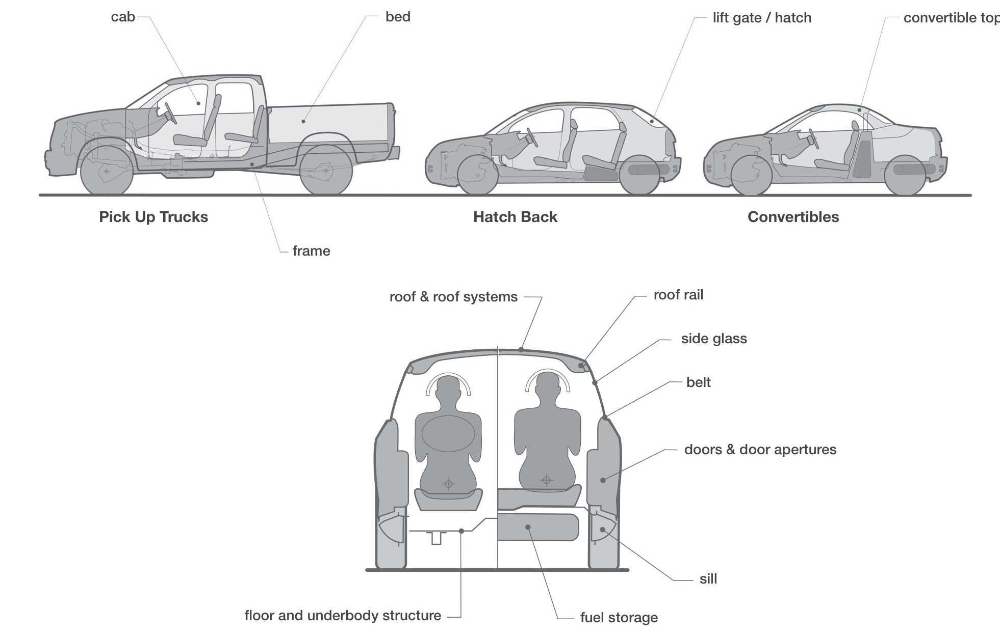

## Section 2.2 The Process

The design process begins and ends with the customer. Their needs, wants and aspirations all need to be considered from the first thoughts to the final model. Having said that, it's the. designer's responsibility to understand the next trends in technology, style and other market forces that may affect the. customer's opinions in the future. It is also important to "read between the lines"when the customer speaks, they don't always want what they say they want.There have been many examples of car manufacturers relying too much on custome input, only for their recommendations to be abandoned when something much better is produced

The first step in the product development cycle is the produci plan, which is usually prepared by the marketing group. The final step happens in the brand's showroom when the first car is sold by the same team . This is the only time the designers know whether they have made all the right decisions.

### THE ADVANCED CONCEPT DESIGN PROCESS
This stage usually takes between 6 months and a year. This. mindset is different than the production phase, much looser and more progressive

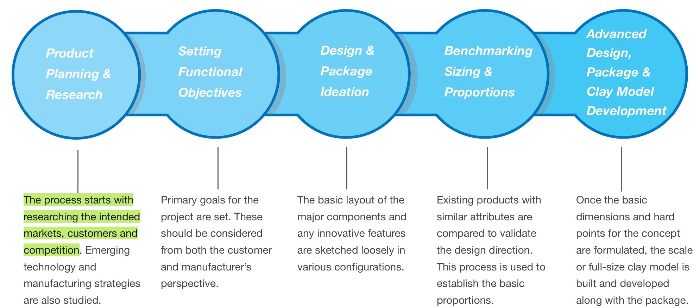

### THE PRODUCTION DESIGN PROCESS 
This can be a two to four-year timeline with usually one yea in the studio. The final product must be 100% feasible, meeting all requirements for manufacturing and marketing.

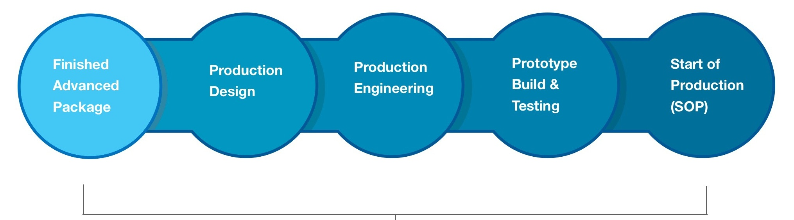

*The advanced concept is handed to a production-design team. This group will develop the exterior and interior surfaces over a package. that is 100% feasible for production and meets all of the cost targets. as well as the needs of the intended markets. After testing, a few. minor design changes may be required.*

### STEP-BY-STEP PROCESS
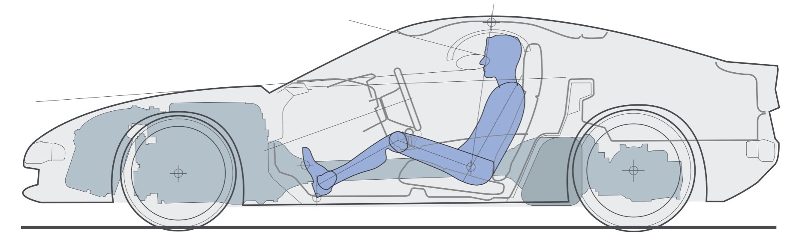
The initial package should be kept as simple as possible.Only a few elements are needed to set up the basic exterior hard points.Just like a design ideation sketch, do not try to include every detail or solve every problem. The main objective is to get started.Fortunately, the bulk of a vehicle's proportions are established by only a few elements, namely: the occupants,. powertrain, tires, cargo storage, ground clearance and crash protection systems. These can be put together in a logical order, but expect to iterate the design continually. Try to think about which components will drive the package and which will be. subordinate and why. As each system is added, it is going to affect the elements already located in the package, so do not be. afraid to start piecing the package together and making adjustments as the concept develops. Always be sure to reference the functional objectives that are driving the architecture. Usually, if you stick to sound logic, the package is quite simple to build and you will be able to defend the layout if it is ever challenged. The examples, on the following nine pages, show how differen types of vehicles can be approached with the same fundamental process even though they require totally different package solutions. Before creating the package geometry, loosely sketch out the package and arrange the major components based on. the functional objectives

**STEP 1 Package & Design Ideation**

Loosely sketch out several package concepts based on the functional objectives. Include layouts of the occupants, cargo, powertrain, wheels and fuel. Also, think. about the body structure and closures (doors) and any other special features that may influence the package
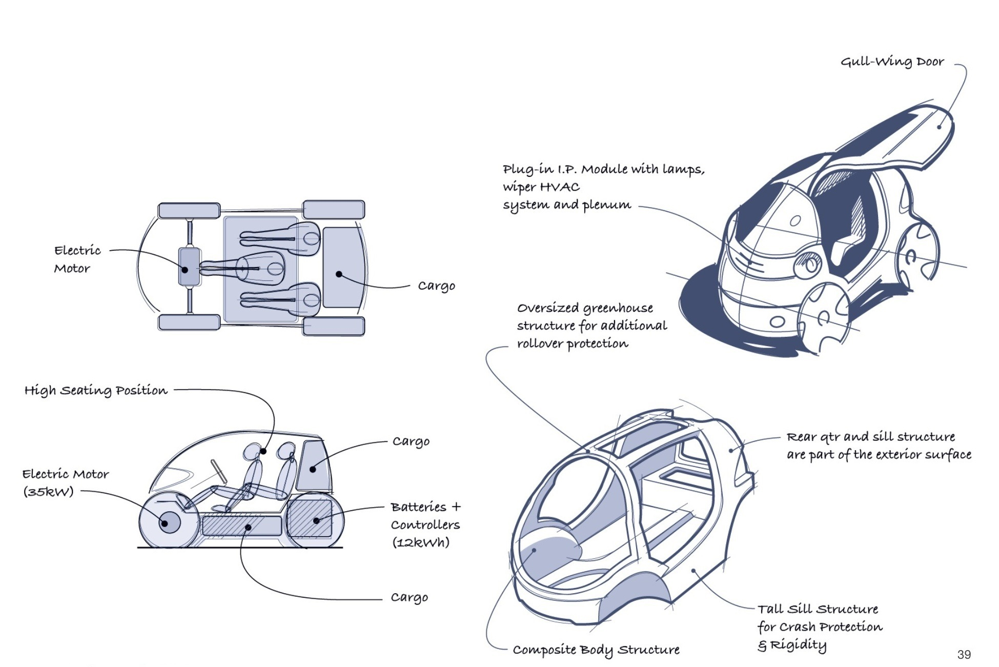

**STEP 2 Set up the driver's height and posture**

Start by positioning the driver using the SAE 95th. percentile manikin.Establish the heel height from the. ground and then the seating posture. Consider the ground clearance and underbody structure when positioning the heel points. Before setting up the seating posture, think. about the following: downward visibility, center of gravity,. command-of-the-road seating, (eye point from ground) ngress/egress and aerodynamics. Probably the best way to get the driver location close is to look at existing vehicles with the same attributes and benchmark them.

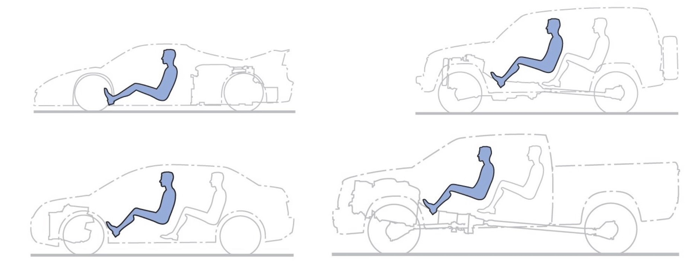

**STEP 3 Set up the rear**

Add the rear occupants if there are any. Again, use  95th percentile manikin with consideration for leg room and "theater" seating, if appropriate, to give. the rear occupants better forward visibility. Note tha. some specialty cars, such as coupes or very small sedans will not fully accommodate a 95th percentile manikin in the rear.With both manikins placed,. establish a spacial envelope around them and develop visibility goals. Look at the effective headroom and shoulder room first.then look at the up and down angles through the windshield apertures. Any other important relationships to the occupants should be noted at this stage

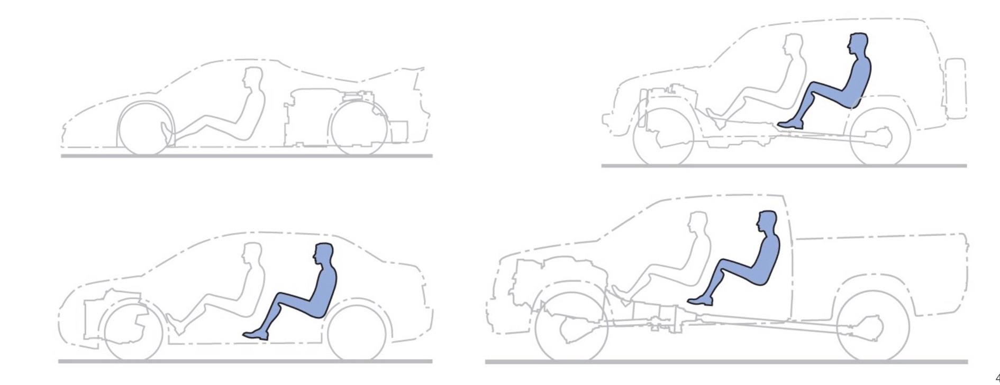

**STEP 4 Select and install the powertrain**

Select and position the powertrain (engine, transmission and final drive). The choice of system may have a dramatic effect on the proportions. Choose it based on the amount and type of power required and also think about which wheels will be used to feed the power to the ground.. See Chapter 8 for more information on powertrain packaging.

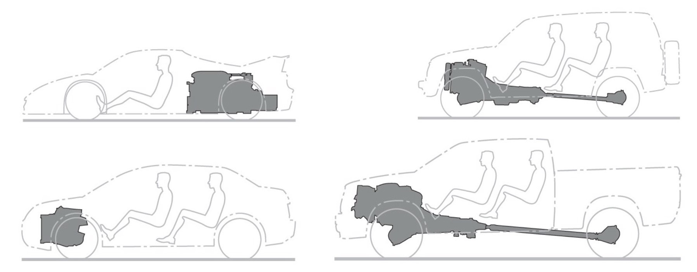

**STEP 5 Set up the occupants' lateral location**

After the powertrain is positioned, set up the lateral position of the occupants. Consider the overall width limitation and the interior. environment expectations for the type of vehicle you are designing. The location of the manikins may also be affected by the. powertrain, aerodynamics, passenger pass-through and three. across seating.

Acommon mistake is not setting up the package in the end view at an early stage and then creating a vehicle that is too wide

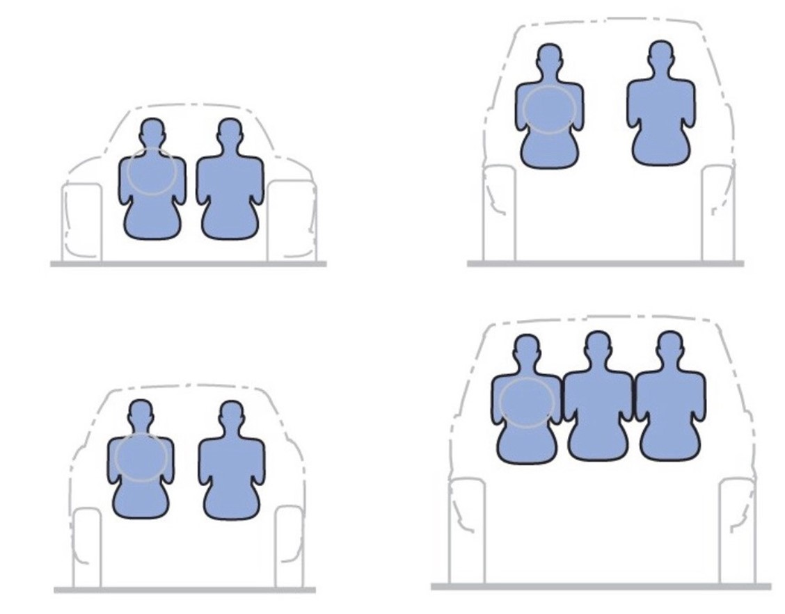

**STEP 6 Create space for the cargo**

The cargo space may be designed around specific objects or a volume target. Look to create a flexible interior environment with folding seats and bulkheads Weight will also be a consideration and this may affect the location and other elements in the architecture such as the body structure and suspension. Refer to Chapter 7 for more information on cargo packaqinq.

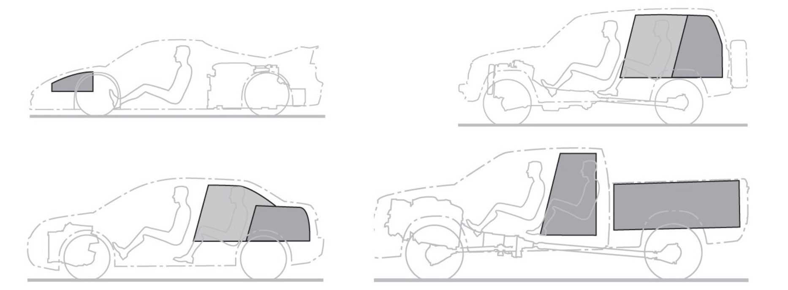

**STEP 7 Size & position the (primary) driven wheels**

Determine the size of the wheel and tire package and locate the spindles of the driven wheels relative to the occupants and powertrain. Study the packages on this page and note the relationship of these elements. They will differ greatly depending on the powertrain layout. See Chapter 9 for information on wheel & tire choice and set up.Note that it is important to focus on the outside diameter of the tire and not the wheel size at this stage.

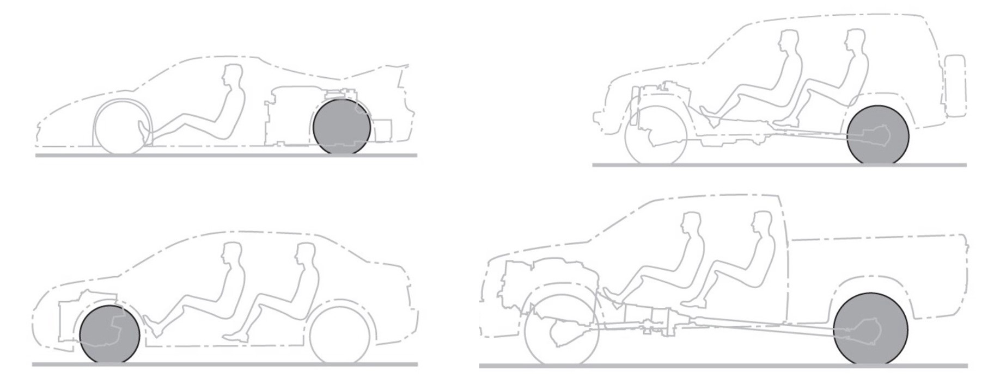

**STEP 8 Establish the wheelbase**

The location of the other wheel/axle will depend on weight distribution or package efficiency.For smaller economy cars, the wheels will be as close to the. occupants as possible.For high-performance or luxury cars, the wheelbase will be set up to improve handling or comfort. Trucks and commercial vehicles need to place the wheels under the cargo area, to limit the effects on the steering when the vehicle is. loaded.

This is a good time to take another look at the ground clearance requirements. Once the tires are in position, the approach, departure and ramp over angles can be studied.

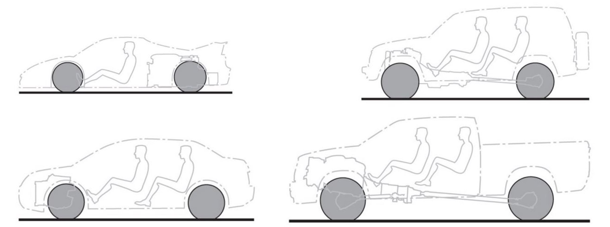

**STEP 9 Set up the front & rear tracks**

Although designers usually prefer the wheels to be as far outboard as possible, the track will be limited by the vehicle width target. The occupant package, cargo requirements or handling targets may also oush the wheels outboard

See Chapters 5, 7 & 10 to understand some of the factors that qovern the track dimensions

**STEP 10 Create the body and interior trim sections**

Develop the body and interior sections throughout the package. The oody structure, door configurations and interior design will influence the exterior surface

See Chapters 6 & 10 for more information on body architecture and interiors.

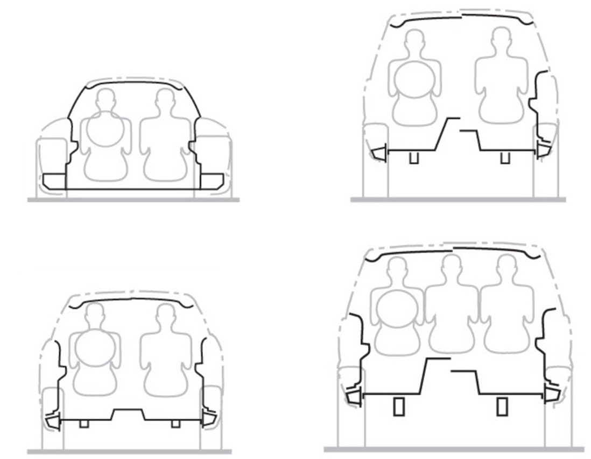

## Section 2.3 Sections

A large portion of the advanced package and the body is. developed in five"Sectional Views" (multiple sections in one view which are cut through the major elements of the package i.e., the hip points (H-points), spindles, powertrain, fuel tank and the. cargo compartment.As the package progresses, more sections will be created around the vehicle, but to get the initial concept started, it is important to keep the studies simple.

The main objective here is to establish some ot the main hard points, so that the exterior design can be modeled over the key elements of the package, developing the body structure as each section is constructed. Every type of vehicle has special requirements and the location of the sections may vary. The engir may be in the rear or under the floor for some cars. For example, pickup trucks will need to be designed around the bed and the cab.

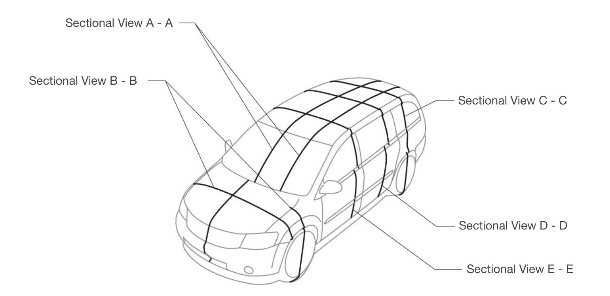

**DESIGNING WITH SECTIONS**

The five main sectional views are cut. through the major elements of the package. Because most vehicles have. a lot of curvature in their surfaces, multiple sections are put in each view to form a simplified picture of each. zone of the package. For example, in the side-view section A-A, the vehicle outline is shown at the Y0 (Y-zero)* centerline. The occupants are also shown in this view with a section through the headliner at the occupant. centerline.The headroom is cross- referenced and accurately illustrated in the rear-view sections. 
>The Y-grid plane runs along the centerline of the car. Anything on- center is therefore located at Y0

**Sectional View A-A**
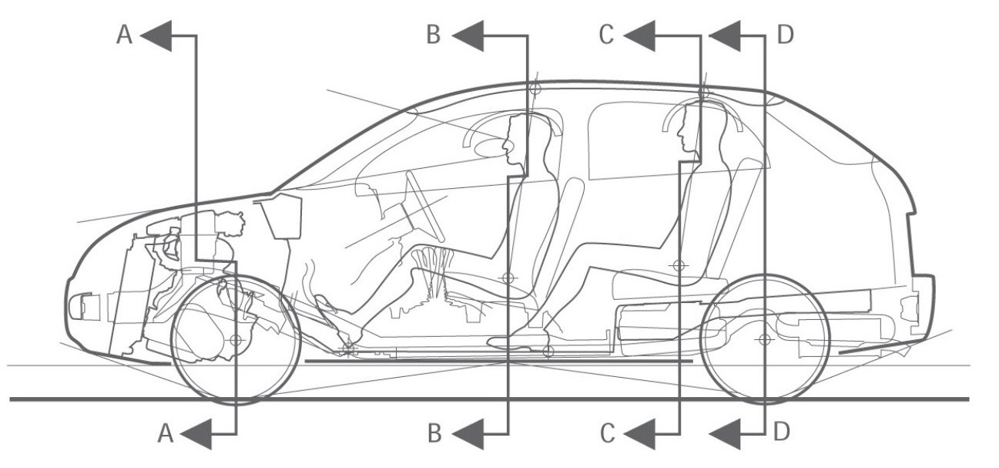
*This sectional side view is cut through the centerline of the body and the occupants. The other elements are shown to create a "picture" of the. initial package layout.*

**Sectional View B-B**
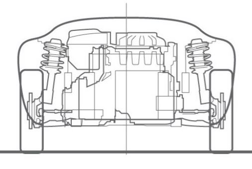
*Cut through the front spindles and engine. This section is used to help prove out the front suspension and engine package under the hood and fenders.*

**Sectional View C-C**
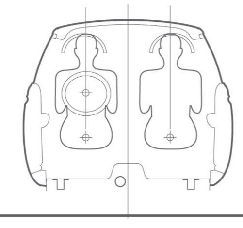
*Cut through the front occupants' H-points and to help prove out the front head contours. This key suspension and engine package section is created to set up under the hood and fenders. the door panels, side glass and roof-rail sections. Other elements like the roof over the head environment, sills, floor and underbody structure are also included here.*

**Sectional View D-D**
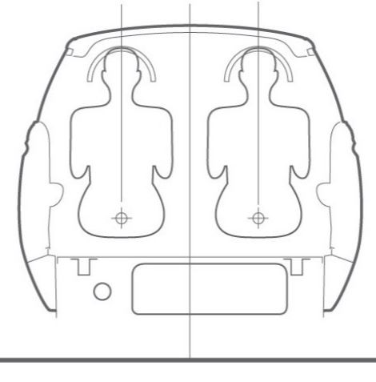
*Cut through the rear occupants. This is similar to the section through the front occupants but here the fuel tank is often included under the rear seat.*

**Sectional View E-E**
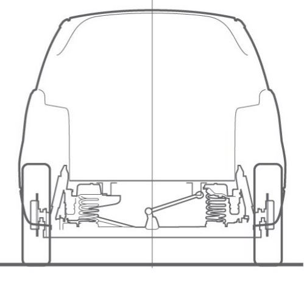
*Cut through the rear spindles. This is similar to the section This shows the cargo bay and through the front occupants but the rear suspension system. here the fuel tank is often Other items such as the exhaust included under the rear seat. system and spare tire may also be featured.*

## Section 2.4 Grids & Ground Lines

The package is built in a 1o0mm three-dimensional grid, which becomes the master vehicle grid system throughout the project's life. This XYZ grid is created by the intersections of a series of horizontal, longitudinal and lateral planes. The grid reference system. is used as a reference between the CAD (computer-aided design) models (or drawings) and the clay models. The location of the vehicle components and section cutting planes are also referenced to the grid

>The GRID ORIGIN POINT should be located out in front of the bumper and below the ground. Once created, it will always remain in the same place relative to the package. If the ground line is modified and pushed away from the body or the front fascia is moved forward, they will not move to a "minus" grid coordinate.

**GROUND PLANES (LINES)**

During the design process, the body, powertrain, occupants etc. maintain their location in the grid system. The ground line, however is repositioned according to the location of the tire contact patch (This is opposite to the real world where the vehicle moves up and down on a fixed road). Three different factors will cause a variation in the relationship of the vehicle to the ground line: Loading, (attitude) tire size variation and ride height settings (illustrated)

Each require their own set of ground lines. There are several reasons to create a around line for each condition.

1. Maintaining the required ground clearance.
2. Measuring the vehicle's overall height and step-in height is also a very important factor to consider.
3. Most vehicles are designed and modeled at "CURB" attitude.

**Vehicle Attitudes**
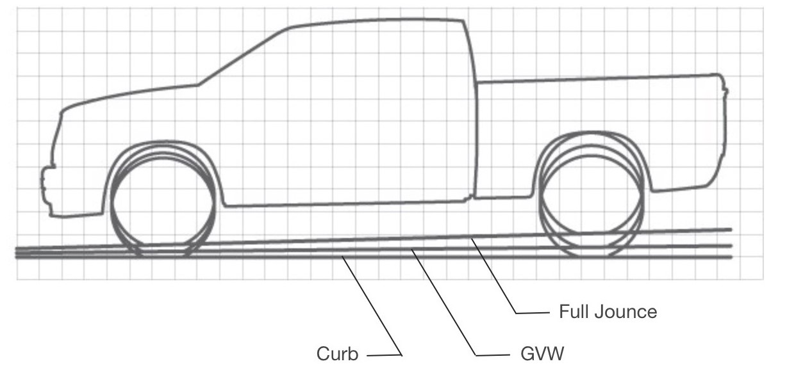

As the vehicle is loaded, the ground line will move closer to the body. The three ground lines or attitudes shown here are:

**1. Curb.** No passengers, full fluids. 
**2. Full Rated.** Fully loaded to the gross vehicle weight (GVW). 
**3. Full Jounce.** Fully compressed suspension. 

These are the three main attitudes used in the design process to check that the vehicle is meeting all the height and clearance requirements.

**Tire Size**
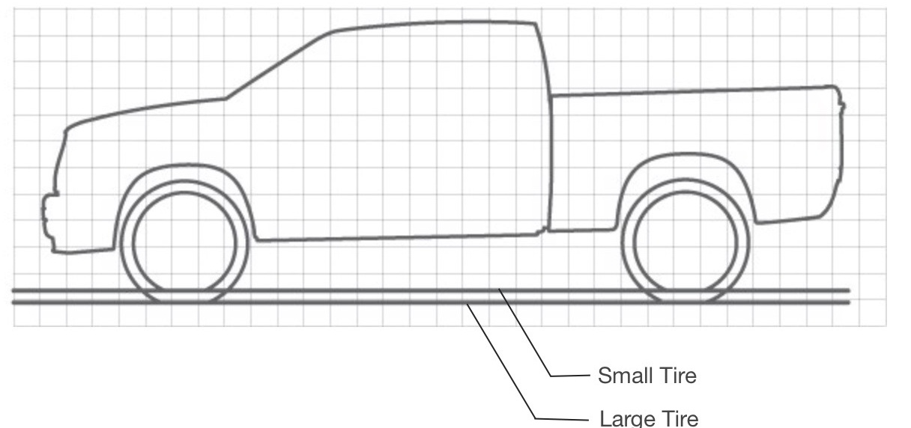
*Most vehicles are offered with several wheel and tire packages.This often results in severa different tire diameters.If the suspension system is not adjusted to each tire, the vehicle's relationship to the ground will vary.*

**Ride Height**
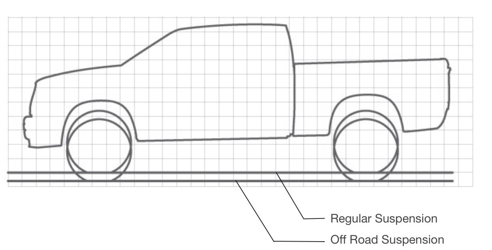
*Vehicles with on-road and off-road packages will usually have two or more suspension settings to improve the vehicle's performance in its intended environment*

## Section 2.5 Hardpoints
A primary function ot an automotive studio engineer is to teed the design team with hardpoints, which are generated from the package.The views below illustrate the main hardpoints that are required to start a clay or CAD model.

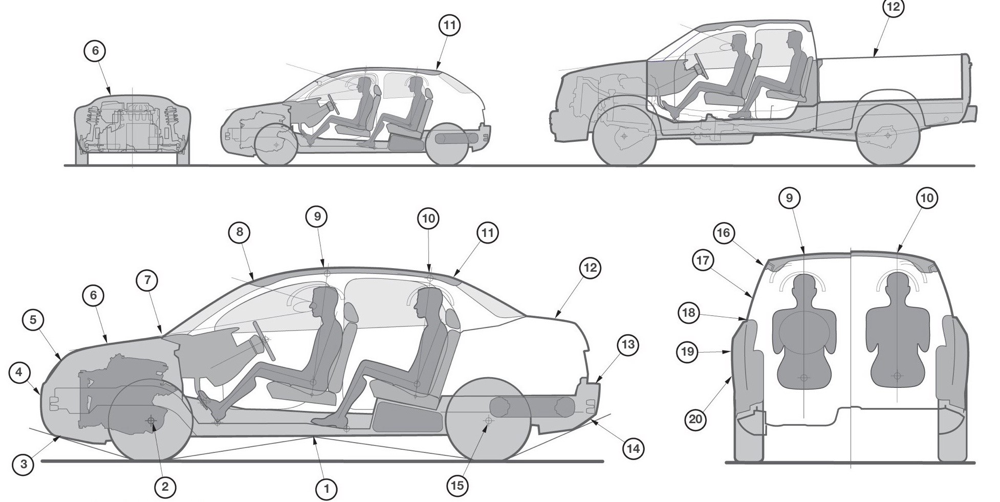

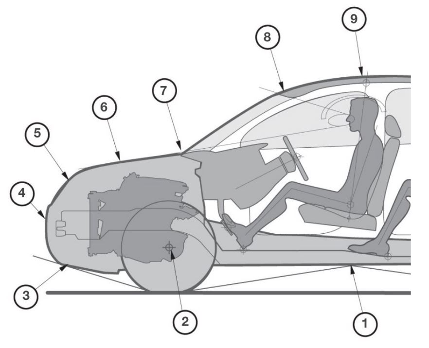

**1. SILL & FLOOR HEIGHT**
Determined by the ground clearance, the ramp-over requirements of the vehicle and the underbody structure depth.The lowest point of the vehicle is often a chassis or powertrain component..

**2. FRONT WHEEL AND TIRE**
The front spindle height is. determined by the static load radius of the tire. Longitudinall. the jounce-and-turn tire envelope will establish the distance. of the front spindle from the driver's foot. It may also be moved further forward to influence the weight distribution of the vehicle.Also, the output shaft location from the. transmission will be a consideration for front-wheel drive (FwD) vehicles. The track is determined by a combination of the distance between the front structure frame rails and the tire turn envelope. Tire size will be limited by body size, suspension components and the vehicle's turning circle

**3. CHINHEIGHT**
The chin should clear a 162mm high parking block.A 10 approach-angle line (when the vehicle is fully loaded) is recommended for passenger cars.Above 28o is required for off road vehicles

**4. FRONT BUMPER LOCATION** 
For passenger cars, the bumper system height must cover the "bumper band" which is generally. mandated to be from 406mm to 508mm above the ground.The longitudinal location must provide enough crush space in front of the occupant's feet to meet high speed (40mph) frontal impact requirements. Any object which will not compress on impact-i.e., the engine. transmission, steering rack, etc.-is added to this dimension. The offset of the bumper impact surface to the body and lamps will depeng. on the collision requirements and the manufacturing cost limitations of the system. To meet low-speed impact requirements, bumpers. with average cost and weight will require about 50-70mm of offset, but it is worth benchmarking vehicles with smaller offsets. The front fascia profile should be shaped to meet pedestrian protection safety requirements.

**5. LEADING EDGE**
Usually the cooling module affects the heigh and horizontal location of this point.Additional space is required for the hood latching structure and pedestrian protection.

**6.HOOD PROFILE**
Influenced by the position of the engine. induction system (manifolds, throttle body, etc).Recent European pedestrian head impact legislation has increased the required hood clearance to hard components. Toward the outboard edges suspension towers often affect the hood height.

**7. COWL / WINDSHIELD TOUCH DOWN**
The cowl height is limited by hardpoints generated from the engine clearance. envelope and driver visibility. A downward vision angle of less thar 5 may be a problem for shorter drivers.Longitudinal locations are controlled by engine maintenance access issues (forward) and proximity to controls (rearward). If the windshield is too far from the driver's eye point the A pillar may affect forward vision. An aggressive windshield installation angle may result in distorted. vision (65 from the vertical is about the maximum, guaranteed to avoid distortion with current glass technology)

**8.WINDSHIELD OPENING & HEADER**
Determined by the head to headliner relationship, header structure thickness. The upward vision angle will help to set up the header location. An upward vision angle less than 11° is considerd a compromise.

**9.FRONT ROOF**
Should provide appropriate room over the manikin's head form for head clearance, trim and a sunroof if required.The roof should be as low as possible to reduce weight, lower the center of gravity and minimize frontal area to reduce aerodynamic drag.

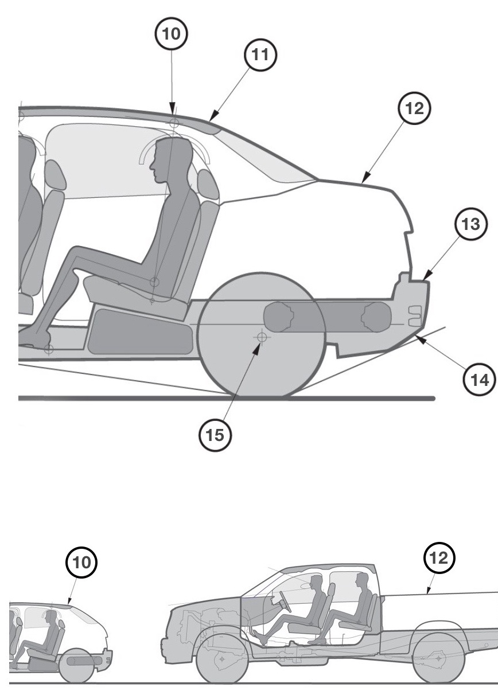

**10. REAR ROOF**
A similar condition to the front headroom is desirabl Many vehicles however will compromise rear headroom to allow for a ower or faster roof line.This is common in sports coupes and in the third row of an SUV where occasional seating is provided.

**11. REAR HEADER**
Similar to the front header. Hatchbacks will require additional structure in order to accommodate the mounting of the rear lift gate hinges.

**12. REAR CARGO**
Most vehicles will have some cargo storage; for. some it is a high priority.The height of the cargo area is governed by the size of the objects that are intended to be carried and the target storage. volumes. Rearward visibility will also limit the deck and bed heights.

**13. REAR BUMPER LOCATION**
Similar height requirements to the frq bumper but with additional consideration for load height variation whi is greater at the rear. Rear impact requirements influence the rearward Iocation of the bumper beam. The height of the fascia panel (bumper skin molding) will affect the lift over height for loading cargo.

**14. BODY REAR LOWER** (Departure angle). 
Can be less than the approach angle (20 for off-road vehicles). Often the lowest parts of the car behind the rear wheels are the exhaust system and spare tire.. 15. REAR SPINDLE The track and height are set up in a similar way to the front. The longitudinal location is normally as close to the rear occupant as the tire envelope will allow. In the case of a cargo truck or minivan, weight distribution will be a factor.

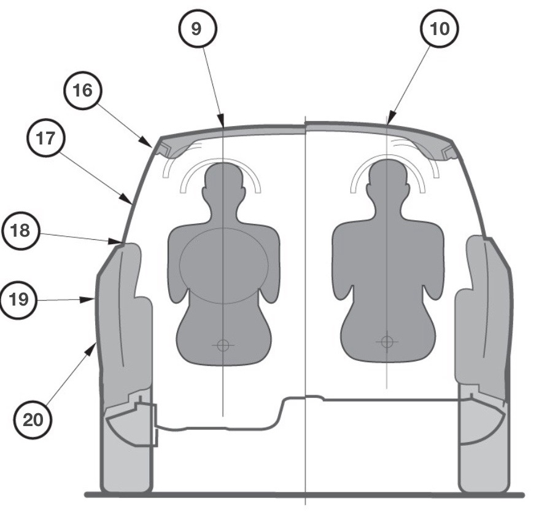

**16. ROOF RAIL SECTION**
The outer skin of the roof rail is established by a stack up of several internally positioned components, while providing adequate clearance to the. occupant head form. The section through the rail will comprise the body-in white (Biw) structure, the door frame, head impact protection, and trim. Additionally, side curtain airbags may be packaged. The type of door construction used will affect the siz. and shape of the roof rail section..

**17. SIDE GLASS**
Usually a radius, but occasionally flat. The. upper location is set up by the roof rail design and location.. The offset to the roof rail section depends on how it is constrained by the door system. The lower point at the belt line. is positioned to provide adequate shoulder room and ensure tha the glass will drop inside the door's outer profile

**18. BELT-LINE LOCATlON**
The height and width can be driven by the exterior design, but the relationship to the occupant. should be a consideration. The height relative to the occupants. can be checked against benchmark vehicles to ensure that it is not too extreme.Adequate shoulder room should be provided tc the door inner panel.

**19. BODY SIDE PROFILE**
Must be designed to allow the glass surface to drop inside the door section, miss of the hardware and obstructions within the door assembly. Side impact requirements will also play a part in s up the door outer surface.

**20. WHEEL COVERAGE**
Most vehicles will be designed to meet European wheel coverage requirements.This dard requires that the body work covers the outboard edge of the tires in a zone between a line 30° from vertical ard of the spindle and 50° rearward.

## Section 2.6 Basic Package Drawing

The initial package is usually developed accurately in a 3D CAD system, but as it progresses it needs to be clearly communicated to everyone involved in the project. This can be done effectively in a 2D graphic format.The drawings on the next three pages are examples of some typical package logic boards.They contains details about the package and the functional objectives that are driving the design.Their goal is to describe the logic behind the concept's architecture so that the design team can make good decisions to steer the project.

 of each board will depend on the story that you are telling and the audience, so some drawings will be very sim te complex. The main views are graphic representations of the architecture with all of the major systems illustrate detail. The vehicle dimensions are also included and benchmark comparisons to other vehicles are drawn to hel context. The benchmarks also prove out the feasibility of controversial proportions

The contents of each board will depend on the story that you are telling and the audience,so some drawings will be very simplew other are quite complex. The main views are graphic representations of the architecture with all of the major systems illustrated ang described in detail. The vehicle dimensions are also included and benchmark comparisons to other vehicles are drawn to help put concept into context. The benchmarks also prove out the feasibility of controversial proportions A more detailed example of package logic boards are shown on the following pages. Benchmarking is covered in chapter 6 - Size and Proportion.

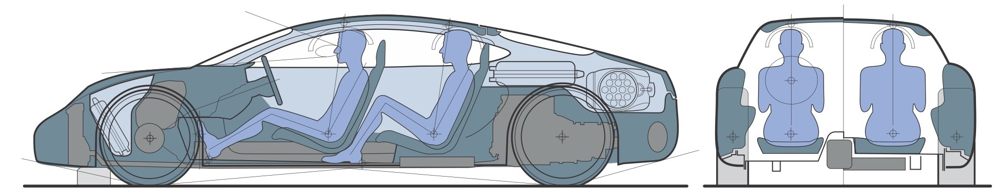

----

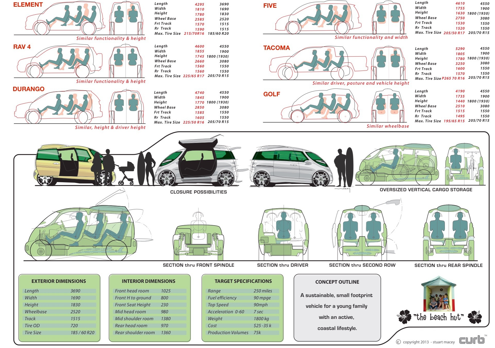
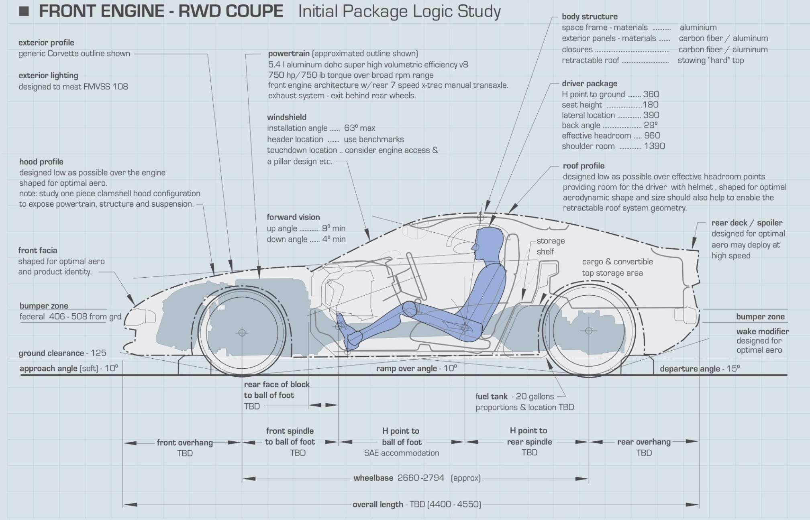
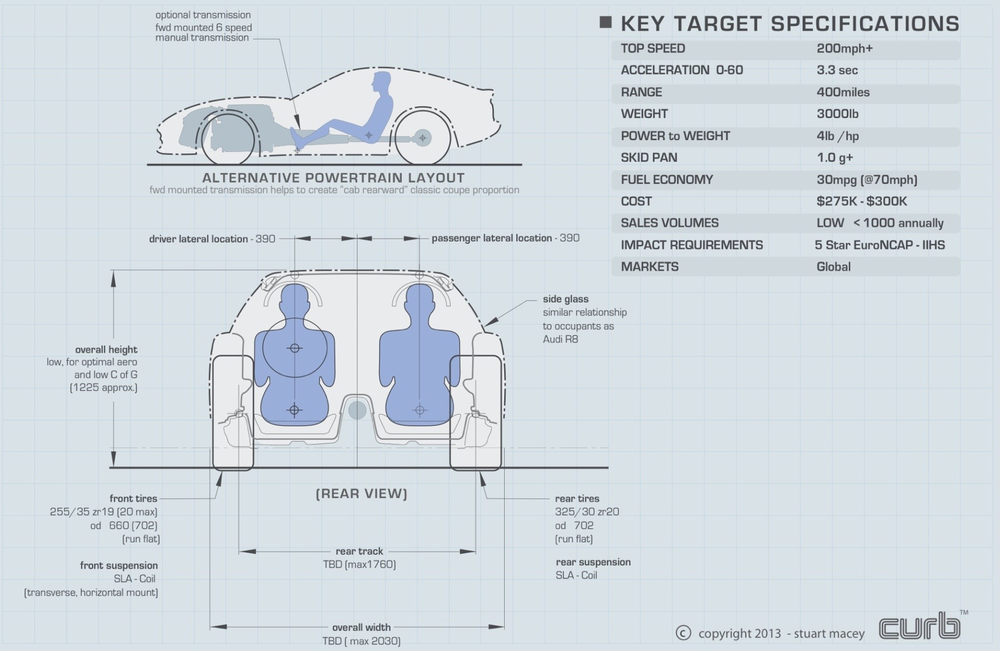
