# Chapter 4 Package Ideation

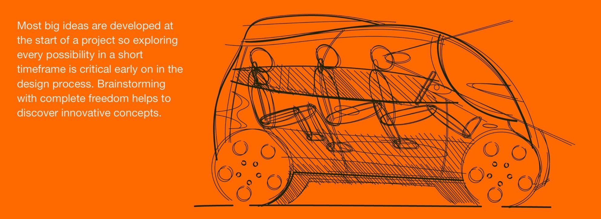

## Section 4.1 Introduction

One of the primary functions of a designer is to create fresh ideas. The package ideation process provides an opportunity to study as many system configurations as possible in a short period of time, allowing the designer to explore all of the possible proportion and basic form options. This process is similar to design ideation where each concept is sketched out loosely on paper and evaluated as a cluster of ideas, but the main focus is on the systems layout, not the exterior design.

Some production projects may not require much package. innovation, while others may be open to any number of fresh ideas. The family vehicle concepts (shown below) are open to a wide scope of interesting seating configurations, cargo storage and powertrain layouts. This in turn, can create opportunities to experiment with new and unorthodox exterior proportions. Othe concepts, such as the sports car shown on the following pages may have limited opportunities with package ideation, but the design may still be inspired by the architecture an vice versa.

There are several ways to configure the key systems for a sports car and although many different options ahve already been utilized throughtout history, it is always worth breaking down and understanding the architecture before setting up; the seating layout, powertrain, body construction and chassis components. Unlike the family vehicles package ideation sketches shown on teh previous page, the designer may want to focus one the exterior design to inspire the package layout. It should be noted that getting the architecture set up correctly is more critical for high performance car, so it's always a good idea to work with a vehicle dynamics expert if you are exploring new and unorthodox package configurations.

It is also significant that many performance cars owners love. the appearance of their vehicle, so there is a lot of value in early design input. In the loose sketch shown below, several architectural cues are indicated. For example, the open. cockpit with the passengers located in front of the engine, exposed suspension and unique body construction are key elements of the architecture, but drawn from an exterior desigr perspective.The main point to understand here is that there is more than one way to kick off package ideation.Just make sure you don't focus too much on one or two concepts, at this stage it's all about generating as many ideas as possible and getting them down on paper.

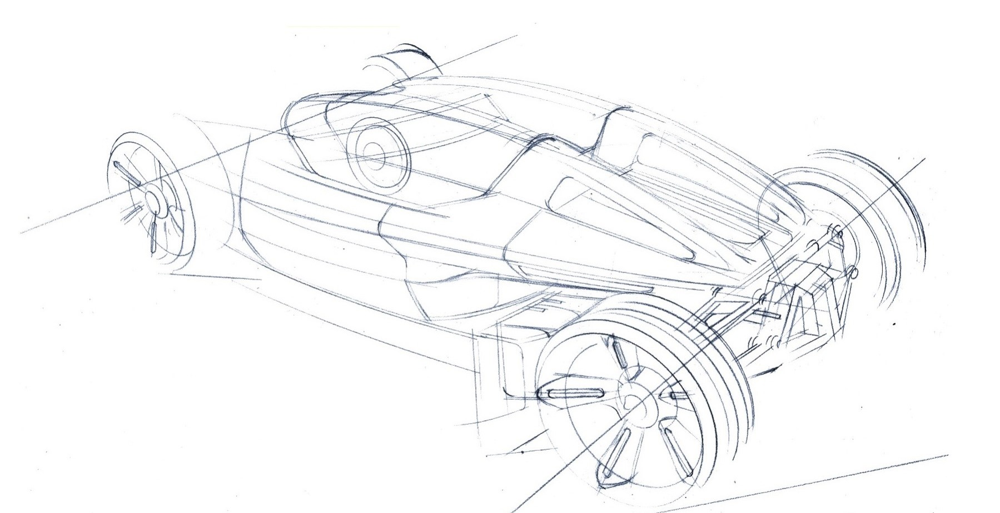

After developing the fuctional objectives, tehre is often a small window of opportunity in the product development process to be innovative with the vehicle architecture. This window often closes quickly due to project time constraints, so ideas need to be freeflowing and clearly communicated.

There isn't a set way to start a project, but thinking about the package first will often help the design team break away from conventional thinking. This crossover between package innovation and stylling represents design in its purest form.

Every designer on the project should apply their creativity and share concepts with the rest of the team. Cross fertiliztion of ideas is a valuable part of this process, with each team member inspiring the next, opening up new possibilities for the whole design group.

As the basic ideas appear, it may also be worth discussing the possibilities with the engineering team at an early stage of the project.

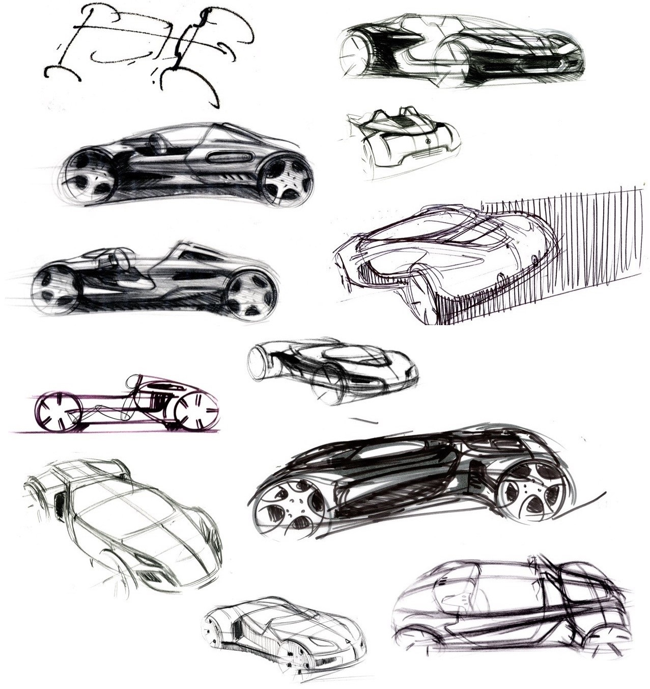

As stated before, the process can be started by sketching the basic proportions and adding in some key elements of the oackage or sketching the package first and adding an outline over it. Either way, start off very loose to get as many ideas or. paper in a short period of time.Keep thinking about the key. elements that are going to influence each concept. The group of sketches below all focus on two passengers with a

mid rear engine"layout, both logitudinal and transverse orientation.Another series of sketches may be created to look at front engine and others for electric drive. More ideation studies may focus on one or three passenger layouts and perhaps some cargo storage space.Ideally each designer will sketch dozens of basic concept drawings during the early stages of the project, exploring every possibility.

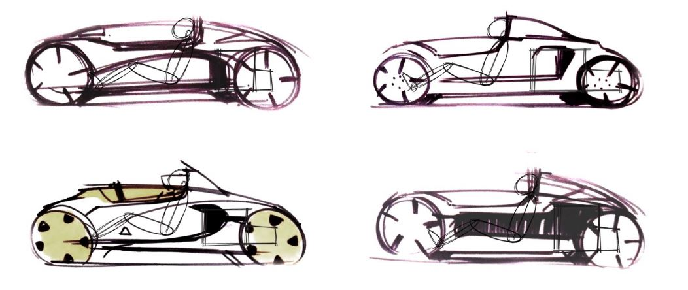

Traditional car shapes are engrained in our minds, but it's important to understand that some of the great, classic designs that we all know and love were created over a new, innovative package that lead to a new trend in automotive design.For example, if a new concept is powered by an electric motor it may not need a traditional hood or deck and the designer may need to get used to that idea before studyir new and unusual proportions. It's easy to jump to conclusions at the start of a project, relying on paradigms that have been applied on previous projects and walking backwards into the future. Make good use of this phase of the project and don't hold back. Once you're deeper into a program there may not be an opportunity to return to this phase.Don't worry if some of the ideas appear strange and unorthodox; what appears to be a bad idea during brainstorming can often lead to the development of a really good one later. It's all about thinking outside of the box" at this stage.

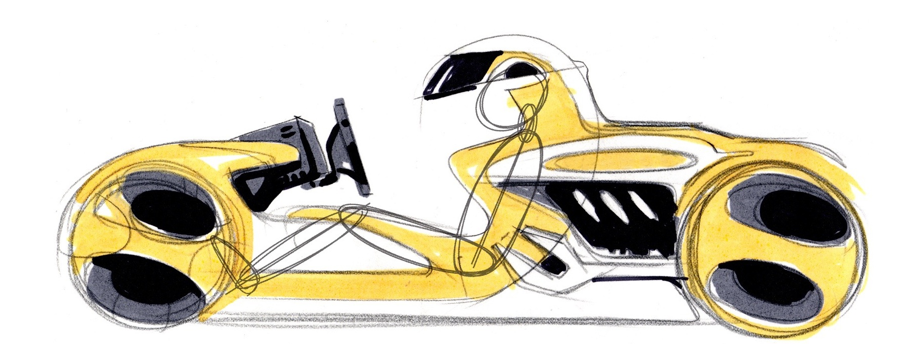

Ideation sketches serve two purposes. They not only provide a loose medium for the designer to develop and record ideas, but also communicate ideas to the decisior makers on the project. There will be milestone reviews during the ideation phase and some sketches may. require some value or color to communicate the design intention. Again, only spend a little extra time working or. each sketch to help sell the concept, not to lock in the. design. More time spent on one concept will rob time. from others, but if one design shows potential above the rest it may be worth investing some time to make sure that it's not overlooked during a review.

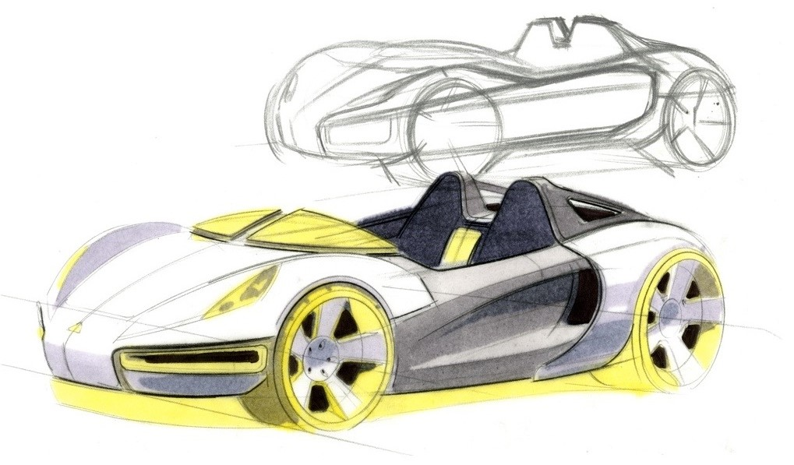
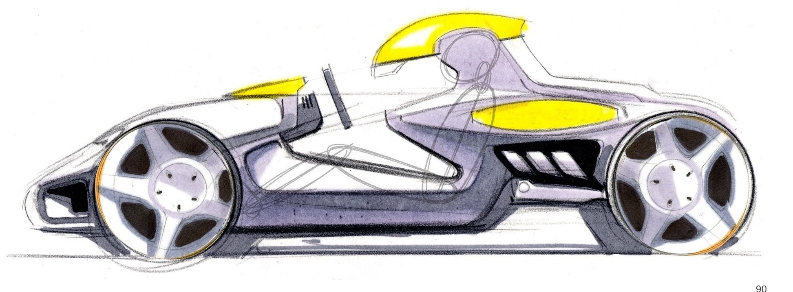

Although this ideation phase requires a broad focus, don't totally overlook small details, they may be part of the big idea. If they are, it will be worth taking additional time to break out some more detail sketches to tell the story. Here the exposed rear subframe detail with detachable cover is explored

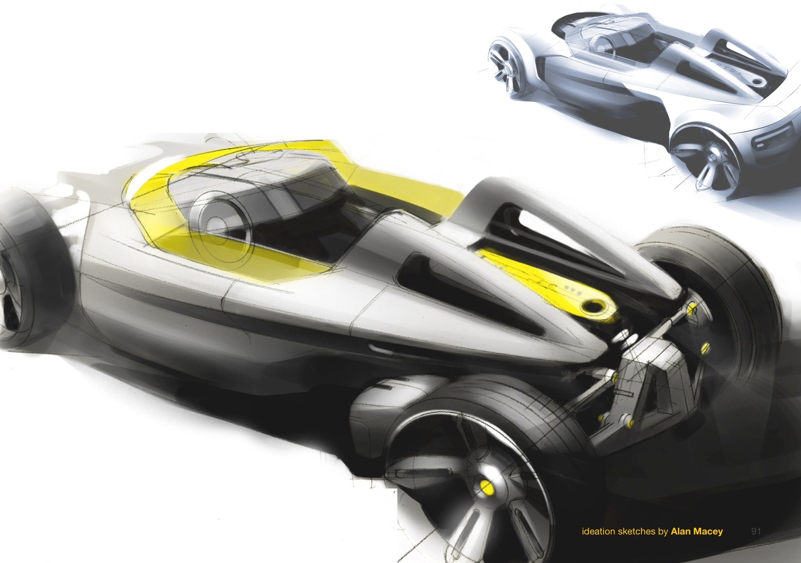

Also sketch the interior. In this concept the interior is highly visible from outside and the basic layout and special features need to be studied along with the exterior. Think about the transition from exterior to interior. Door apertures, the cowl area, seats and convertible roofs, for example, may be the focus of some interior/ exterior ideation work. Ingress egress studies are always good to consider at this stage.Note here, the tilting steering column helping the driver get into the low seating position.

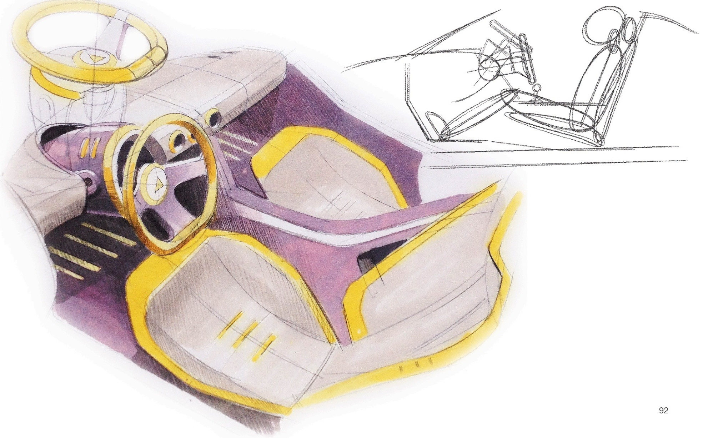

## Section 4.2 Micro Car Ideation

The word-picture for the example project on the following. five pages is "An Aspirational Commuter Car." This statemen. communicates both the physical and emotional aspects of the theme. It sums up the vehicle and customer in just a few words, but also creates an open brief. From this heading. specific objectives or targets for the concept need to be developed before the ideation work is started..

Think about the three entities involved in the product development: the customer, the manufacturer and the market environment. Choose several aspects of these entities to help steer the design. Some of these are simple, like top speed,. fuel consumption and the number of passengers. An example. is shown on the following page..

Other factors like manufacturing strategies and international legislation will be more complex subjects, but should be giver. consideration. Try to think about how each objective may. affect the basic architecture.Requirements for passengers,. ground clearance, a large engine, heavy cargo and doors wil have an impact even on a loose ideation sketch.

Other less influential features like lighting, instruments and trim may be ignored at this time unless there is a specific focus in the design brief for these systems.

As a commuter vehicle it will probably be small, inexpensive to buy and drive, easy to park, carry only one, two or three people and have limited cargo capacity. It may be sold all over the worlq. and therefore be manufactured in very high volumes. To be aspirational, the styling will be important and performance may need to be stepped up

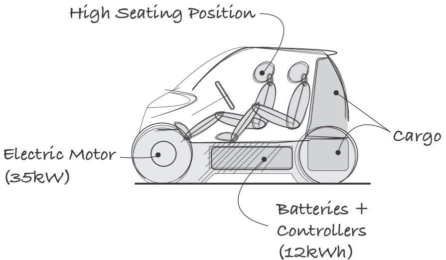

As you work through this process, continue research into the major elements of the package. Consider the seating position for the occupants and think about the number of passengers, how they will relate to each other, their orientation and approximate location. Set up their height from the ground and their posture. Make notes on the drawing as you go.

The powertrain specification should be estimated from the target performance goals and approximate weight of the car. Also look at which wheels will be driven.

The cargo requirements should be set out in the functional objectives. If specific items need to be carried, get their measurements and include these in the sketches.

If the wheel size or locations are important, add information about diameters, wheelbase, track, etc.
Loosely sketch a body profile over each package to look	at the proportional difference between each study, theoutlines may inspire a design theme.

**Some Primary Target Specifications**

| Item                        | Spec                                        |
| --------------------------- | ------------------------------------------- |
| **Passengers**        | 1-3                                         |
| **Number of doors**   | 1-2                                         |
| **Top Speed**         | 85 mph                                      |
| **Acceleration 0-60** | 7 Seconds                                   |
| **Fuel Consumption**  | 60mpg or equivalent                         |
| **Range**             | 100 - 150 miles                             |
| **Safety**            | 5 Star Crash (IIHS & NCAP)                  |
| **Cost**              | $9,000-$12,000                              |
| **Cargo**             | Minimal (groceries, small travel case etc.) |
| **Powertrain**        | Fuel efficient /Alternative                 |
| **Controls**          | Autonomous Drive Mode Option                |
| **Weight**            | 850 - 900kg                                 |
| **Dimensions**        | -                                           |
| **Length**            | max 4000                                    |
| **Width**             | max 1400                                    |
| **Height**            | max 1400                                    |
| **Ground Clearance**  | min 150                                     |

As mentioned previously, keep the sketches very simple; at this stage they are just to look at basic proportions. These three. options look at various ways to approach the Aspirational Commuter Car.

The low car will possibly be performance oriented to make it. aspirational. The short vehicle will be more practical and easier to park and maneuver. The ultra narrow concept will be able to cut through traffic and be very easy to park.

Setsomeszelmltatlohsbased onthekhownehvronmenta requirements. For example, to park sideways, the length of the short car will need to be similar to the width of a large truck. To cut through traffic, the ultra-narrow concept will need to be the width of a large motorcycle

Sketch several layouts with the occupants, cargo, tires and powertrain.At this stage, don't worry too much about scale, accuracy is not important here. This will be addressed at the next phase of the process

The main objective is to get as many ideas down on paper, quickly, so that you can think about how the exterior. proportions will be influenced by the major elements.For example, when thinking about the powertrain, just look at whether it is large or small, at the front or the back, longitudir or transverse, electric or internal combustion. FwD or RwD.

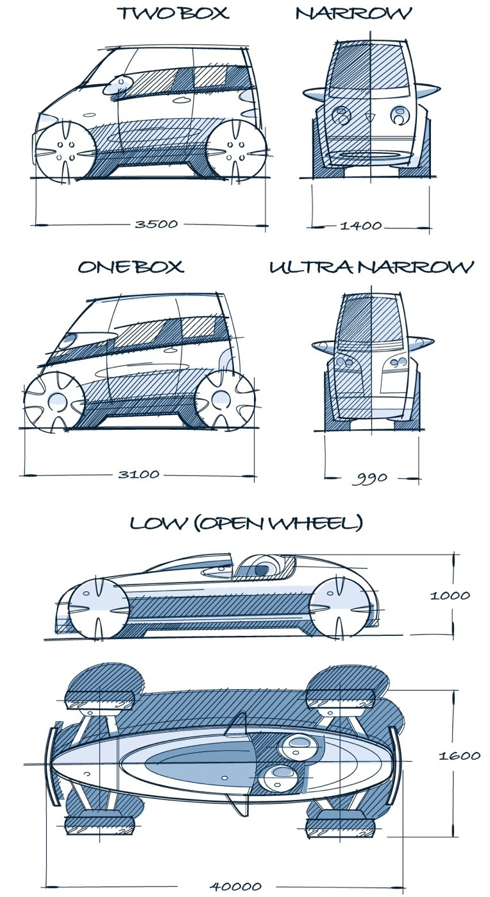

Contigure the package in as many different ways as possible and exhaust all of the possibilities. Don't underestimate the magic that comes from drawing out your ideas. In the same way that a new design may develop as it is rendered, sketching out the architecture will often foster new concepts that would never have been conceived had they not been part of the ideation process. This is a disadvantage for many engineers who simply neve sketch their ideas on paper.

Try to make sure all of the ideas meet the functional objectives and target specifications. Each sketch should only take 5 to 10 minutes to draw, so it should be possible to create many ideas in a short time period

Looking at the example concept sketches,the brief for this project asked for up to 3 passengers, so the ideation work ooks at layouts with one, two and three occupants. This study also looks at the different types of passengers. Knowing that a commuter car will need to be small and inexpensive the powertrain options are limited and only very. efficient package configurations are given consideration. Be aware that concept objectives often evolve during the ideation process and a compelling design may help to steer. the direction of the product planning team.

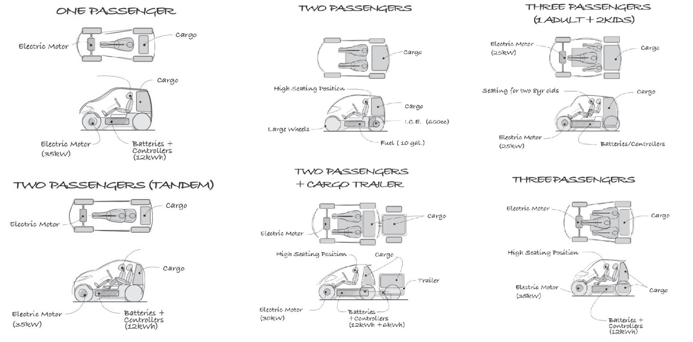

## Section 4.3 Body Design Ideation

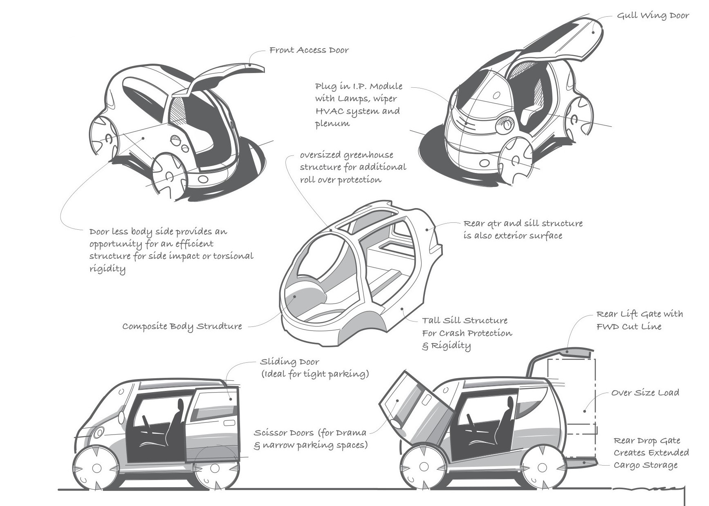

Sketch the body structure, apertures and closures. Look at various ways to open the doors and configure the body structure around them.

Think about how the main load bearing structural elements may be configured. Consider the materials and possible manufacturing methonds that may affect the package.

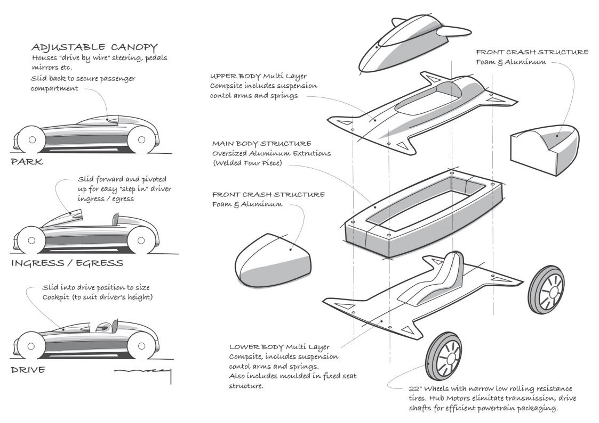

## Section 4.4 Family Vehicle Ideation

Sometimes experimenting with proportions first can inspire some innovative package concepts. Don't be afraid to exterior proportions either before or at the same time as you're sketching the package ideation studies..

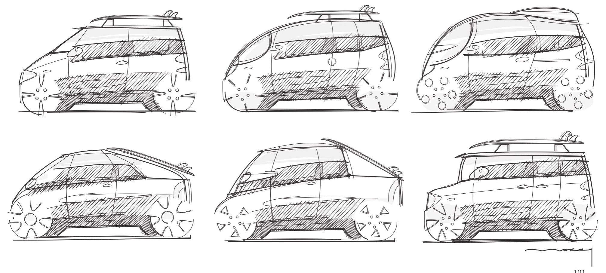

After developing some exterior shapes, look at how the key components will fit into the various silhouettes. Be prepared to make some adjustments to the proportions as the reality of accommodating the package takes over.

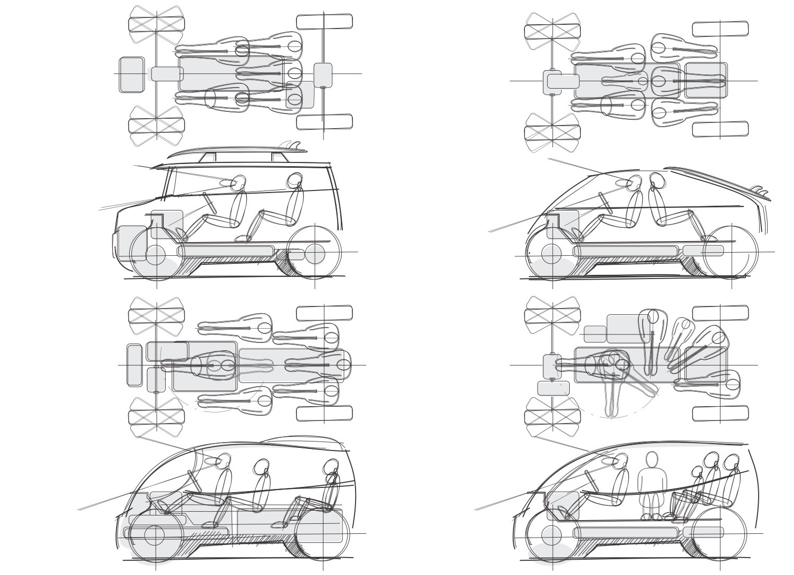

After the concept exploration studies are completed, choose the best one or two and develop them further. Although. there is quite a lot of detail in this package study example, it shouldn't take too long to create. This type of study will need to be more dimensionally accurate than the initial package ideation as it takes the concept to the next level.

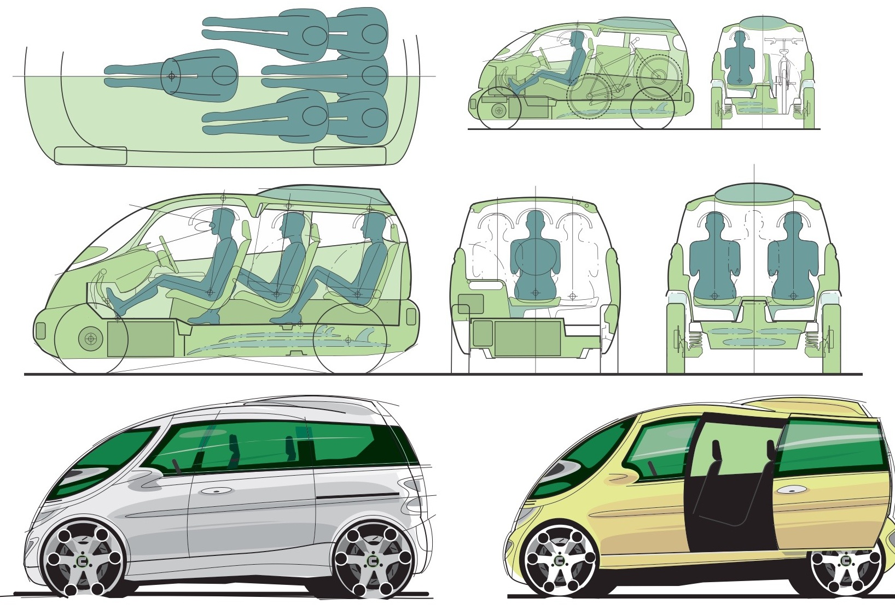
