# Chapter 5 Size & Proportion

## Section 5.1 Introduction 

Setting up the size and proportion of a vehicle can be approached in several ways. The first approach may be purely emotional. You may have already decided that the concept wil be large or small, high or low, have a short or a long hood. You will be working with a mindset that the vehicle needs to be. designed to look a certain way for the customer to accept it. If. this is the case, the package can often be designed under the skin, because there will be nothing revolutionary about it. It is taking what we already know today and simply refining it. This is a case of the package being lead by the design.

Another approach may be driven by a specific requirement to meet dimensional legislation or market segmentation.This combined with a challenging set of functional objectives may require some innovative packaging to fit everything into a limited envelope.

The final methodology is to start only with the functional objectives. This involves research into advanced technology

to develop innovative solutions betore building the package around the occupants and new kinds of componentry.The exterior proportions can define the forms around this fresh architecture. If some of the functional objectives for the vehicle are to fit into a small footprint and be fuel efficient, then a fully optimized package will develop. If the customer requirements call for a much larger vehicle with an emphasis on making a statement with its size, then the package can b relaxed in some areas

The Function& MarketSegments chapter gave an insight int some of the factors that set up the proportions.As always, th occupant package will have a major influence on the vehicle's size but the powertrain and cargo are often the elements that define the proportions of the main "boxes." If a car is of the three-box layout with a long hood, or long dash-to-axle relationship (front wheel set well forward of the A pillar), there is a good chance that it is a luxury car with a large engine.

### PROPORTIONS

There may not be a great deal of emphasis on larger cargo space, but room for suitcases and golf clubs might be an mportant requirement.A smaller, two-box hatchback will be a more efficient and versatile design with a smaller engine, but larger cargo environment for carrying bulkier objects

Proportions are always going to relate to the function of the vehicle. This may be an obvious statement but every time a. new project is kicked off, the design team should fully. investigate what opportunity there is for the architecture of the vehicle to make an exciting statement about its intended function.Similarly,the designers can consider how new technology could be applied and how that might lead to a redistribution of the masses

New advanced propulsion systems are very different in their size, proportion and arrangement to conventional internal combustion engines, so a concept that employs an electric powertrain may not look the same as one with a conventional internal combustion engine.

The three sports cars (shown right) may have similar objectives but look totally different because their engines are in different Iocations. Performance cars vary a great deal in appearance for this reason. The top car has a large mid-front engine which creates a long hood, pushing the driver towards the rear of the wheelbase.

The middle car is a mid-rear engine layout with the transaxle behind the engine. This package creates a longer rear end, pushing the rear wheel away from the driver.

The bottom car has a rear-mounted engine which requires a lot of mass behind the rear wheels but does allow a small amount of room for rear passengers

**FRONT ENGINE**
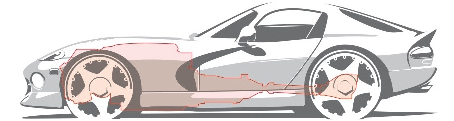

**MID ENGINE**
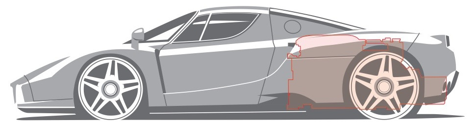

**REAR ENGINE**

### PROPORTIONSAND BODY TYPES

The side-view proportions of the body are influenced by the occupants, cargo and powertrain packages.Additionally, the ground clearance, crash systems and aerodynamics wi affect the profile. All of these, in turn, are driven by the functional objectives. Some typical examples of various body types. and proportions are illustarted here.

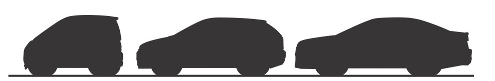
**One Box - Micro** & **Two Box - Hatch Back** & **Three Box - Sedan**

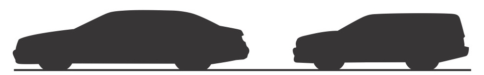
**Stretched Limosine** & **Wagon**

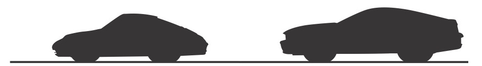
**Coupe** & **Fast Back**

**Mid Engine Sport Car** & **Roadster**

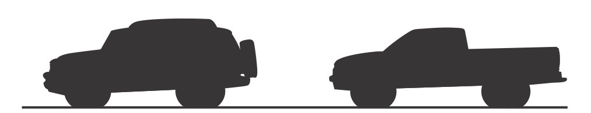
**Sports Utility Vehicle** & **Pick Up Truck**

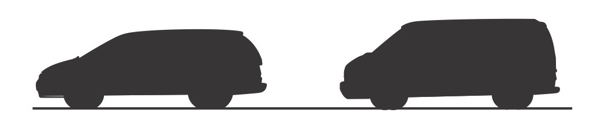
**Minivan** & **Commercial Van**

### SIZING THE CONCEPT

As previously mentioned, accurate scaling is not an import part of the ideation process. In fact, to maintain the flow of ideas, worrying about the vehicle's accurate size should be a low priority. After the initial ideation phase is complete and the concept possibilities are edited down, the next step is to determine the size of the vehicle.

Looking at the vehicle outline below, there is no way of understanding its scale. Only when the rest of the package elements are added to the drawing, can the size be developed, understood and communicated.The main element of the architecture that wil accurately determine size and proportions are the occupants, as shown on the following page

**HOW BIG IS THIS VEHICLE?**

Looking at the these three vehicles, notice that the outlines are exactly the same, but with the occupants set up in the basic package it is easy to understand their relative sizes.

The manikins are a consistent component in each package so the outlines of a concept can be set up around the driver and passengers' geometry and spacial requirements. Benchmarking existing known vehicles will help perform this task quickly, as described at the end of this chapter.

The next chapter looks at the occupant geometry and packaging, this should be studied to better understand how the manikins can be utilized to accurately scale each concept.

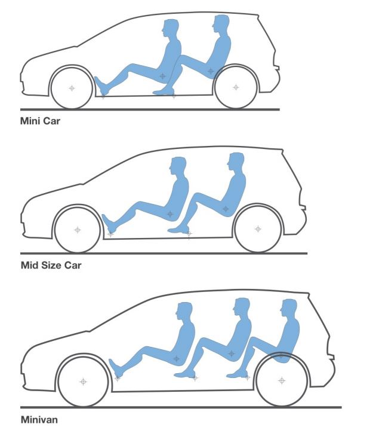

## Section 5.2 Classification by Size

Often the size of a vehicle will put it into a category or market. segment. Unfortunately, there is a lot of ambiguity in this area. This can be seen in the vehicle segmentation matrix on page 111..

Slzelsrelatlve,soltyouareworking onasmallcarlnEuropeo Japan it will be much smaller than a small car in the USA. The type of vehicle will also make a difference. A small truck, for example, will be much longer than a small car, van or SUV. The market's view of size is constantly changing. Notice (on the opposite page) the size of the original Mini & Fiat 500 is much smaller than the current models. Cars have grown considerably in recent years in both size and weight. In some markets, legislation will set a mixture of dimensional, functional, weight or power-output divisior ines. These are usually there to help reduce vehicle size in regions with a dense population or for economical and environmental reasons.

Because some vehicles need to be contigured a certain way to perform their intended function, they will be exempt from some. limitations.Some divisions are mandated and strictly enforced,.

others are encouraged with tax incentives or penalties. Countries with poor economies, limited oil resources and/or. high population densities, will have stricter limitations..

An example is the designation for passenger cars and light trucks.Passenger cars have to meet stricter fuel consumption limits than trucks and their bumper design is governed by low-speed impact requirements. To be classified as a truck, the vehicle has to be either primarily designed to carry cargo, carry 9 or more people behind the driver, have an open bed or be designed for off-road use. Much of this criteria is open to interpretation, allowing som vehicles to be classified in either cateaory.

Before starting the project, try to understand the objectives from the customer, brand and environmental perspective. Look at the size of competitive vehicles and the cars and trucks in the showroom of the brand.Check all local egislation and think about how the environment and climate may affect the vehicle's architecture and classification.

### VEHICLE SIZE EXAMPLES

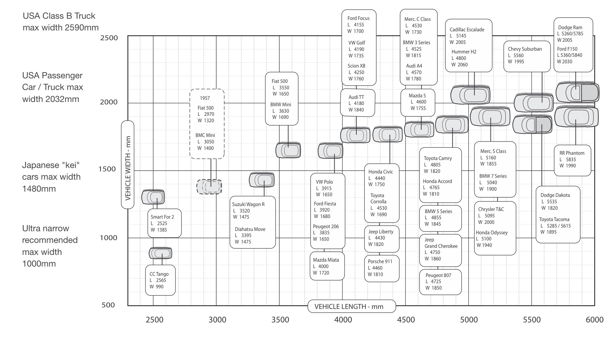

### VEHICLE SEGMENTATION

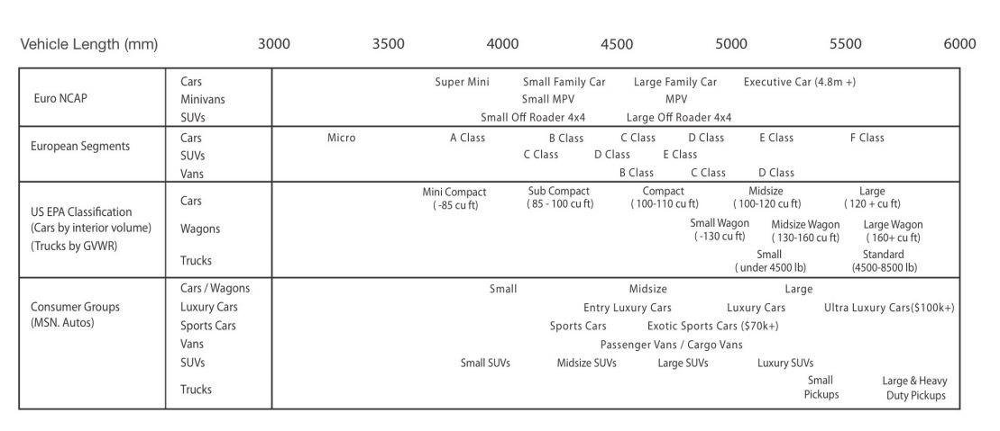

Vehicle segmentation can be broken up by several factors including: weight, size,. function, cost and speed. Various groups will determine segments to suit their objectives.

## Section 5.3 Slicing Up The Package

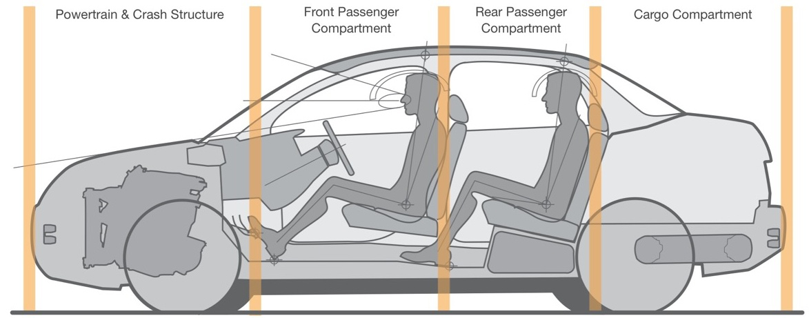

Every package should be developed in zones.This helps to simplif the thought process and allow the designers to understand how the overall dimensions are built and where changes can be made The typical sedan package drawing shown above,illustrates the main compartments of the architecture divided longitudinally.

These may be different for each vehicle, depending on the objectives and system layout, but the fundamentals remain the same.For example a rear engined, two passenger sports car wil be sliced up completely differently to a pick up truck.Each package will also be divided up into vertical and lateral slices as shown on the following pages.

|Front Impact Structure & Powertrain|Driver Package.|Rear Occupant Package|Rear Impact Structure & Cargo Space|
|--|--|--|--|
The size and orientation of the engine will significantly affect the proportion of the front end. Free crush space for frontal impact is. required around the powertrain and chassis components to help meet frontal impact requirements.|The space occupied by the driver's lower limbs is determined by. the chair height. An increase of chair height. will shorten the horizontal length between the feet and. the hips.|The distance between the front and rear occupants (couple) will directly affect the vehicle length, which is why the rear passengers suffer the most in smaller cars..|This space is mainly used to accommodate cargo, the spare tire and fuel tank. Protecting the rear occupants and fuel from rear impact will also influence this dimension.

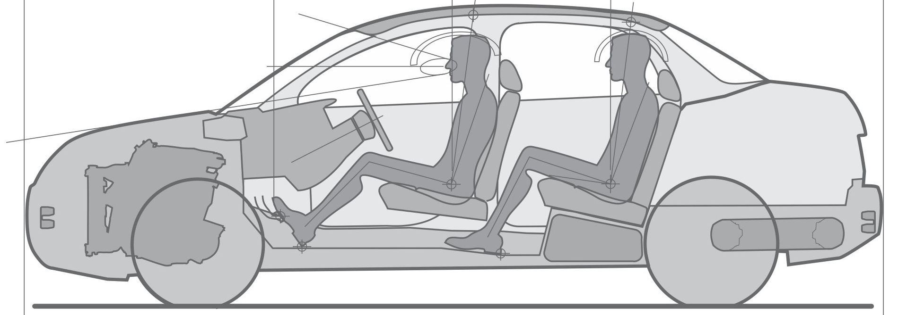

|Overall Length Targets & Limitation|
|--|
The maximum overall length may be a project goal established to ensure the vehicle fits into a particular market segment. lly, street/garage parking and maneuverability are also limiting factors.Accommodating a specific spindle locatio. e and overhang may also affect the overall length (OAL). Excessive length will add cost and weight and limit performance.

**Front Engine - FWD**
* The front overhang and spindle is set up by the driverhaft location.
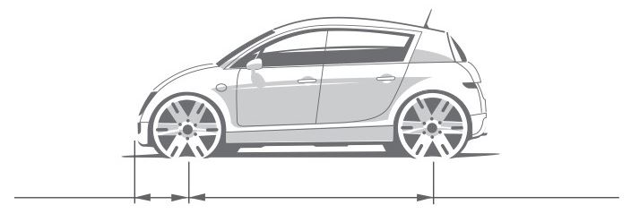
* The wheel base is set up efficiently around the passenger location.

**Front Engine - RWD**
* The front wheel is set forward to imporve approach angle and minimize the effects of a heavy load on the steering.
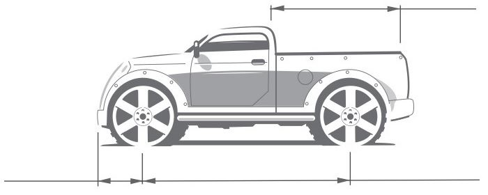
* Bed length is determined by function. They range from 850 to 2500mm.
* The rear wheel location is set close to the middle of the bed for ideal load distribution and ramp over.

**Front Engine - RWD**
* RWD/FWD The front wheel is set forward to allow the driver to be located in a forward location.
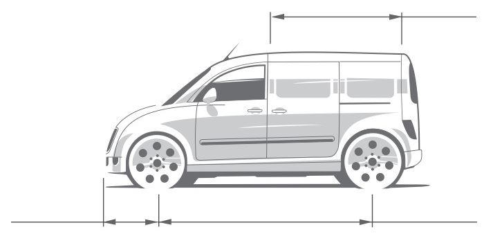
* Rear cargo bay length is determined by functional requirements.
* The rear wheel location is set behind the side load door which is designed to allow specific items to pass through, which are usually over 1000mm.

**Rear/Mid Engine - RWD**
* The front wheel is positioned to establish perfect weight distribution.
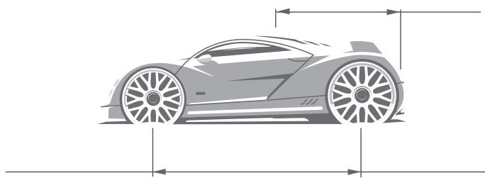
* The engine transmission fuel tank and crush space are all located behind the driver.
* The rear wheel is lined up with the driveshaft location.

### DETERMINE THE HEIGHT

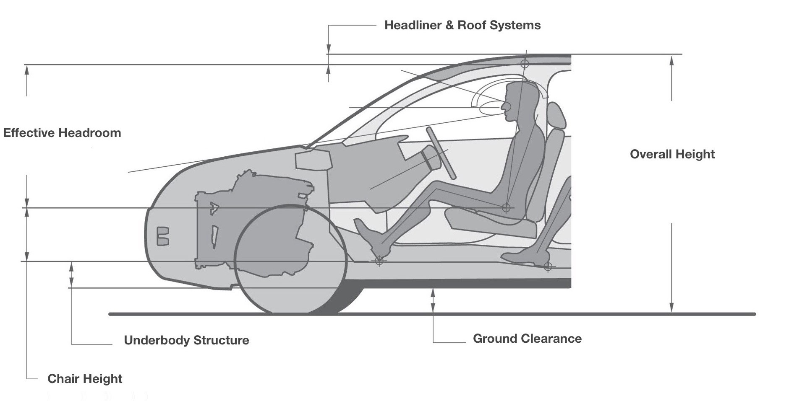

**Overall Height**
The vehicle's handling, aerodynamics, ground-clearance needs and occupant comfort all have to be considered when determining the overall height. Garage and undergound parking access can limit the maximum height for vehicles such as SUVs and minivans.

**Headliner & Roof Systems**
Space is required to accommodate trim and various roff systems such as sunroofs and roof racks.

**Effective Headroom**
The distance between the seat and the headliner is determined by head clearance requirements and spatial expectations.

**Chair Height**
Lowering the chair height will help to lower the center of gravity and minimize the frontal area to reduce drag. Minivans & SUVs utilize a higher seating posture to provide command of the road seating positions.

**Underbody Structure**
Provides space for an appropriate structure. Heavyduty vehicles my require a seperate frame system. Most unibody cars will require an integrated rail system under the driver's feet.

**Ground Clearance**
Off-road vehicles require high ground and "ramp over". clearances to avoid bottoming out on rough terrain. Sports. cars will have minimal ground clearance to lower their center of gravity and improve aerodynamic performance

### WIDTH SLICES

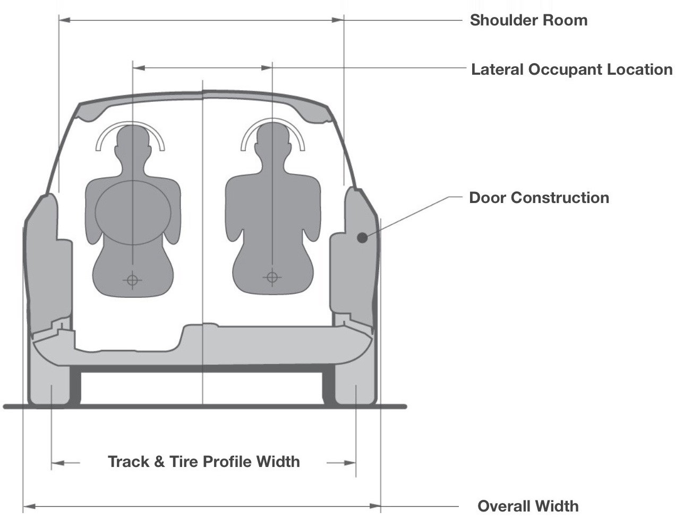

**Overall Width**
The width is the most controlled of the three dimensions and is usually governeq by various authorities to ensure that each vehicle can function in its intended environment.Also, the width affects the frontal area of the car, which directly. influences the aerodynamic drag.

**Shoulder Room**
Measured between the door trim panels, this dimens part of the equation to calculate interior volume.The objectives are to maintain a comfortable relationship the occupants and help reach interior volume targets.
**Lateral Occupant Location**
Often influenced by the overall width limitations, the occupants may also be pushed outboard by the powertrain or interior functional requirements.

**Door Construction**
The body-side profile, side (drop) glass and door construction, added to the shoulder-room dimension, will usually set up the widest point of the body.

**Track & Tire Profile Width**
A wide track will help to stabilize the vehicle and reduce roll. The track and tire width will often establish the overall vehicle width for high performance cars where cornering, acceleration and braking are critical.

## Section 5.4 Key Dimensions

The basic dimensions are used to set up and communicate the size and attributes of the package. Developing concepts are under continuous scrutiny and these measurements help to keep the design team informed about the overall proportions of the concept and how it compares to other vehicles in it's class.

Additional dimensions may need to be added depending on the type of vehicle and its functional objectives. An off-road truck, for example, may need to record ground clearance and bed length

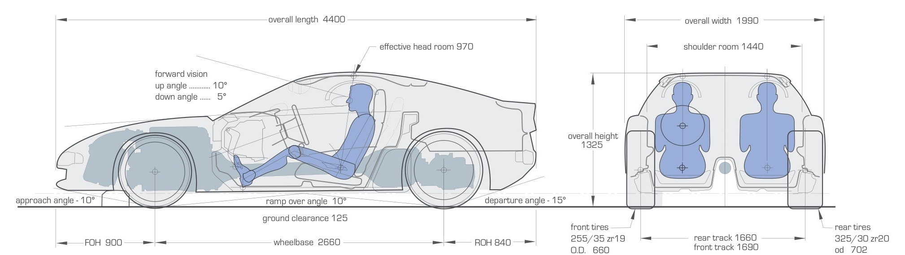

### MAIN EXTERIOR DIMENSIONS
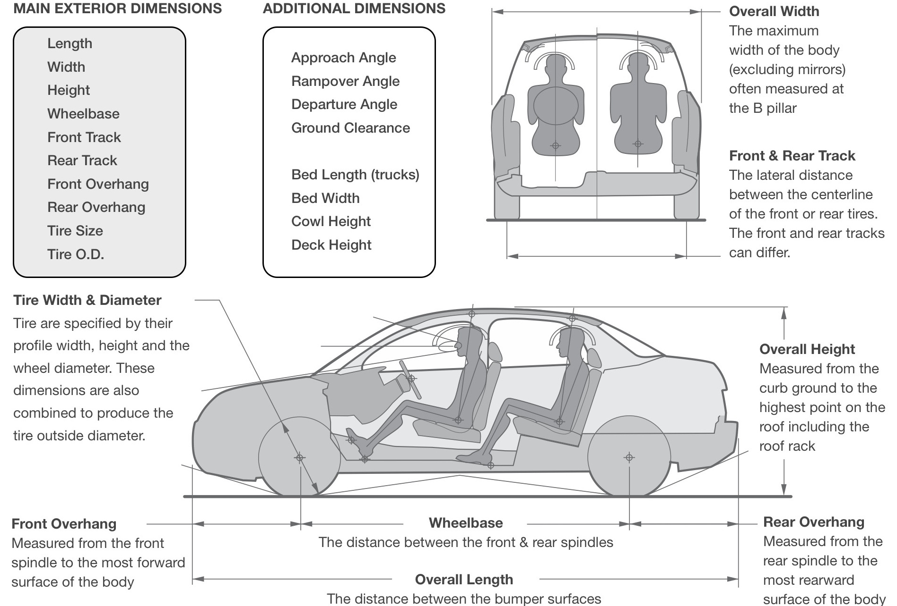

### MAIN INTERIOR DIMENSIONS
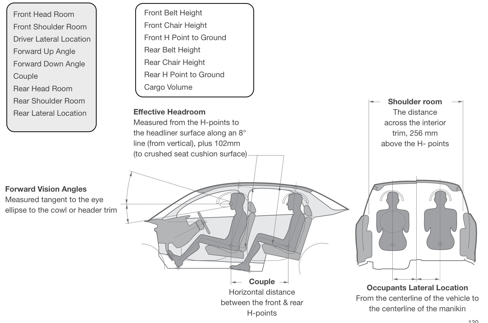

## Section 5.5 Benchmarking

Benchmarking is the most empowering packaging tool a designer can use. It provides the key building blocks to set up the proportions quickly and with confidence..

After the functional objectives have been established, start to research existing vehicles with similar attributes.If the intendec market segment is mature, this should be a straightforward process.If the concept is reaching into new and unknown areas, benchmarking will require more thought and creativity

The illustrations on pages 125-127 show a simple benchmarking study, where several products have been selected for comparison and are superimposed within the basic package of the new concept.Although this looks quite primitive, a great deal can be learned from this simple study. Because an existing car or truck is the result of a huge amount of research and development, benchmarking serves to provide a sound foundation to launch a new concept study, as long as the design team doesn't just follow the same paradigms

Before starting the study, it is a good idea to examine a. comparison vehicle and understand its design philosophy.Get to know the vehicle as intimately as possible by reading various consumer reports and test driving if possible. After this,. elements of the package can be dissected and used where they make sense

Break up each package according to the information on pag 113-117. Giving separate consideration to key elements that make up the overall dimensions. Ultimately, you will need several benchmark studies to prove the new concept. The overall dimensions, the occupant package, the powertrain package, crashworthiness, cargo storage and any other innovative features incorporated into the design can be validated by demonstrating their similarity to other vehicles

Line up each comparison according to the story it tells.For example, if headroom is the focus, line up the occupant's heads to each comparison vehicle. If it is the H-point to ground dimension, line up the ground lines of the vehicles.

Add the relevant dimensions to each study to add a higher level of accuracy to the comparison. It is always advantageous to have access to a database of packages. Most companies will either buy these from organizations who specialize in vehicle measurement or they measure competitive vehicles and maintain their own database of package drawings. For basic benchmark studies, each package should contain the vehicle outline, tire O.D. (outside diameter), spindles, occupants, h-points and hool locotion

These should be drawn in side and front views and a full set of dimensions is also very helpful. There are many online resources which provide valuable information. The manufacturers' websites have all their vehicle specifications and measurements and websites like www.autos.msn.com have tons of information and can create dimensional comparisons quickly. This information can be cross-referenced with vehicle-safety information from www.euroncap.com, www.safercar.gov or www.safecarguide.com

**BENTLEY CONTINENTAL**
Similar overall length and width (lined up at ground and bumpers)

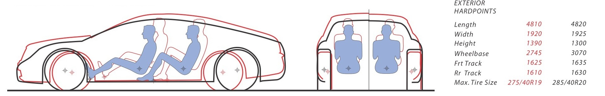

Example benchmark study, showing similarities in length and width to an existing car. The new concept is shown in black/blue and the benchmark vehicle is in red.

**BASIC SIDE & END VIEW BENCHMARK PACKAGE DRAWING DATA BASE**

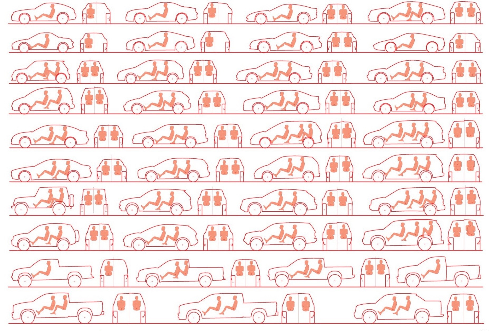

### BENCHMARK PROCESS EXAMPLE
The example shown here is an off-road sports truck concept with a V12 engine.

The five comparisons shown on the following pages demonstrate how elements of serveral different vehicles can be used to build and communicate the proportions of a new concept.
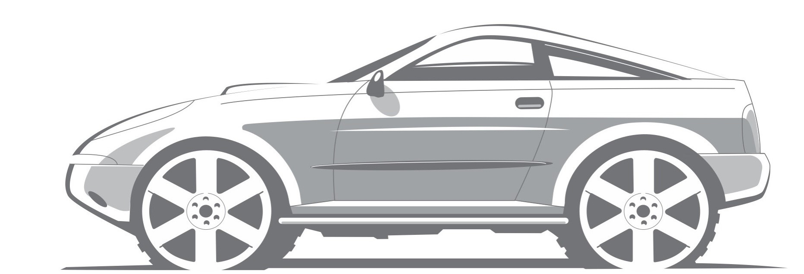
To set up the basic package for a concept, several comparisons are usually necessary. The number and nature of these studies will vary from project to project depending on the key element that make up the architecture. Each comparison will help the design team understand the various requirments, features and attributes of the architecture. The five comparisons illustrated on the next three pages focus on the following:

1. Ground clearance, wheelbase and driver heel height.
2. Driver postrure, head enviornment and windshield location.
3. Engine/Transmission envelope.
4. Cargo storage.
5. Overall dimensions.

**Similar Underbody and Tires**
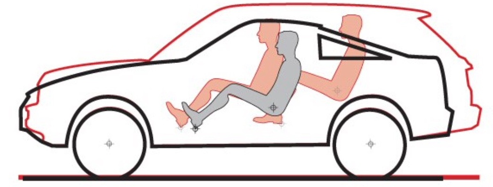
1. The concept could adopt same wheelbase and grounc clearance as the Range Rover so it may have a similar. off-road capability. The driver's heel is also a similar. height, providing room for a strong and durable. underbody structure suitable for off-road use.

*Note: The packages are lined up at the ground and wheels*

**BENCHMARKING THE VEHICLE ARCHITECTURE CHUNKS**
**Similar Driver Posture, Roof & Windshield**

2. The occupant has a similar posture and head environment to the 911 - i.e., the roof and windshield relative to the driver's head and H point. Note: The packages are lined up at the driver H-Point

*Note: The packages are lined up at the driver H-Point.*

**Similar Front End Proportions (Foot to bumper)**
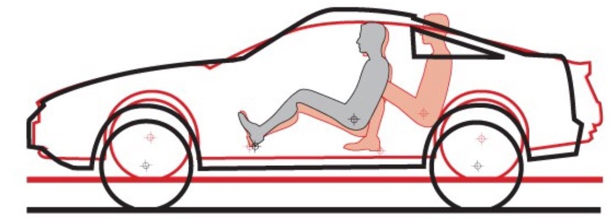
3. The DB9 has a similar V12 engine. This front end comparison shows a similar hood profile and front end length to driver's foot relationship, proving the engine should fit and meet crash requirements

*Note: The packages are lined up at the driver's ball of foot.*

**Similar Cargo Bed Length(shoulder to tailgate)**
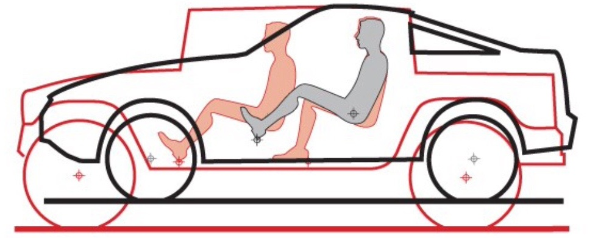

4. The concept will have a similar bed size as the Hummer H1. This study looks at the stack up of the seat back, rear bulkhead and bed length, tailgate and bumper.

*Note: The packages are lined up at the rear occupant's shoulder.*

**BENCHMARKING THE OVERALL SIZE**
5. After piecing the package together in chunks, check its overall size against a benchmark vehicle. Although the new concept is a different type of vehicle than the Jeep, the overall dimensions are similar helping to check and communicate the size. The occupants' lateral location ( the transmission will pass between them) and the tracks are also similar. Note: the packages are lined up at the ground and bumpers.

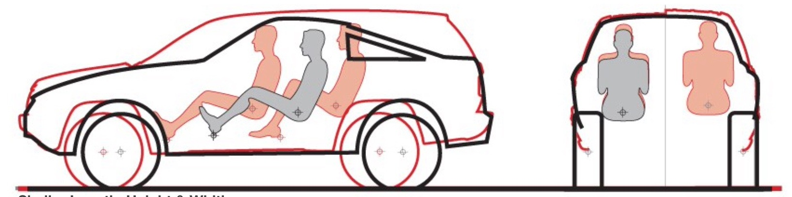

After developing the concept to this level, start to consider other large elements in the package, such as the fuel tank, spare tire, and stowing seats. Don't get too hung up on these components, but respect the space they will occupy.As the project moves forward, an engineering team will become more involved and adjust the package accordingly.

## Section 5.6 Evaluating Proportions

The main objective at this part of the process is to get the 2D design into a 3D clay or CAD surface model, as soon as possible. After blocking in the main "slab" surfaces from the 2D curves, there will usually be surprises and the proportions may not look as good as expected. If major changes are required, any excessive time spent in the tape drawing will have been wasted. This is one reason why the initial conceptual packaging is done quickly, to get the basic model "blocked" in, allowing the designers to evaluate the proportions and make necessary changes before asking the engineering team to challenge the package

*This initial template or "tape drawing is quite basic but it is enough to start a scale mode/ with confidence.Most of the main slab surfaces, i.e., the side glass, body side, hood, roof and windshield can be blocked in from these side and end view profiles. The package will become more complex as the mode develops, but should be kept very simple at the start. The basic process to create this drawing is shown on the following pages.*

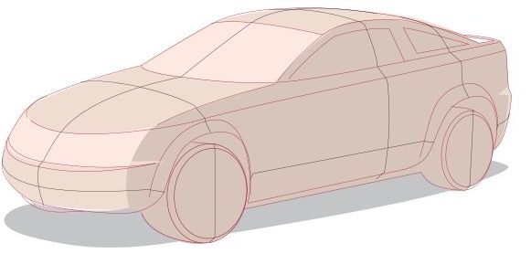

### TAPE DRAWING" OVER THE PACKAGE - STEP 1. SIDE VIEW

Traditionally, this stage of the process was done in black tape on mylar at the same scale as the model. This can be expensive and time. consuming, both creating the drawing and transferring the data into the templates. This media is rarely used today. The drawing can be created over the package in a vector based 2D CAD application (such as Adobe lllustrator) or directly into 3D in a surfacing application (such as Alias or Modo). It's important to understand that if a 2D process is used, the orthographic drawing has no perspective and some elements, such as the overhangs and roof height may look odd. Try not to spend too much time getting their design to look perfect in relationship to the side of the car. The body side, wheels and DLOs will all be close to representing the vehicle in side view, so these need to be quite accurate The same can be said for the front and rear views.

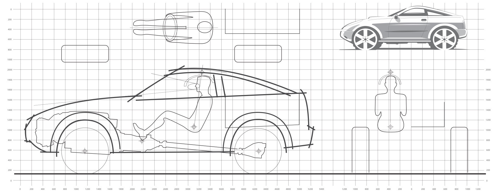

Start by creating an approximate side view over the package. Include all of the major curves that influence the proportions. Overbuilding the curves or surface at this stage will help to establish a preliminary outline quickly.. H-POINT|Size & Proportion

###  A "TAPE DRAWING" OVER THE PACKAGE - STEP 2. END VIEW

Create end view sections over the key elements in the package, such as the occupants, tires and cargo using the si r setting up the main end view sections, go back and adjust the side view where necessary..

*Note: The belt height highlighted in the rear view section. This and other "hard points" can be projected across to the as a reference to locate the curves*

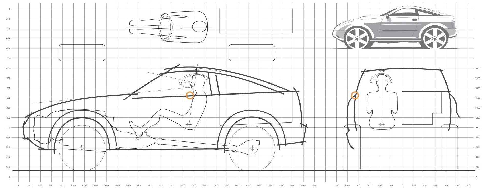

### CREATING A"TAPE DRAWINGOVER THE PACKAGE-STEP3. PLANVIEW

Create an accurate plan view, with key hard points projected from the side and end sections. Create the body wide curves and the glass boundaries such as the. belt, cowl and rear deck curves. To get the desired curves, the other views may need to be adjusted.

At this point templates can be made from the overbuilt curves. Alternatively, the. curves can be used to generate the main slab surfaces in a CAD model.

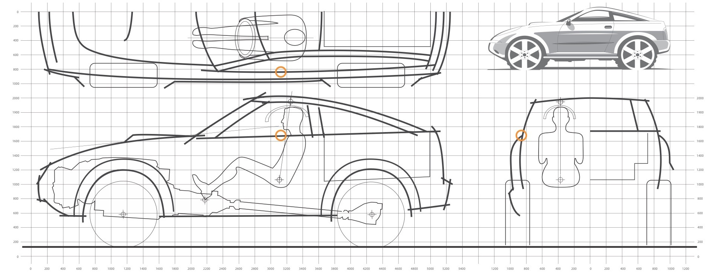

### CREATING A"TAPE DRAWING"OVER THE PACKAGE-CLEAN UP
The drawing can also be cleaned up for further 2D evaluation and design changes

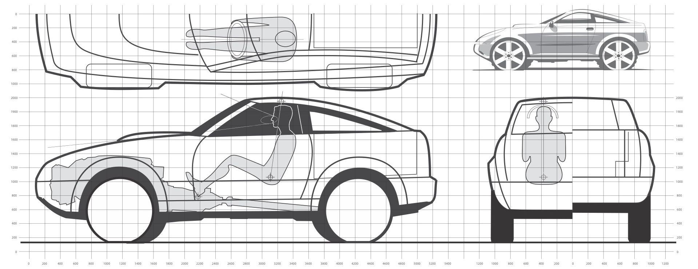

