# Chapter 7 Interior & Cargo

## Section 7.1 Introduction to Interiors

The interior components can be divided into about seven systems, shown in the illustration. These are typically developed and manufactured by various suppliers who work with the major auto companies from the beginning of the design process.They will often be delivered to the assembly line complete and ready to install. The interior design on most projects will follow the exterior. There are exceptions, particularly if the vehicle interior has special features which will affect the overall package. such as rotating or stowing seat systems or special cargo needs.These will drive the initial package together with the occupants, creating hard points to work around.

### DESIGN FOR SAFETY

An important concept to consider is that the interior must be safe. 

Some parts contain the active and passive safety systems, such as the air bags, seat belts and knee blockers.They can be attached directly to the vehicle structure to aid their function. 

Other items, such as the headrests and roof. linings are designed to prevent head and neck injuries, in the event of severe impacts. 

The completed interior components will play a role in every safety test, so the location, shape, surface hardness and supporting structures have to be carefully designed to protect the occupants

### INSTRUMENT PANELS AND CONSOLES

Generally, the I.P. will not influence the exterior proportions of the car, so its design can follow the exterior. However, many of the key components are directly related to the driver location and posture to provide reach, visibility and safety. If the occupant package changes, it will tear up the I.P. and console design. This is one reason why the interior design is not developed to a great degree until the exterior development is quite advanced.

Overhead consoles will help redistribute some components and free up space on the l.P. but their size is often limited by the sunroof

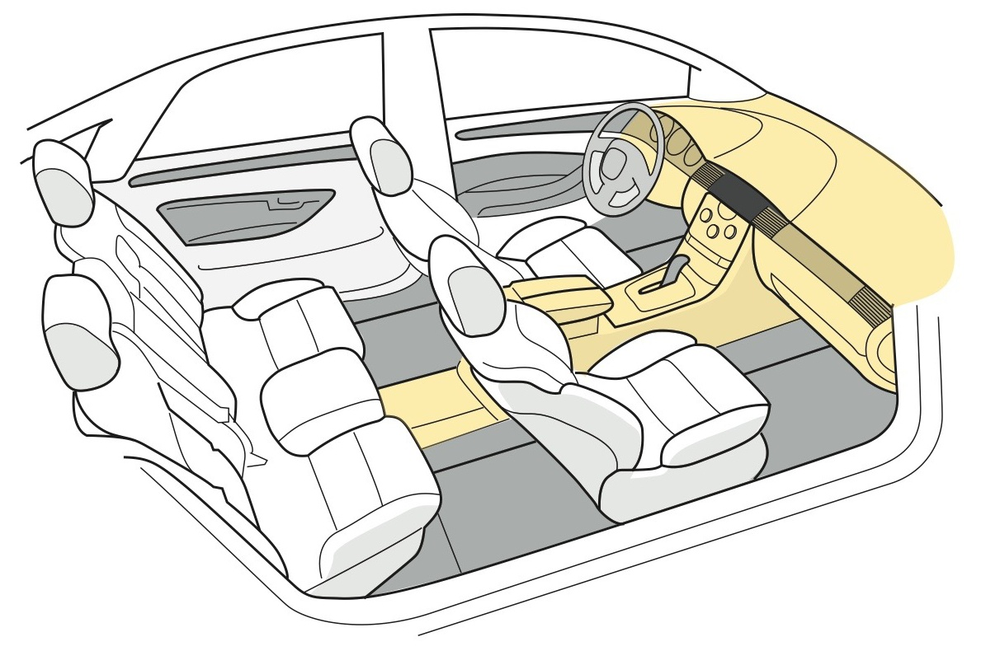

### DOOR & PILLAR TRIM PANELS

Although these may appear to be of lesser importance to other interior components, many of the upper trim panels feature extensively in early package studies because they are designed to reduce head trauma if the occupants strike the upper body structure during an impact or rollover. As the roof rail, pillar and header sections are developed, they always include the trim.

The door trims are set up relative to the occupant's H-point to establish the belt height, armrest. ocation, side impact protection, door release levers and various switches for power windows and locks.Because some of the critical interior dimensions, such as shoulder and hip room, are measured to the door trims, these are always included in initial package studies

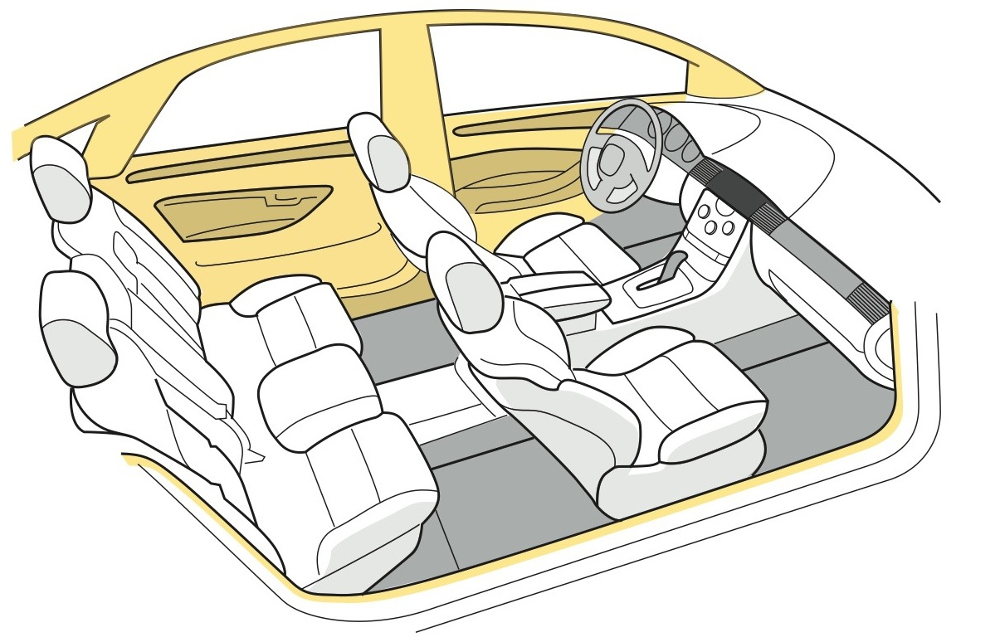

### CONTROLS, INSTRUMENTS & SWITCHES

These are the main elements in the vehicle's HMl or Human Machine Interface.The steering wheel, shifter, hand brake and turn-signal stalks all have to be located where the driver can use them effectively and also allow easy. ingress/ egress. Some of these primary controls may be set up with the initial package if they influence other key. systems. The instrument cluster is usually seen through the steering wheel, so accurate vision studies are. crucial. The illuminated screen should also be shrouded from reflecting in the windshield by the cluster brow.

Other switches and controls will need to be located within reach of the driver and front passenger.

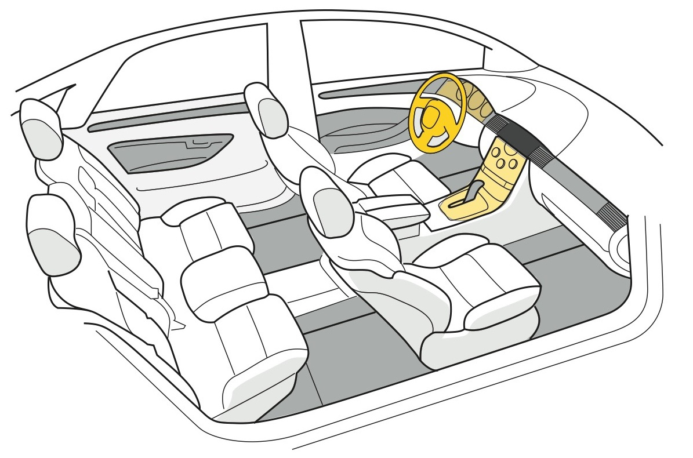

### DISPLAYS
The telematics may effect the layout of the vehicle package. For some cars it may just be a navigation scre and a smart phone dock, but other vehicles may have a 50" flat screen TV with a full home theater system.

Telematics systems and their interfaces are causing a revolution in automotive design and are a high. consideration for customers. As the technology continues to develop the interior design will follow to take advantage of elements that simplify driver tasks and improve customer satisfaction.

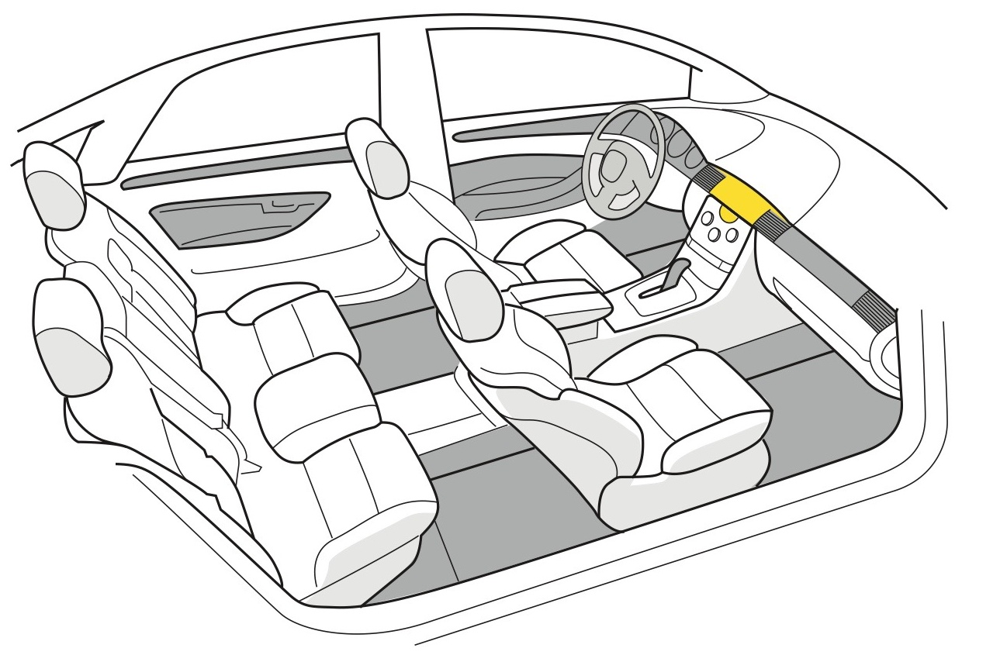

### HVAC & AIR DISTRIBUTION

The main visible elements of the heating, ventilation and air conditioning systems are the air distribution vents and controls. Getting these in the correct location should be a high priority at the start of the interior design.

Additionally, the modules that heat and cool the air and blow it through the cabin are quite large and are usua. located between the fire wall and center stack between the footwells

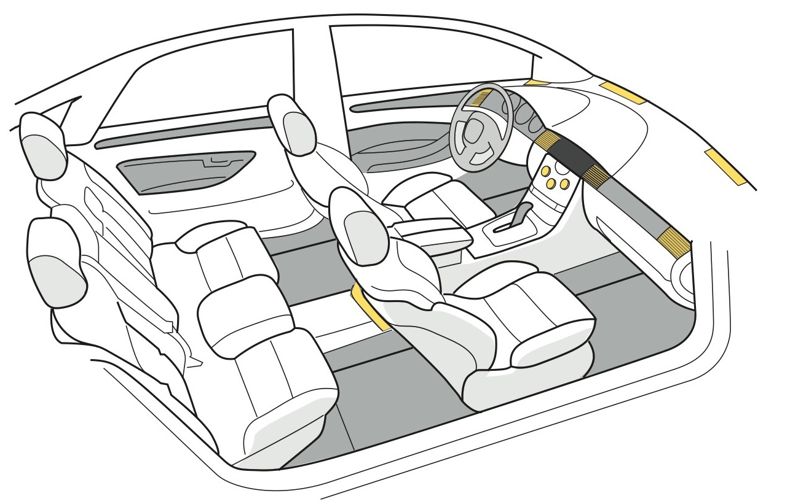

### SEATS

The seats are designed around the occupants'location and posture. They occupy a large volume and adjustment ranges have to be factored into the location of adjacent components. Special seat systems that rotate or stow will require studies at the initial stage to investigate special packaging needs.

The front seat belts will normally be attached to the B pillar. In some vehicles there is no B pillar and the belts. attached directly to the lower body structure and or the seat structure.Attaching belt anchors to seats adds considerable stress loads to the seat structure

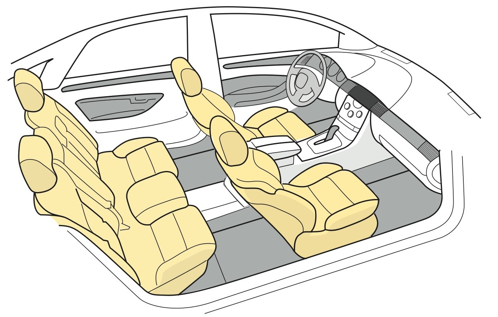

### CARPET & SOUND INSULATION

The carpet does not influence the package too much other than raising the heel points. Luxury cars may have thick sound insulation material which can stack up to become significant to the packaging of the heel point height.

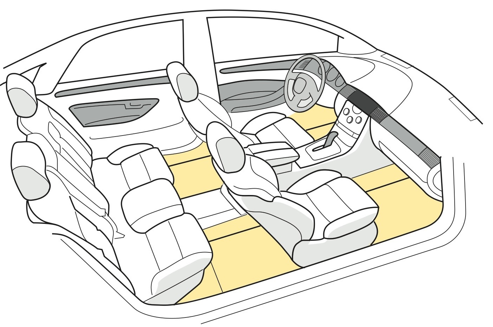

## Section 7.2 Instrument Panels

The instrument panel (I.P.) is one of the most complex assemblies in the car. In most conventional interiors the area around the instrument cluster is very crowded, witl the steering column, instruments, I.P.structure and HVAC ducting all competing for the volume. The center stack layout also needs to be carefully prioritized and organized so that vent outlets, HVAC controls, displays, cup holders, switches and storage trays all fit and are ergonomically positioned.

Additional consideration must be given to safety because much of the instrument panel is within the head impact zone.This means that the contours, radii and hardness of all surfaces have to be designed to pass all interior safety legislation and testing procedures Also, during a high-speed frontal impact the occupants rely on the knee blockers and air bags to restrict their forward travel and cushion the impact.For this reason the relationship of the I.P. and controls to the driver and front passengers is critical, with everything set up for reach, vision and safety.Special consideration should be given to vehicles in global markets where both left and right-hand drive configurations are required..

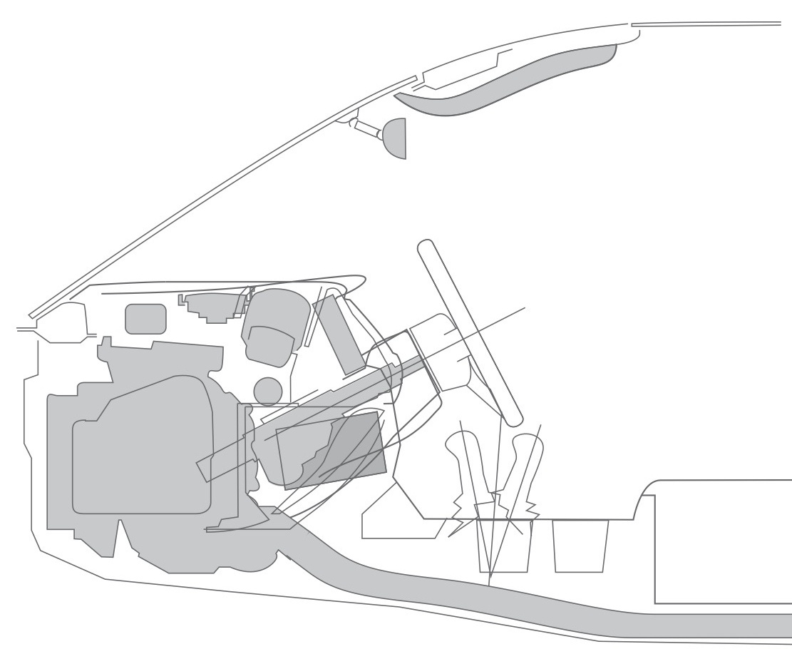

*The instrument panel is crammed with various system component many of these are safety related. These need to be given serious consideration during the initial design stages.*

**Steering Wheel**
Mounted on the steering column, which is usually adjustable and attaches to the main I.P. structure.

**Drivers Side Airbag**
Packaged in the steering wheel hub it works more effectively if the steering wheel is angled toward the driver's face.

**Pedals**
Pedal layout will depend on manual or automatic

**Knee Blocker**
Working in conjunction with the air bag, it is a component of the safety restraint system (SRS). Its relative location to the occupant is critical to prevent an unbelted occupant from "submarining" during a frontal impact. It is connected directly to the main I.P. structure to provide a solid pad.

**Instrument Cluster**
Usually housed behind the steering wheel, occasionally in the center stack, the instruments usually include the speedometer, tachometer, fuel gauge, engine temperature, battery charge, and warning lights. 

**AVN Displays**
Primarily for navigation, audio and communication information.

**Center Stack & Center Console**
The shifter, telematics, HVAC controls, vents, radio, cup holders and banks of switches may be housed in the center stack and should be within easy reach of the driver and passenger. Recommended reach zones should be utilized to place these items.

**Air Distribution Face Vents**
Positioned to blow conditioned air at the occupant's face and torso.

**Passenger Side Air Bag** 
Can be mounted in the top pad or on the front of the instrument panel.

**Door Trims**
The door trims are usually designed to flow into the I.P., so these are often modeled and sketched at the same time. These also relate closely to the occupants and set up the "shoulder room" and "hip room" dimensions. The armrests, release levers and switches should be set up appropriately to the occupant.The door trims are also designed to help minimize injury during a side impact.

**Knee Blocker (Glove Box Door)**
Working in a similar fashion to the driver's knee blocker, it utilizes the glove-box door to provide a solid pad to prevent forward travel off the seat.

### STEERING WHEEL & CLUSTER GRAPHICS SET UP

The steering wheel is set up to the driver as shown in the illustration. There are several additional reference dimensions, which are often used including the distance between the steering wheel and the driver's torso center line and H Point height

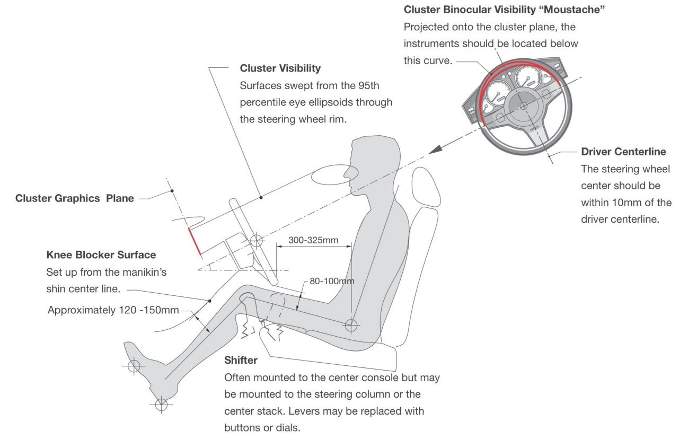

**Cluster Visibility**
Surfaces swept from the 95th percentile eye ellipsoids through the steering wheel rim.

**Cluster Binocular Visibility “Moustache”**
Projected onto the cluster plane, the instruments should be located below this curve.

**Driver Centerline**
The steering wheel center should be within 10mm of the driver centerline.

**Knee Blocker Surface**
Set up from the manikin's shin center line.

**Shifter**
Often mounted to the center console but may be mounted to the steering column or the center stack. Levers may be replaced with buttons or dials.

### REACH ZONES

The objective of the reach envelopes is to provide. recommended zones to locate each control lever or knob tha the driver may need to adjust while driving with a seat belt fastened. The geometry for these envelopes is given in SAE J287. The envelopes are represented by a series of sections cut every hundred millimeters, from 400mm outboard of the driver centerline to 600mm inboard. These sections relate to the H-point location in x, y and z directions.

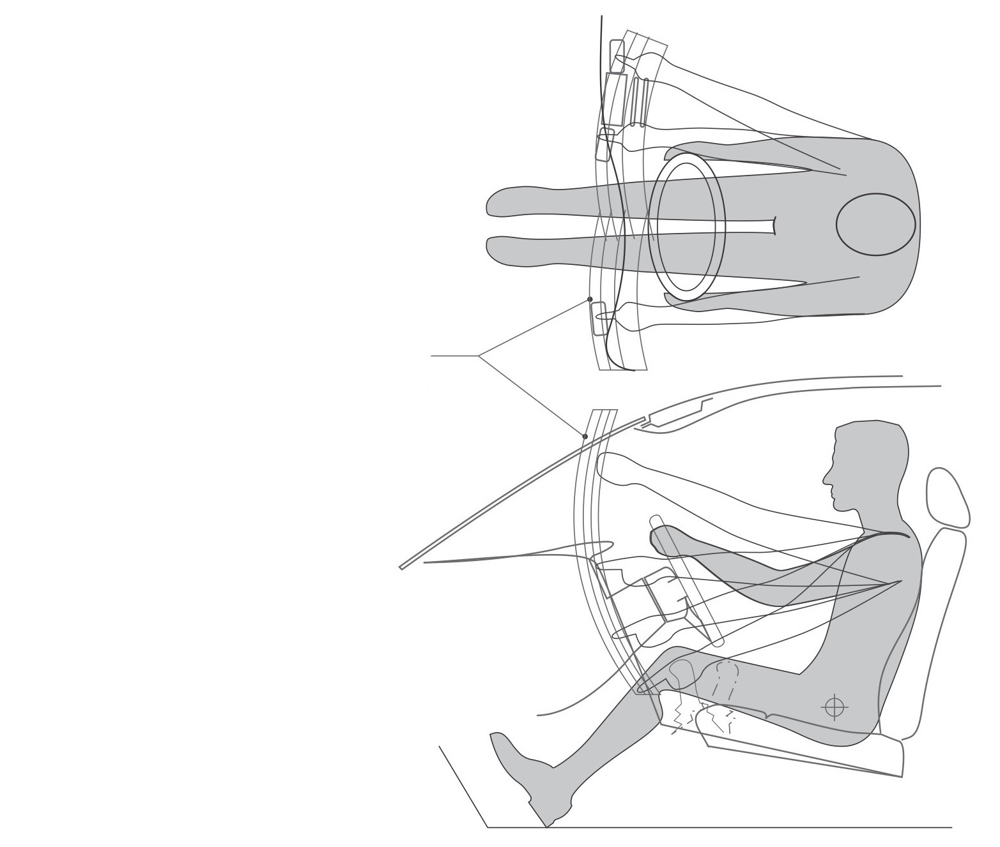
SAE J287 reach envelope surface created between 400mm outboard of the driver and 600mm inboard

### AIR BAG DEPLOYMENT

The passive restraint systems are designed to protect the front occupants in a high-speed frontal and side impact, even if they are not wearing seat belts. Notice that the momentum of the driver causes the manikin to slide forward until the knees hit the knee blocker on the instrument panel. The air bag deploys in a split second to cushion the impact and protect the driver from hitting the steering wheel. The passenger side air bag deploys from either the top or rear of the instrument panel in a similar fashion. Side curtain & seat bolster ai bags also deploy from the side rail and seat cushions to protect the driver's head and torso in side impacts.

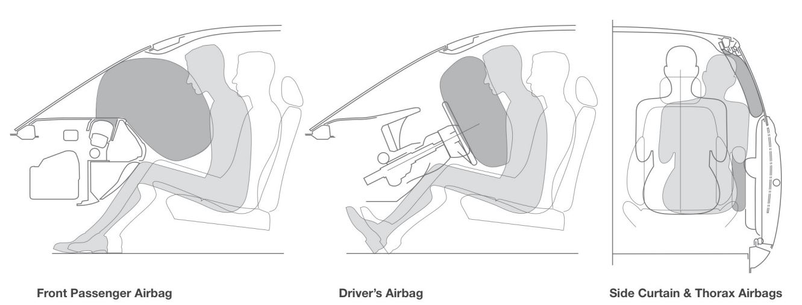

**Front Passenger Airbag**
Deployed from the top of the instrument panel

**Driver's Airbag**
Deployed from the steering wheel hub

**Side Curtain & Thorax Airbags**
Deployed from the roof rail and seat bolster. (For convertibles the side airbags will deploy upwards. from the door trim panel.)

## Section 7.3 Seats

### SEAT CONTOUR & CONSTRUCTION

Most car seat cushions are made from cloth or leather-covered foam, supported by a sprung steel frame mounted to adjustable tracks which sit either on the floor or on risers as shown on the next page.

Establishing a relationship between the H-point and the seat is important but can be difficult to control. The seat cushion foam and occupant flesh combined will compress about 50mm, so the seat should be drawn intruding into the occupant. After the seat has been manufactured, the 3D H-point machine(SAE J826, 76kg) can be placed to check the accuracy of the final H-point location.

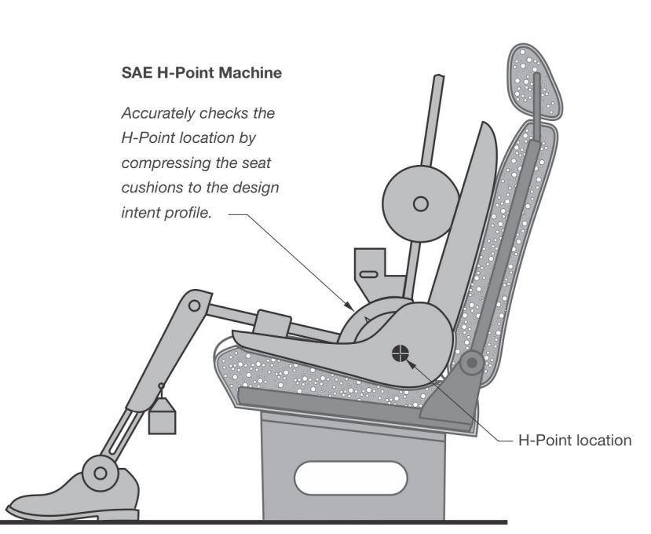

**SAE H-Point Machine**
Accurately checks the H-Point location by compressing the seat cushions to the design intent profile.

### SEAT ADJUSTMENT

Seat adjustment will vary depending on the size and cost of the vehicle. The goal is to comfortably accommodate as many different sized people as possible. Many luxury cars will have extended seat tracks for customers with very long legs. Adjustment can be made manually or powered.

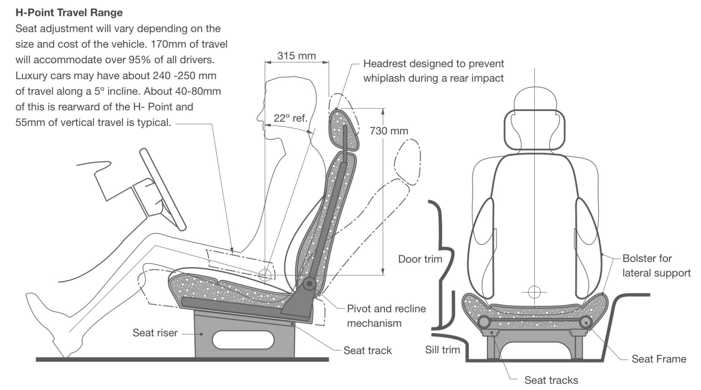

**H-Point Travel Range**
Seat adjustment will vary depending on the size and cost of the vehicle.170mm of trave will accommodate over 95% of all drivers.. Luxury cars may have about 240-250 mm of travel along a 5 incline.About 40-80mm of this is rearward of the H-Point and. 55mm of vertical travel is typical.

### TYPICAL FOLDING REAR SEAT

Ideally, the seat should be designed to provide comfortable seating in the upright oosition and also to stow efficiently in the foot well (with the headrest in place) to provide a flat load floor. Achieving this will depend on the under-floor packaging of the suspension, final drive system, fuel tank, exhaust, spare tire and body structure. An inclined rear floor will help to create a flat load floor with the seat in a higher position.

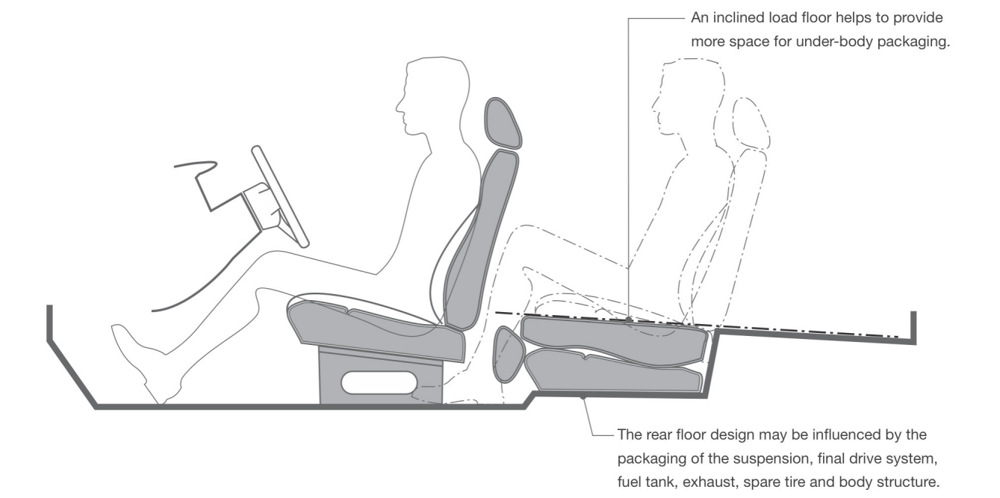

* An inclined load floor helps to provide more space for under-body packaging.

* The rear floor design may be influenced by the packaging of the suspension, final drive svstem fuel tank. exhaust, spare tire and body structure.

### Typical Minivan Stowing Seats

Minivan floors are usually flat and quite high so stowing seats flat into the floor is possible with some creative under- floor packaging. Because the chair height is often high, the seat risers can be used to articulate the seats into their stowed position. When the seats are in their normal, upright position the vacant underfloor storage is an additional bonus for hiding valuables. A feature of this magnitude will have to be considered at the initial package ideation stage.

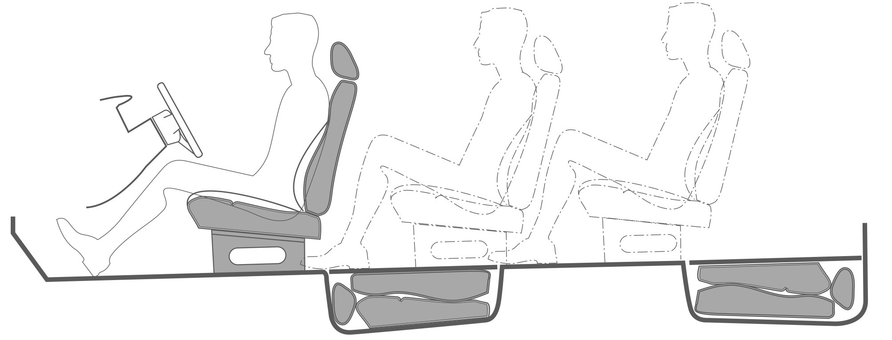

*Before the seat storace wells are created consideration will have to be given to the underbody components such as: the frame rails, exhaust, spare tire, fuel tank and suspension systems.*

## Section 7.4 Cargo

Cargo can take up as much space, or more, than the occupants, so it is worth thinking about from the start. veral factors should be investigated to determine the architecture adjacent to the cargo storage area.

* **Overall dimensions** are usually designed around specific items to be carried. This often relates to the customer's lifestyle. 
* **Interior volume** is a big selling point in passenger cars (see page168). If several smaller items are carried, the volume measurement helps to determine how one car compares to another. 
* **Aperture size** should be as big as possible to allow large items to be fed into the cargo bay.
* **Lift-over Height and Floors** should be as low as possible. For most vehicles this will be just above the bumper height (530mm). For trucks the load floor may be quite high to allow for the frame rails and suspension travel. 
* **Suspension** design may need to be compact to help lower the load floor, or very strong to carry heavy loads.  
* **Load Floors** should be flat to make organizing and moving heavy objects easier. 
* **Underbody** and seat design should be set up for maximum space flexibility 
* **Tumblehome & Backlight** attitude should be as vertical as possible. 
* **Rear Wheel Placement** should be set up for optimal weight distribution.

### PRIMARY CARGO CONSIDERATIONS

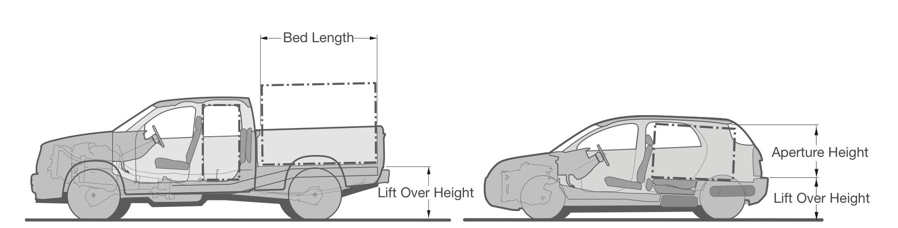

**Pickups and Commercial Vehicles**
These types of vehicles are designed around their capacity to carry cargo. The bed length or cargo bay varies between 1700mm to 2450mm for most commercial trucks. Personal trucks may have. beds as short as 850mm.

**Hatchbacks and Wagons**
Designed for multifunction between carrying cargo or rear passengers. Exterior body shapes may compromise cargo-size potential. The seats will usually fold down over the fuel tank.

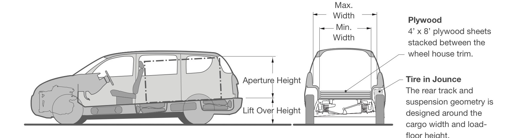

**Minivans**
The angled floor provides a low step in height for the driver and a lift over at the rear bumper height. Loads a. easier to move around if the floor is flat. The underbody components are designed around stowing the seats.

### DESIGNING FOR CARGO

The customer's lifestyle will dictate the type of cargo he or she will carry. Here are some approximate dimensions.

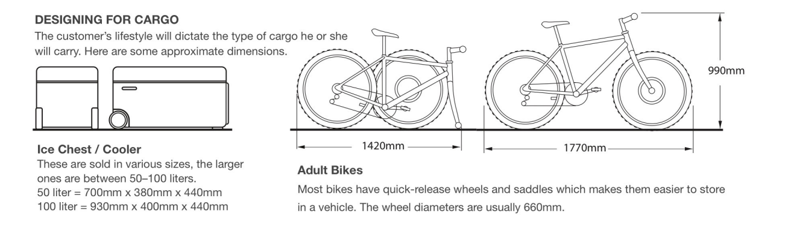

**Ice Chest/ Cooler**
These are sold in various sizes, the larger ones are between 50-100 liters.
50 liter = 700mm x 380mm x 440mm
100 liter = 930mm x 400mm x 440mm

**Adult Bikes**
Most bikes have quick-release wheels and saddles which makes them easier to store in a vehicle. The wheel diameters are usually 660mm.

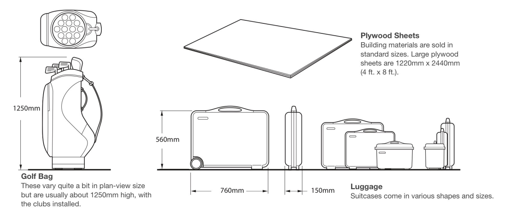

**Golf Bag**
These vary quite a bit in plan-view size but are usually about 1250mm high, with. the clubs installed

**Plywood Sheets**
Building materials are sold in standard sizes. Large plywood sheets are 1220mm x 2440mm (4 ft.x8 ft.).

**Luggage**
Suitcases come in various shapes and sizes

## Section 7.5 Interior Volumes

The interior volume measurement index is used primarily to determine how much usable space is available for the occupants and cargo. The volume is reported in cubic feet or cubic meters and is the sum of the key interior measurement, shown below.

Target volumes are often set out in the functional objectives.Creating a competitive space becomes an important marketing tool, so these numbers are often used by consumer groups to describe how efficient a package is and how it stacks up against a competitive vehicle. 

In the US, the Environmental Protection Agency (EPA) uses the interior volume to determine vehicle-size classifications.

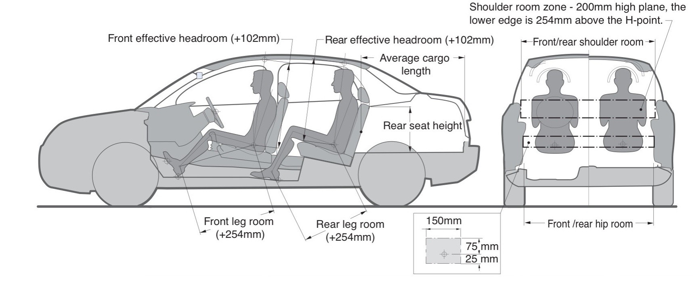

**EPA Interior Volume Index**
|Class|Mini Compact Car|Subcompact Car|Compact Car|Midsize Car|Large Car|Small Wagon|Midsize Wagon|Large Wagon|
|--|--|--|--|--|--|--|--|--|
|Cubic Feet|under 85|85-99.9|100-109.9|110-119.9|over 120|under 130|130-160|over 160|

## Section 7.6 Interface Design - HMI

The term "HMI' or Human Machine Interface covers just about any element that a person may interact with to. operate a vehicle. The acronym became popular in the auto industry during the 1990's as the incorporation of telematics grew and vehicle systems became more. complex, offering owners greater functionality. Before thi. interface design came under the heading of ergonomics and human factors

With this came the headache of designing interfaces that were easy to learn and simple to use, but more importantly not distracting to the driver. It's probably fair to say that. many companies failed to meet these goals leaving their. customers frustrated and hungry for better solutions.

With this came the headache of designing interfaces that were easy to learn and simple to use, but more importantly not distracting to the driver. It's probably fair to say that many companies failed to meet these goals leaving their customers frustrated and hungry for better solutions.

More recently, the arrival of smart phones has created a whole new way of thinking about user interfaces and as the vast majority of drivers now want to connect their phones to the vehicle to access many important aspects of their life (music, contacts, phone, texting, email, internet and an ever growing number of apps that offer unlimited functionality) while they are driving.Designing for this is not only fraught with logistic issues but often creates a very dangerous environment for driving.

Visit www.distraction.gov. for more information on distracted driving

Fortunately, autonomous and semi autonomous driving. technology and legislation is on the horizon and the. responsibility of controlling vehicles is shifting away from the driver to be placed in the systems of the car and. surrounding infrastructure.

With this in mind, the scope of HMI will grow tremendously as vehicle owners choose to focus on other activities such as watching TV, working, sleeping, talking to other passengers etc., rather than actually driving. As technology continues to open up more opportunities a totally new approach to interior design will be required.

Traditionally, the design mindset was"function and operation but with the opportunities that in-vehicle apps provide, designers should think in terms of "content and delivery".This will help them create interfaces that are more aligned with peoples' everyday experiences, such as using a smart phone rather than picking through a mass of buttons and knobs that are frustrating, confusing and inflexible.

Regardless of technology and customer needs, the basid principles for HMl design will always remain the same. It should be safe and intuitive, with the elements designed. around basic ergonomic requirements such as reach and visibility of the occupants.

### HMI COMPONENTS

Although the boundaries for HMl are unlimited, the main focus for a design team are the interfaces that surround th iese can be configured in numerous ways, but the primary components will always take priority over less important ones.

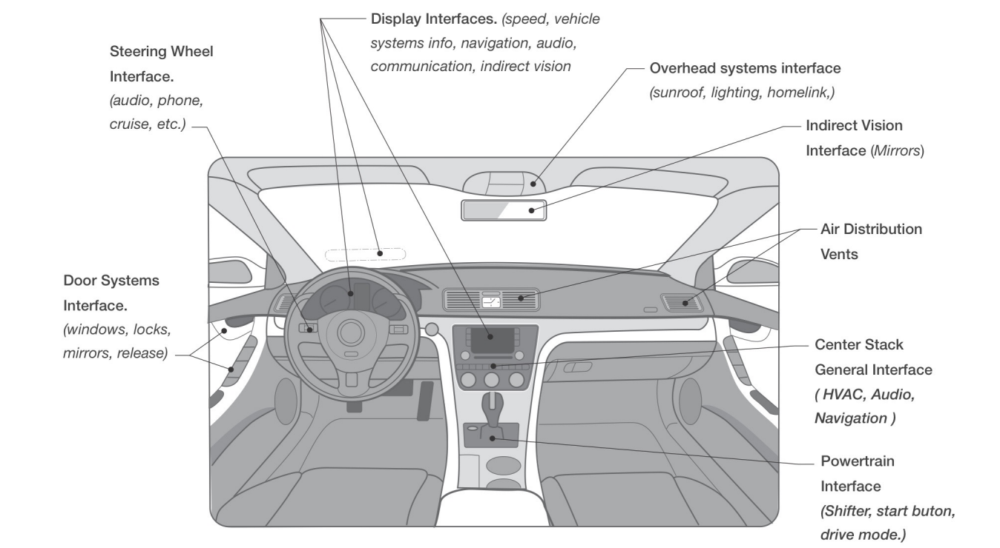

* **Display Interfaces**(speed, vehicle systems info,navigation, audio,communication, indirect vision)

* **Steering Wheel Interface** (audio, phone, cruise,etc.)

* **Overhead systems interface** (sunroof, lighting, homelink)

* **Indirect Vision Interface** (Mirrors)

* **Air Distribution Vents**

* **Door Systems Interface** (windows, locks,mirrors，release)

* **Center Stack General Interface** (HVAC，Audio, Navigation)

* **Powertrain Interface** (Shifter, start buton, drive mode)

Packaging an interior often leads to conflicts over prime space, so before locating the main elements of the HMl, always conside other important components in the interior. Air distribution vents and storage,for example, shouldn't be compromised to incorporate large displays or clusters of switches

Currently there are about five ways to interact withthe various systems. Traditional switches, buttons, turn knobs and levers may always be the best solution to many input operations, but alternative technologies such as touch, voice, gesture and eye tracking should always be considered where appropriate. Determining what technologies are applied and where is critica to the design of a perfect HMI system.

For receiving information the simple interfaces such as the. position of a turn knob or a colored light may quickly inform the. driver of the status of a system. However, the use of large. reconfigurable touch displays is shifting feedback to the driver or a more centralized location with a common visual image. The use. of sound and haptic feedback are also useful to provide. information instantly

Every interface solution has its advantages and drawbacks so these need to carefully considered and new technology. should never be implemented just for the sake of it.

Much of the HMI elements are going to be located in the center stack and cluster areas in front of the driver. Interface that need to be shared with the front passenger, such as navigation displays, climate control and audio should be reachable and visible from the passenger seat. Other interfaces are scattered around the cabin in appropriate Iocations , i.e. door systems (locks, drop glass and mirrors) will usually be located on the doors. Sunroof and interior lighting will be incorporated into the overhead console.Any other systems that are required by the rear occupants shoulq have interface components located conveniently in the rear compartment.Where possible, the interface components should be clustered by system to make operation more convenient and intuitive.Many manufactures now offer remote features such as starting, unlocking and diagnostics from a smartphone app, so these interfaces need to be. included in each scenario.