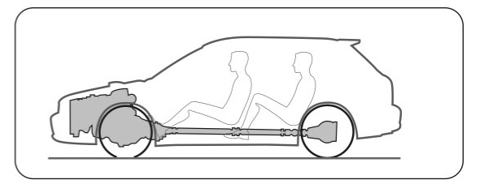

# Chapter 8 Powertrains

> “The powertrain is one of the most influential systems on the architecture, due to its size and weight.
> Battery electric, hybrid and revolutionary powertrains create opportunities to reinvent architectures for more efficiently packaged vehicles."

## Section 8.1 Powertrain Anatomy

The powertrain system provides and transmits power to the wheels.Historically,. the vast majority of cars have used an internal combustion engine (l.C.E.) and some kind of mechanical system of gears and shafts that connect the engine to the driven wheels. Today we see a greater variety of powertains available such as electric motors with batteries or hydrogen fuel cells or combinations of systems. hybrids). The simplified graphic below shows a side view of a conventional.. ongitudinal, front-engine, rear-wheel-drive powertrain layout. Other internal combustion engine configurations can look completely different but contain the same basic elements

**The Engine**
These come in many different sizes and configurations but they are made up from similar components: the cylinder block, cylinder head, oil pan (sump), pistons, crankshaft, flywheel, induction system, exhaust manifold, starter motor, accessory drives and several other auxiliary components. Due to its size, weight and relationship to the wheels it is one of the most influential components in the package

**Transmission**
Manual or automatic transmissions are usually attached to the end of the engine to fe the power at various speeds or ratios to the final drive. The clutch (manual) or torque converter (automatic) is sandwiched between the engine and transmission.

**Cooling**
The cooling module is usually packaged at the front of the vehicle where fast-moving cool air is easy to access. Cooling modules are sized according to the engine power and oading capacity. Often other coolers for oil, air conditioning, transmissions and turbo intercoolers are packaged together with the engine cooler, creating quite a large volume that needs to be placed where there is airflow.

**Fuel Tank**
The volume will depend on the size and range of the vehicle.The main factor to consider for fuel-tank packaging is its protection during a high-speed impact..

**Exhaust**
Exhaust packaging is not usually the focus of early package studies, but large components n the system such as catalytic converters and silencers should be given some thought

**Final Drive**
This comprises the drive shafts, differentials and transfer case (for 4WD). Their motion linked to suspension travel, should be considered during the initial package studies.

### ANATOMY OF A TYPICAL FRONT WHEEL DRIVE POWERTRAIN

The transverse engine, front wheel drive layout is one of the most common configurations in passenger cars.

### ANATOMY OF THE ELECTRIC POWERTRAIN

Packaging an electric system requires a different attitude to a conventional powertrain.. Here the motors are relatively small but the energy or fuel-storage systems are quite arge in comparison to those of internal combustion systems. The main thing to take. advantage of is the low-profile potential for these components.If the system can be packaged under the floor, for instance, it allows the designer the opportunity to reduce the overall length of the vehicle and change the exterior proportions.

**Batteries / Fuel Cell**
The electric power can be stored in batteries or created by a fuel cell. The batteries can be made from various materials based on cost versus power density requirements.The fuel-cell system consists of several components including the fuel stack. compressor and hydrogen fuel storage

**Cooling**
Although electric systems are far more efficient than internal combustion engines, they still generate heat which needs to be dissipated.

**The Motor and Final Drive**
Electric motors are very powerful for their size and. develop a lot of torque at low revs.This allows then to be packaged easily on the axle or at each wheel and also eliminates the need for a conventional transmission. The final drive (shafts) and differential can be attached directly to the motor through. reduction gears.

**Electronic Controllers**
The energy from the power source (batteries, fuel cell or generator) must be processed and fed into the electric motors The control systems that do this can be surprisingly bulky, but they can be put somewhere conveniently out of the way.

## Section 8.2 Location & Orientation

The internal combustion engine has been used in just about every possible location and orientation. Each configuration has its strengths and weaknesses and is chosen to meet specific functional objectives like power, package efficiency, traction or weight distribution. Here are some examples of typical production-vehicle solutions.

### RONT TRANSVERSE ENGINE - FRONT WHEEL DRIVE

One of the most popular configurations for passenger cars over the last 45 years. This is a very space-efficient layout, which can be mounted to the body with the powertrain and. suspension pre-assembled. It is ideal for small economy cars or large minivans where. passenger space is a priority. This layout is also used on most standard midsize cars..

The width between the front frame rails can limit the length of the engine,making this layout unsuitable for luxury cars. The offset transmission also causes the driveshaft length to be. shortened on one side, limiting suspension travel. The shorter driveshaft also requires the. spindle location to be close to the transmission output shaft in side view so the engine Iocation is governed by the front wheel center. This configuration is easily adapted to a. parallel hybrid system with little overall size change.

### FRONT LONGITUDINAL ENGINE - REAR WHEEL DRIVE & 4WD

This traditional layout was introduced in the late 18o0s and is still used on the vast majority o1 pickup trucks, luxury passenger cars and sports cars.The longitudinal orientation allows for Iarger (longer) engines to be installed between the frame rails without restricting the steering angles, helping to reduce turn circles on vehicles with longer wheelbases. Because the engine is not linked directly to the driven wheels it can be positioned for optimum weight distribution. The manual gear shift can also be directly linked to the transmission for crisp gear changes.

Final drive can be through a fixed differential or articulating solid axle. Four-wheel drive is. achieved through a transfer case and additional driveshaft to the front axle. The longer. driveshafts also allow for greater suspension articulation for off-road vehicles

This configuration is usually adopted by manufacturers who specialize in AWD passenge cars. It provides a lightweight, efficient way of getting drive to all four wheels. The main. drawback of this configuration is the long front overhang caused by the relationship of th. transmission to the front spindle.Unlike the transverse engine, the driveshafts are equal lengths and longer, allowing for more flexibility in engine location, but driveshaft angles are still limited. The fixed differential reduces the "unsprung weight," helping to improve. handling over solid axle configurations.

### MID ENGINE REAR-WHEEL DRIVE & AWD

This configuration is best suited to high-performance sports cars. Having the engine mounted longitudinally ahead of the rear wheels optimizes the weight distribution for handling and cornering capabilities but eliminates the possibility of rear passengers. All- wheel drive is also possible with this layout. When the powertrain is located toward the rear of the vehicle, the cooling modules can be ocated remotely at the front or adjacent to the engine, usually in front of the rear tires. This will affect the location of the breathing apertures which will significantly affect the exterior design.

### REAR LONGITUDINAL ENGINE REAR-WHEEL DRIVE & AWD

Once favored by many European makers for low-powered family car this layout is rarely used today. The rear-weight bias can make for tricky handling at the extreme, although electronic traction controls and tire technology have made rear-engine cars more forgiving to drive. Traction for acceleration though, is supreme. All-wheel drive is. easy with this layout. Luggage accommodation under the hood and some rear passenger space are possible with this configuration. H-POINT Powertrains

### MID TRANSVERSE ENGINE -REAR-WHEEL DRIVE

The mid transverse layout is often used on small sports cars. Engine size is limited by the track width, so these are usually found in lightweight, performance cars.The powertrains. are often adapted from front-wheel drive vehicles.This provides great weight distribution. in a car with a short wheelbase.

### REAR TRANSVERSE ENGINE -REAR-WHEEL DRIVE

Rear transverse engine layouts are applied when space (length) is critical. It is ideal for micr.. cars where the engine size is small enough to package behind/under the driver seat, helping. to reduce the length of the vehicle in front of the driver's feet. Frontal impact targets require. vehicles to have free crush space between the bumper and driver's feet. Taking the engine out of the crush zone helps to create a more efficient package.

### MID UNDER FLOOR ENGINE-REAR-WHEEL DRIVE

This layout is used for space efficiency more than weight distribution and is usually applied to micro-utility vehicles. The engine is packaged under the passenger seat, which restricts its size and limits the weight of the vehicle. Access for maintenance can be an issue. AwD is possible through a transfer case.

### ELECTRIC DRIVE

From a packaging perspective, electric drive offers a tremendous opportunity to design more space-efficient vehicles, mainly because the motors are so much smaller than internal combustion engines.The other components that make up the powertrain can b distributed throughout the package in remote locations, unlike conventional powertrain. systems which are linked mechanically, creating a large, heavy assembly that has to be worked around. Another significant difference is the power source or fuel. Conventiona. cars have fuel tanks that are relatively small and can be molded to fit around other components, whereas the energy source for an electric system, either a battery or fuel cell, is quite large and in the case of batteries, very heavy. This can work as an advantage, lowering the center of gravity.

### HYBRID DRIVE SYSTEMS

These systems are seen as a stepping-stone toward future all-electric powertrains.They mix the attributes of internal combustion engines and electric motors to provide a fuel-efficient powertrain with a long range.Although they have more components than conventional systems, the engines can be smaller because of the extra torque provided by the electric motor

**Parallel Hybrids**
The internal combustion engine and electric motor (starter generator) are linked mechanicallv and the power is fed to the driven wheels throuah the transmission and final drive svstem.

**Series Hybrids**
The generator is turned by the internal combustion engine and the electricitv is fed to the electric motor(s).This type of hyrid system offers packaging advantages bv eliminating the need for a mechanical transmission and driveshafts as well as divorcing the internal combustion engine from the wheels.

## Section 8.3 Powertrain Selection

Before choosing a powertrain look closely at the functional objectives and give the following criteria close consideration:

**What "type" of power is required to meet the objectives?**
Some vehicles will require a lot of power, others not so much.High. amounts of torque will be needed to tow or carry heavy loads, favoring large gasoline or diesel engines. Brake-horse-power (BHP) will be a priority for performance cars, sometimes requiring higher revving ability and efficiency rather than outright engine size. Luxury cars focus on quiet, smooth powertrains with good acceleration, while environmental concerns encourage powertrains that are clean and fuel-efficient.

**What powertrains are available?**
Developing internal combustion engines and transmissions takes a Iong time and is expensive, so each manufacturer generally already. has their own limited but strategic range from which to choose.. Sometimes a manufacturer will develop an engine with a competitor to save costs.As the industry moves away from internal combustion engines, it is likely that the manufacturers will source powertrains. from their suppliers rather than develop them themselves.

**What is the main priority for the package?**
For some cars, power and performance are a high priority so the powertrain may dominate the architecture.

For others the passengers and cargo may be the most important consideration so the engine and transmission layout will be driven by package efficiency (see the following page).

**What are the constraints of the package?**
Powertrains occupy a lot of space, particularly conventional internal combustion engines and mechanical transmissions, so finding room for them can be challenging. Some packages can. be designed around large components but often dimensional constraints will limit the size of the engine and limit the final drive options.

**What are the traction requirements?**
The tinal drive system distributes the power to the wheels, so this part of the powertrain will be influenced by traction. requirements. Front-wheel-drive cars gain an advantage because the weight of the engine is directly over the wheels Rear wheel-drive cars work well when loaded or under acceleration but usually require the transmission to pass along the center of the vehicle, through the passenger compartment Driving all four wheels is ideal but a more expensive and heavier solution.Vehicles designed for off-road use or for operation in extreme climates may require special all-wheel drive (AWD or 4WD) configurations, which usually intrude into the occupant package more than a 2WD layout.

### POWERTRAIN PRIORITIES

High-performance cars often use their engine to make a bold statement. In this package the power train dominates the side view and has a dramatic effect on the proportions, exterior design and occupant package.

**Weight Distribution and Aerodynamics**
A mid-rear engine package works well when very high speeds and handling are critical. This layout allows the designer to distribute the weight of the major components closer to the middle of the wheelbase. This reduces the polar moment of inertia, allowing the car to change directions more quickly.Because there is no engine up front, the hood ca be lowered for better air penetration and forward visibility.

**Traction&Torque**
For serious off-road vehicles, traction takes a high priority, so durable 4WD systems. coupled to motors with low speed/high torque characteristics are a requirement.This. usually results in a tall powertrain with a large center tunnel between the front occupants

**Occupants & Cargo**
Minivans require a very efficient package and put great emphasis on the occupants. Th transverse engine and transmission occupy only a small portion of the architecture. Because all of the powertrain components are in front of the occupants' feet, the. entire floor can be designed flat

**Environment**
Alternative propulsion systems are being developed to help reduce harmful emissions, but their size and proportion also create new packaging opportunities.Generally, the motor and transmission are a fraction of the size of conventional internal combustion engine powertrains, but the fuel systems (batteries and fuel cells) are considerably large compared with gasoline fuel tanks. Because no one component is large in all directions the entire powertrain can usually be packaged under the floor.

## Section 8.4 Power Characteristics

Before specifying the engine and transmission, the power requirements should be studied.The type of power will depend of the type of functions the vehicle has to perform

Engine power or torque is measured at the (rotating) crankshaft in pounds/feet (Ib/ft) or Newton meters (Nm). This is multiplied oy the engine speed (revolutions per minute or RPM) to give the total power output which is measured in Horsepower (HP) or Kilowatts (kW)

The curve graphs on the next page illustrate the different power output characteristics of various motors. For a large vehicle to have smooth acceleration or carry heavy loads uphill, it needs an engine with high torque. To maintain a high speed in a small car, a highei revving engine is required with more brake horsepower (BHP). Brake horsepower is the power as measured at the end of the crankshaft, at the engine unlike horsepower which is the power measured at the wheels.

It is quite simple to choose an engine based on the vehicle tunction.A tew other factors may also affect the engine choice such as package space, cost, fuel consumption, emissions, sound and smoothness.The far-left graph illustrates a typical heavy-duty truck engine. It may be expected to carry and tow very heavy. loads so it needs very high torque at low revs.

These graphs show how the relationship between torque and HP changes as the weight of the vehicle reduces and speed and handling become more important. The graph on. the far right shows the dramatic difference between internal combustion engines and electric motors.They provide quick smooth acceleration without the resulting high top speed. Because electric motors are so much smaller than I.C. engines producing the same torque, they create some interesting packaging opportunities.

## Section 8.5 Size & Configurations

The number of cylinders and their configuration will depend on several factors. Cost, power, package space, weight distribution and. vibration are the main considerations behind each selection. Smaller engines tend to have fewer cylinders, which are usually arranged. in straight-line configurations (in-line). As engines get larger to produce more power, the number of cylinders increases, keeping the. piston size to a minimum. With an increase in cylinders the configuration may change from in-line to a "V"formation to minimize the engine length. Some engines flatten the V out to become "horizontally opposed" or "boxer" engines. This not only shortens the engine. but decreases its height which is very useful to help lower the center of gravity and hood or deck height..

Short engines (in-line fours and V sixes) are often used in transverse applications (mounted across the car) where the designer is trying to keep the vehicle length short. The longer engines (straight sixes and V eights) usually need to be placed in a longitudinal orientation generally requiring them to drive the rear wheels

**Proportions Influenced by Engine Length**
Below are four examples illustrating how the number of cylinders and engine length may influence the overall size and proportions.

**Typical Short Engine Applications**
In-line four or V-six engines are often used on vehicles where package efficiency or minimizing overall size is a priority. These can usually be packaged in a transverse orientation.

**Typical Longer Engine Applications**
Larger engines are used when power is a priority. The vehicle. proportions are quite different to the cars with smaller engines.Due. to their length, they are usually packaged in a longitudinal orientation.

### CYLINDER AND BLOCK CONFIGURATIONS

The blocks are configured to help the vehicle meet its functional objectives by either improving the package, performance or comfort. Larger engines have more cylinders to minimize the size and reciprocating mass of the pistons.

## Section 8.6 Fuel / Energy Storage

Traditionally, fuel tanks have been considered part of the "chassis group of components, but with advanced alternative propulsion solutions, storing the energy or fuel is now often the responsibility of powertrain groups.Whether the powertrain uses a traditional internal combustion engine or is driven by an alternative electric solution, the basic principles of storage remain similar.

Wherever possible, the fuel tank, batteries or fuel cell should not, unduly influence the overall package of the vehicle.The fuel tank should be located in a natural open volume away from other key elements.For example, most passenger car fuel tanks are located under the rear seat in an open space created by the rear occupant's posture. Always look for a void space in the. architecture and try to place the fuel there. Because the fuel. storage usually takes up a significant volume, it should always be ncluded in the initial package ideation sketches so that it does no become an afterthought.

Next, consider safety. This is actually the most important part of fuel packaging and should not be overlooked. Unlike other elements in the package, the fuel is combustible, so if the vehicle is in a high speed collision or rolls over, the fuel should remain inside the tank and away from the occupants, on the other side of a firewall, such as a metal floor or bulkhead

The fuel source, whether liquid, gas or solid, is dense and often heavy. In the case of gasoline or diesel, the mass of the fuel tank will vary as the fuel is consumed. On sports cars, this may lead to a noticeable variation in handling if the fuel tank is located in the wrong place. Keeping the fuel as low as possible and toward the center of the vehicle is always the objective. Considering these three objectives usually pushes the fuel to an inboard,. underfloor location often under the rear occupants' seat. It is always good to look for the strongest areas of the body structure and locate the fuel inboard of these. The main frame rails and cross members will help to protect the fuel from impact.

The amount of fuel required is going to depend on the functiona objectives.Range and fuel consumption will be the two main. factors, but packaging space may also limit fuel capacity. Benchmark existing vehicles for ideal fuel volumes.

Batteries generate heat as they provide energy and require cooling, so additional space should be allocated for cooling solutions.Hydrogen for fuel cells is stored under very high pressure (10,o00 psi) and the tanks must be designed and Iocated to avoid rupture on impact. Traditional fuel tanks will. also require some space for the fuel pump and measurement systems.

### FUEL STORAGE LOCATIONS

**General Information**
All of these fuel storage solutions will be molded to fit into as small a space as possible, and mounted symmetrically about the vehicle centerline (where possible) to improve weight distribution Benchmark existing vehicles to under- stand the typical range and fuel consu mption versus the tank capacity or battery volumes. One small design feature to consider is. that the fuel filler will usually be close to the tank location
**Passenger Cars**

The most common location for passenger car fuel tanks is in the space under the rear occupants' seat. In rear-wheel drive cars, the tank has to straddle the prop shaft.

**Minivans and Trucks**

Minivan fuel tanks are quite large but usually package easily under the long high floor structure. Stowing seats. can be an obstacle in some vans.

**SUVs**

SUVs have been forced to move their. fuel tanks from under the rear cargo floor to in front of the rear axle to comply with rear impact safety legislation.

**Small Sports Cars**

It is common to locate the fuel behind the driver in small front or mid-engine sports. cars to help with good weight distribution.

**Front Engine Sports Cars**

Larger sports cars may package the tank on top of the rear axle to help shorten the wheelbase.

**Rear Engined Sports Cars**

Packaging the fuel in front of the dash is uncommon but helps to distribute the masses in rear-engine sports cars.

**Tall Electric Vehicles**

Due to the large but low protile proportions of electric powertrains, it is common to package the whole system under the floor. This may result in a high. occupant package which may be desirable in some vehicles.

**Electric Sedans**

With the reduction in the size of tuel cells and batteries, it is possible to. package an electric propulsion energy. system in the tunnel and various. locations to allow for a low passenger compartment floor.
