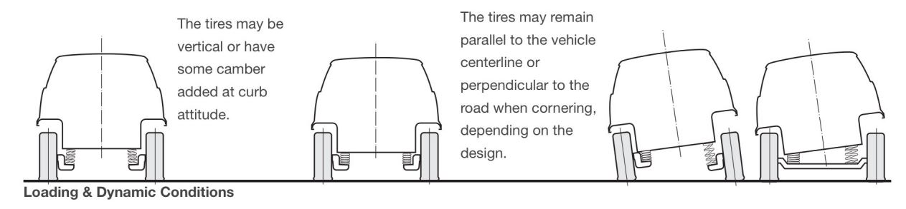

# Chapter 10 Suspension & Chassis

> "Suspension systems are complex Fortunately most designers do not have to fully understand how to set them up, but it is important to know why a particular system is chosen and how they may affect the package and vehicle proportions."

## Section 10.1 Introduction

Choosing the type of suspension system that works with the functional objectives of the vehicle should be done at the ideation phase of the package.

The two main objectives for any suspension system are to provide ride comfor to the occupants and keep all four tires in contact with the road for optimum traction and handling. These can be achieved in many different ways. The. effect that each kind of system has on the tire envelopes and adjacent package components should be understood so that the initial package study can be set up with these in mind.Here are some functions that will determine the type of mechanism and spring/damper units to employ:

* **Heavy Load Carrying**
* **Travel & Articulation**
* **Handling Comfort**
* **Cost**
* **Package Constraints**

A large chunk of the initial package process involves setting up the relationship between the tires and the occupants. This cannot be done accurately until the "Jounce and Turn" envelopes, shown on page 206, have been established by the suspension engineers. These envelopes define the swept area. of the tire profile, as the suspension articulates and the steering angles change. Full jounce and full lock conditions are usually the most important, although these two extremes may not alwavs occur at the same time

There are many different systems, each having positive and negative attributes depending on the application. Each is designed with three main elements, namely the springs, that support the weight of the vehicle and absorb the road shocks the dampers or shock absorbers, that ensure the springs do not overreact; and the mechanism that controls the geometry For each suspension mechanism type there may be several spring types which could work.For example, short / long arm (SLA) suspension can be sprung with coils, torsion bars, or eaf springs. Solid axle types can be supported by coils, leaf springs or air bags, depending on the application and package constraints.

Some systems will package very well and almost disappear in the initial package drawing, others will be massive and have a great influence on the architecture. Truck and off-road. vehicles, for example, will require very strong components. with long travel and articulation capabilities so often solid axle configurations are used. These span the entire width of the vehicle and require lots of clearance to the floor and. underbody structure

Sports and race car suspension is critical to handling, so the geometry cannot be compromised and is set up around the. ideal pivot points. Golf carts on the other hand will employ the cheapest, smallest systems that can be found.Typical priorities for different vehicle types are shown on page 214.

In this chapter there are some examples otvarious systems, their applications, advantages and disadvantages.The main thing to note is that they each work well in several situations so if the first choice does not fit your package well, there will be other options.

### PITCH, YAW & ROLL

These three dynamic conditions happen during acceleration, braking and cornering. They are reactions to inertia, which cause the vehicle to rotate around the center of gravity.

Generally speaking, minimizing these will improve the handlir and in some cases, the ride comfort. The best way to control all three is to reduce the vehicle mass and distribute it evenly as close to the vehicle center as possible and low to the. ground. This reduces the "polar moment of inertia." Once the. aerodynamics and major components are set in the package the only way to further control the pitch, yaw and roll is with suspension design and tire choice.

**Suspension System Attribute Priorities**
Each vehicle will have its own set of priorities for both front and rear suspension.The systems should be matched up to these criteria.

## Section 10.2 Suspension Types

From the designer's perspective, it is important to know why a particular type of system will be applied and how its configuration will affect the vehicle's proportions and package..

If you're not a chassis specialist, understanding the geometry is not so important, but it helps to know the effect that the mechanism will have on the wheels as they travel in jounce (up) & rebound (down).

The illustrations below show some of the many systems currently in use. These are described in more detail on the following pages. Notice that they are divided into non-independent and independent.

Generally speaking, the non-independent systems are used on vehicles that carry heavy loads or require extreme articulation in off. road environments.The independent systems are more sophisticated and provide better handling and ride comfort.

### SOLID AXLE SUSPENSIONS (LIVE & BEAM)

Often used on utility vehicles that are designed to carry heavy loads.Most commonly used on rear suspension, but occasionally on the front.“Live axles contain the final drive system (differential and driveshafts). Beam axles are applied if drive is not required.The advantages include low cost, strength, long articulation, efficient packaging, consistent ground clearance and adjustability. The main drawback is compromised handling due to the amount of unsprung weight.

This system will often be applied to extreme SUVs, providing 4WD, strength and articulation. When setting up the package, allow for at least 150 mm of iounce travel for the axle assembly. The axle will usually be located directly underneath the engine, which will be mounted high enough to allow for the suspension travel. This will affect the driver's eve point which should be located high enouah to see over the hood.

**SOLID AXLE SUSPENSIONS (LIVE & BEAM) Cont.**

**SOLID LIVE AXLE WITH COIL SPRINGS**

**SOLID LIVE AXLE WITH LEAF SPRINGS**

**SOLID BEAM AXLE WITH LEAF SPRINGS**

### TRAILING ARM SUSPENSIONS

Often used on small cars because it packages efficiently in light vehicles with short rear overhangs and most. configurations provide space for the spare tire. This system works well when loaded because the camber change is very limited. The swing arms are often linked by a twist beam which can be located along the pivot axis or the spindle centerline. These reduce body roll and the atter will help the tires remain vertical during cornering.

Using torsion bars and horizontal shock absorbers helps to lower the rear floor, improving cargo space. One drawback of trailing arm suspension is lateral flexing during cornering. Lateral links can be added to the system to improve handling Triangular trailing arms also help to minimize flexing.

**TRAILING ARM / COIL SPRING SUSPENSION Cont.**

**TRAILING ARM WITH COIL SPRING**

**TRAILING ARM WITH TORSION BAR SRPING**

**REAR SEMI TRAILING ARM WITH COIL SPRING**
Semi trailing arms create a slight camber change during cornering which can optimize the handling attributes during hard driving.A solid beam axle can be mounted to trailing arms to create a simple lightweight system.A panhard rod or Watt's link controls lateral movement of the beam.

### STRUT SUSPENSION SYSTEMS

**STRUT SUSPENSION SYSTEMS Cont.**

**FRONT - MCPHERSON STRUT/COIL SPRINGS (INDEPENDENT)**
Very common front suspension on passenger cars. McPherson struts incorporate the steering axis into the strut centerline, reducing cost.This system packages well with transverse engines, but usually requires a high fender to fit the spring above the tire. Chapman struts are used on rear applications where steering is not required.

**REAR-CHAPMAN STRUT / COIL SPRING (non independent)**

Ihis system can be very simple, inexpensive and lightweight (as shown).It also packages very efficiently It is ideal for lightweight, entry-level sports cars. More robust versions can be applied to larger, more capable cars and SUVs. In these applications the hub may be attached to the control arm rather than the strut.

### SLA (SHORT-LONG ARM)

These are the most sophisticated systems, mainly used on high- performance and luxury cars, at both front and rear. Trucks and SUVs often use the SLA (short and long arm) system for their front suspension.

The geometry of the control arms is designed to control camber change to maintain each tire's contact patch as the body rolls during cornering. Packaging the inner pivots axis can be a challenge on some vehicles.

Note that the upper control arm can be mounted in a low or high Iocation depending on the ideal attachment position and drive shaft configurations. Springs are usually coils but torsion bars and leaf springs can also be used to suit the application. On open-wheel race cars the coils are often mounted longitudinally inside the body to improve aerodynamics. These are actuated by a push rod and bell rank.

Tires can be set vertically or with camber at curb attitude. Camber increases as the vehicle is loaded.When the body rolls during cornering the controlled camber change compensates,keeping the tire contact patch on the ground.

**REAR -MULTI-LINK/COILSPRINGS (INDEPENDENT)**

