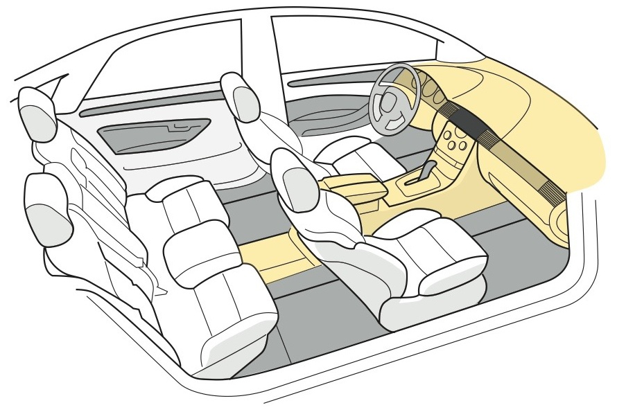

# Chapter 13 Design Exercises

> Building a basic package can be quite a complex process, so take each step one at a time.
> The following assignments outline the tasks that need to be accomplished at each stage, following the order of the chapters in this book.
> These are ideal for students to complete as weekly homework assignments,helping to build a conceptual vehicle package over a typical14-16week term.

## Section 13.1 The Exercises

The tollowing ten assignments outline the tasks that need to be accomplished at each stage of the design process, following the order of the previous chapters.

Although each individual assignment can be focused on one at a time, the result of the research and execution of each study may affect the. outcome of previous exercises, so be prepared to continually adjust the concept as you learn more about the possibilities and constraints of the architecture.

These are ideal for design students to complete as weekly homework assignments, helping to build a conceptual vehicle package over the course of a 12-14 week term.

### Exercise One Setting Functional Objectives

> Reference Chapter 3

Set out some clear functional objectives for the three entities: customers, brand and market environment.

**CUSTOMERS**:

* Purpose of the vehicle.
* Number of occupants.
* Type of occupants.(gender, age, nationality, disabilities, etc.)
* Performance and capability expectations.(acceleration, top speed, handling, off-road capability, GVW, towing capacity)
* Purchase cost & cost of ownership.(economical, luxurious, exotic, practical)
* Image.(modern, retro, prestigious, ecological, safe, bold, high-performance)

**MANUFACTURER /BRAND**:

* Vehicle position in the brand portfolio.
* Investment & manufacturing costs.
* Annual sales volumes(1-100;100-5,000;5000-50,000;50,000-100,000;100,000-1,000,000)
* Marketing strategy. (traditional dealerships, internet, loss leader, halo, concept)
* Technology.(traditional, advanced)

**MARKET / DRIVING ENVIRONMENT**:

* Infrastructure, terrain & climate.
* Size limitations.(length, width, height, tire size, engine size & output)
* Legislation.(safety, emissions, fuel consumption, lighting)
* Crashworthiness.(front & side impact, rollover, low-speed impact)
* Consumer advocate groups.(JD Power, MSN Autos, EuroNCAPInsurance Institute for Highway Safety Consumer Reports)

### Exercise Two Package Ideation

> Reference Chapter 4

Loosely sketch some basic package concepts based on the functional objectives which drive the architecture.Each sketch should only take a few minutes.Don't worry too much about scale and keep sketching until you have exhausted all the possibilities.

**Focus on the following elements:**

* The occupant package.
* Cargo.
* Powertrain & Fuel Storage.
* Wheels & Tires.
* Special features - doors, flexible seating, aerodynamics alternative body construction, convertible top, etc.

**Sketch each package concept in at least two orthographic views and add isometric illustrations where necessary.**

Continually revisit the functional objectives to make sure that they are feeding your ideation. Work out which systems are important to the success of the concept and. begin to establish a hierarchy. Determine which elements are subordinate and which ones lead.

### Exercise Three Size & Proportion

> Reference Chapter 5

Choose a direction trom the package ideation sketches and establish the size & proportion of that concept. Look again at the functional objectives to see which key dimensions deserve the most focus.Use known benchmark products to help build the package in chunks, using a separate product for each chunk if required

**Set up comparisons for:**

1. Occupant package and interior environment.Look at occupant location and posture.Also focus on the space around the manikins.
2. Cargo.Think about volume, size and weight of the items to be transported, and set up space around the occupant package.
3. Powertrain package. Choose a product with a similar propulsion system and note the spacial envelopes around the major components.
4. Ground clearance. Look at vehicles with similar capabilities (off-road vs. on-road) to your concept, and note the relationship of the underbody components to the ground..
5. Crashworthiness. Study vehicles that meet the appropriate safety standards and note the "crush space" and structure allocated to protect the occupants.
6. Wheel and Tire package.Compare the tire outside diameter and profile to vehicles of similar size and capability.
7. Other Elements.Study other significant components in the concept, such as windshield placement, closure articulation and cut lines, lighting, and seating flexibility

**Establish some key target dimensions:**

WIDTH
HEIGHT
WHEELBASE
TIRE O.D.
GROUND CLEARAN

### Exercise Four Occupant Packaging

> Reference Chapter 6

Set up the occupant package based on the functional objectives and benchmark studies. Accurately position the SAE 95th percentile male driver in front and rear views. Include all of the theoretical construction lines and datums, including the H- point, Heel point, ball of foot, shin and thigh centerlines, back angle, effective headroom (8 degree) line, headform and eye. ellipse with vision angle lines.Next locate the rear passengers also using the 95th percentile manikins

**To help set up the occupants prioritize the tollowing**

Aerodynamics, handling, comfort, space, ingress /egress, safety, security package efficiency, ground clearance, durability and load carrying.

**Establish some key target dimensions for each row of occupants**

H-POINT HEIGHT FROM GRG
CHAIR HEIGHT (H-Pt. to Heel)
BACK ANGLE
FORWARD VISION ANGLES
EFFECTIVE HEADROOM
SHOULDER ROOM
LATERAL LOCATION
COUPLES (if applicable)

### Exercise Five Interior & Cargo

> Reference Chapter 7

Set up the interior environment around the occupants.Look at each major component/system and establish its relationship to the. occupants.

**Focus on the following**

Headliner and door trim. (use these to set up the exterior hardpoints)
Cargo storage areas.
Steering wheel, controls and instrument panel.
Telematics/ HMI.
Seating systems.
Floor consoles.

**To help set up the storage areas, list the items to be carried and note the size & weight where appropriate.**

Examples:

Purse, cell phone, personal devises, briefcase, groceries, dry cleaning weekend luggage, family vacation luggage, dog, tools bikes, skis/ snowboard, strollers, building/landscaping materials and golf clubs

**To help allocate additional space and provide other attributes, also note interior functions that may require special consideration.**

Examples:

Outside visibility, reclined sleeping, video screen visibility face-to-face seating, tables and work surfaces, work/. business meetings, automated driving, interior flexibility,. (i.e., stowing seats) and cooking..

### Exercise Six Powertrain Packaging

> Reference Chapter 8

Select and lay out the propulsion system. Look carefully at the functional objectives and benchmark studies to understand the concept's performance requirements, which include top speed, acceleration, weight, fuel consumption, emissions and traction requirements.If a traditional internal-combustion-type system is chosen, this process should be quite straightforward, by. benchmarking existing products. Specifying a less conventional electric or hybrid powertrain will be a more complex process ang involves calculations to establish a power-to-weight (and vehicle efficiency) ratio vs. speed and range.

**Set out the priorities for the powertrain.Organize the following in order of priority:**

Power, image, handling, aerodynamics, off-road capability, cost, fuel consumption and environment, package efficiency and occupants.

**List target specifications for the following:**

Top Speed
Acceleration 0-60mph
Fuel Consumption (MPG or equivalent)

**Specify the type of system and the components:**

* Type (internal combustion, electric, hybrid or other)
* Fuel type (Gasoline, Diesel, Hydrogen, Biofuel, Electric, etc.)
* Motor:
  Size (cubic capacity)
  Configuration (V8, Flat 4, straight 6, etc.)
  Location
  Orientation
  Power output. BHP or kW.
  Torque

### Exercise Seven Wheels & Tires.

》Reference Chapter 9

Establish the wheel and tire sizes for your project and position them in the package. Start by setting an approximate target tire diameter and profile width.Also state the desired wheel size.Locate the spindle centers and establish the track width。

**Check the functional objectives to establish the priorities for this task. Organize the following nine factors in order of priority:**

On-road handling,off-road capability, high GVW, package efficiency ride comfort,appearance/image adverse weather,brake packaging, rolling resistance

**List the following specifications for the Front & Rear Wheels and Tires:**

* Technology and Tire type. (conventional, run flat, airless, passenger car, truck, off-road, variable inflation, etc)
* Tire-size specification. (i.e., P 225/45 R 17)
* Tire O.D.
* Wheel rim width.
* Also confirm: The Wheelbase and Track Width.

### Exercise Eight Suspension and Chassis

> Reference Chapter 10

Select a front and rear suspension system for your concept. Look at the functional objectives and prioritize the following:

On-road handling, off-road capability, high GVw, package efficiency, ride comfort, exterior design and cost.

**Based on the priorities, choose the appropriate systems and describe the following:**

* FRONT - System name or mechanism and Spring type
* REAR - System name or mechanism and Spring type
* Suspension travel dimension front and rear. (curb attitude to full jounce)

Optional:

* Steering System
* Braking System

### Exercise Nine Body & Exterior Trim

> Reference Chapter 11

Determine the body style for your concept and choose a type of construction. Think about the following before making these decisions:

The vehicle's purpose and function, annual sales volumes, weight targets, cost, investment, paint, durability, towing capacity, closures, load-carrying capacity.

**State the following:**

* Body style (sedan, hatchback, minivan, pickup truck, coupe, convertible, etc.)
* Number and type of doors. (sliding, gull wing, rear-hinged, etc.)
* Other significant closures. (tail gate, hatchback)
* Estimated Annual Sales volumes.(custom, low, medium, high)
* Type of construction.(unibody, body on frame, space frame)
* Materials for the structure, exterior panels and closures.
* Special glazing requirements. (tall belt height, extreme windshield angle, dropping side glass, etc.)
* Consider the size and location for the other exterior features. (lights, breathing apertures and license-plate pockets)

### Exercise Ten Create a Package Logic Drawing

> Reference All Chapters

Compile the information gathered in the previous nine exercises and clearly communicate the package with a clean and graphically appealing drawing which should be created in Adobe Illustrator or a similar computer graphic system. Reference the layouts on pages 61-64.

**Include the following information:**

* Functional objectives tor the concept and a briet description of the vehicle.
* Target sepcifications.
* Orthographic side and end views showing the vehicle outlines and the basic layout ot all o the systems. (Add a plan view if required to clarify the story)
* Benchmark comparisons that illustrate the overall proportions, the occupant package, powertrain layout and any other significant features.
* The key exterior and interior dimensions.
* A basic description of each system.

The size, scale and layout of the drawing should be determined by its use (with other design work) as part of a studio presentation, but should also work in a portfolio. This may require it to be set up on several sheets and printed out at various scales to suit each specific purpose

---

# END OF THE BOOK

For further information about the contents of this book or supplementary education resource material for this subject contact: stuart@curbindustries.com
