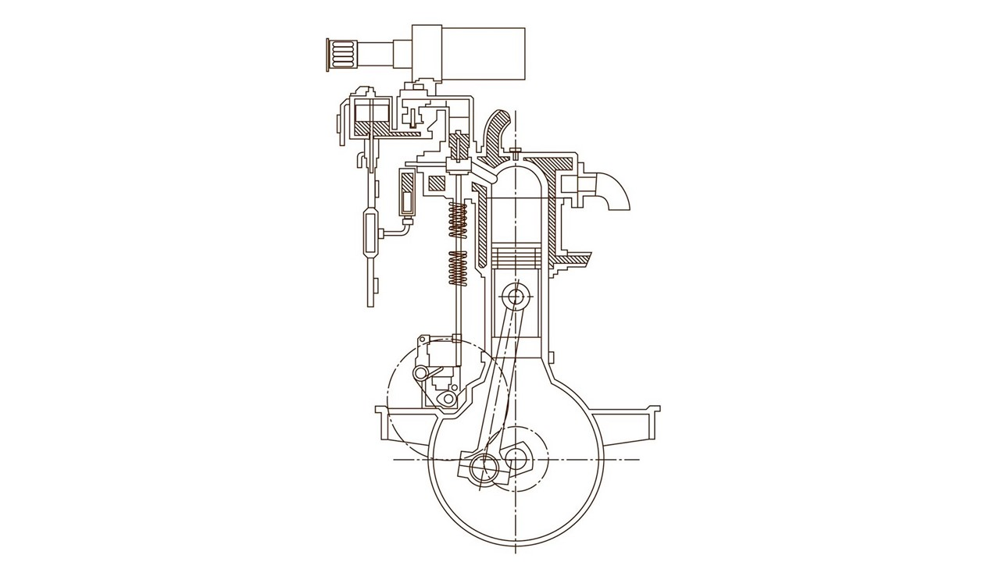
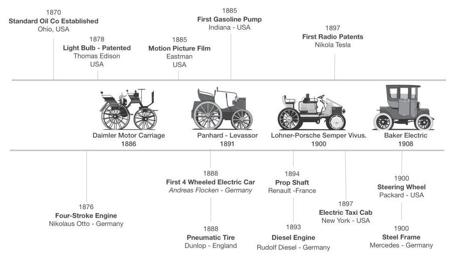
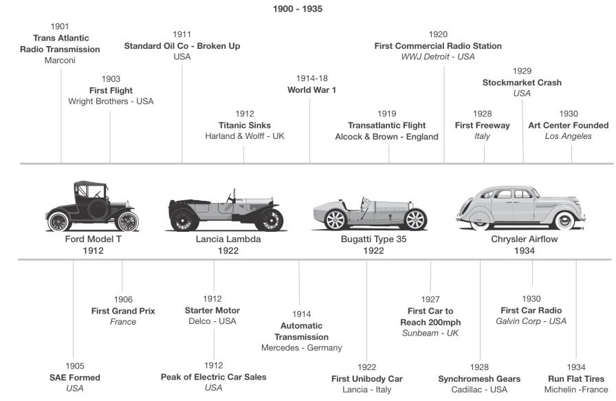
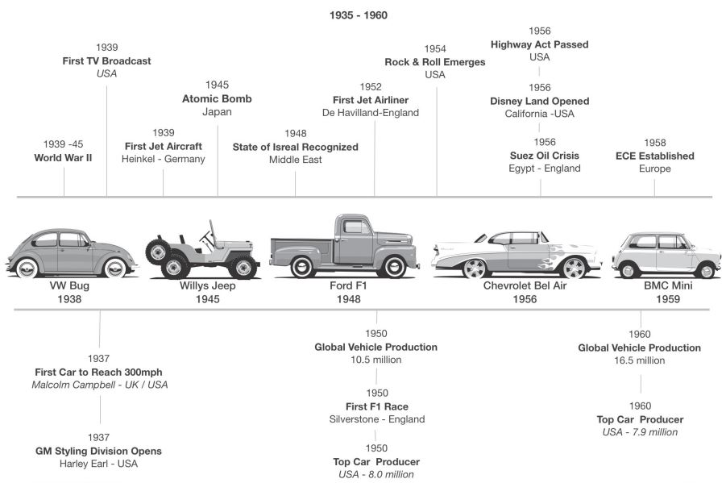
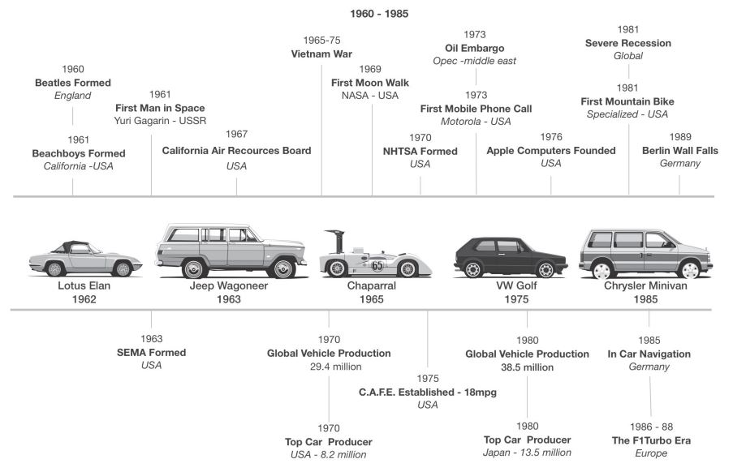
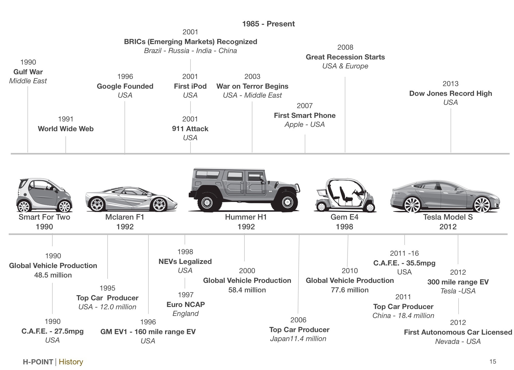
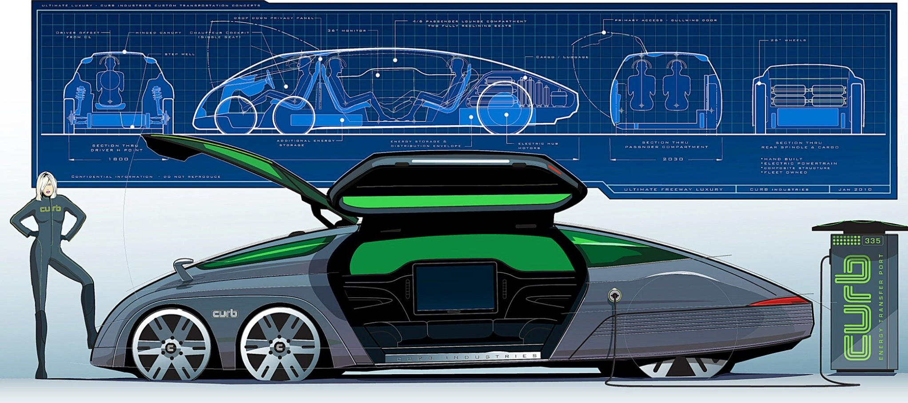

# Chapter 1 History

Probably the best way to understand the role of packaging in the design process is to look at how and why vehicle proportions have changed over time.

The next few pages provide a concise overview of some of the key milestone vehicles from 140 years of automotive history and the events that influenced them.

Note that many of the timeless cars and trucks shown were created entirely by their architects "Fashion dates, but logic is timeless" but when styling or emotion became the. Sir Alec Issigonis - Vehicle architect driving factor for the concepts, their lifespan and designer of the 1959BMC Mini was often short.

## 1.1 The Milestones

### THE INTERNAL COMBUSTION ENGINE

Probably the most significant milestone was the invention of the four-. stroke internal combustion engine (l.C.E) by Nicholas Otto in 1876. This turned out to be one of the most significant inventions in the history of. mankind. Its location, size, configuration and orientation have always had a major effect on a vehicle's exterior proportions..

Many of the early cars had simple two-cylinder engines, but as customers demanded more power the I.C. engine developed rapidly. The first six- cylinder appeared in 1902 followed by a V8 in 1903. Cadillac built a V12 ir 1909 and started to mass produce a 70hp V8 in 1915. This became the benchmark motor in the USA for many years.

In 1912, Cadillac also introduced the starter motor made by Delco. This helped to give the internal combustion engine a clear advantage over steam and electric power plants, which had until then dominated early. automobiles.

### SIGNIFICANT MILESTONES IN AUTOMOTIVE HISTORY

Many factors have driven change in automotive design over time. Man's desire to continually improve our way of life have been a big part of this, but sometimes other emerging technology or a challenging situation can accelerate or hinder the automobile's development. As always, necessity is the mother of invention but with cars, sometimes passion and emotion are all the industry need to take the next step.

---

---

---

---

---

---

## 1.2 The Cars

**THE FIRST MOTOR CAR**
Gottlieb Daimler is generally credited with creating the first. vehicle powered by an internal combustion engine.Many early cars were adapted from horse-drawn carriages and haq the same body and chassis architecture as well as a similar occupant package. Carl Benz's "Motor Car" was an exception and had a new, ground up package.

")
*This is probably one of the first examples of an automotive designer stuck with the paradigms of the past. It was called the motor carriage and that's exactly how it was configured.*

**FRONT-ENGINE LAYOUT**
Panhard-Levassor made some great strides in the early years of automobile design. They were the first to place the engine. in the front of the car and link it to the rear wheels through a clutch and multi speed transmission.The Panhard-Levassor Company was one of the largest auto companies before WW I.

")
*At this time, many other cars added faux hoods to copy th style of the European Panhards. Significantly, millions of luxury cars and trucks today are built with this same basic component layout.*

**HYBRID PROPULSION**
Prof. Ferdinand Porsche was originally an electrical engin and before he went on to develop some significant petrol. engined cars, he developed hybrid cars for the Lohner company.The Semper Vivus was introduced at the Paris World Exhibition in 1900.

")
*It's taken over 100 years to get back to this way of thinking,. understanding that electric power has it's advantages over petrol and visa versa.The hybrid gives the customer the best of both worlds*

**ALTERNATIVE PROPULSION**
Electric and steam cars were in the majority in the US at the. early part of the 20th century.Companies like Baker, Wood and Detroit Electric developed electric vehicles that were clean, reliable and easy to start. Steam technology was. mature at this time and cars made by Doble and Stanley. were also quite successful.

")
*The power, range and lower cost of I.C. engines soon made electric cars uncompetitive. Ironically, the introduction of the electric starter motor in 1912 finished them off.*

**MASS PRODUCTION**
Henry Ford set out to democratize the automobile, by. reducing the price of a car and raising wages through mass. production. The Ford factory produced one Model T every. three minutes.They were all painted black because that was the only color that would dry quickly enough to keep up with the production line

")
*With annual vehicle sales today of over 60 million, it looks like Mr. Ford succeeded. The design of cars today is often. influenced by the complexity and investment of high-volume. mass production.*

**UNIBODY CONSTRUCTION**
This Lancia was a revolutionary car for the early 1920s, and the first car with a load-bearing unibody (monocoque). Othe innovations included independent front suspension with coil springs and a narrow 13o, V4 aluminum engine with a single overhead cam

")
*Thevast majority ot passenger cars andvans todayarebuilt with a frameless unibody structure and independent suspension.*

**ART & SCIENCE**
Ettore Bugatti was not only a great designer but also a brilliant vehicle architect who, along with his son Jean, were responsible for some of the most beautiful cars in history. Ettore had the unique ability to design structure empathically, without stress calculations.The Type 35 is still one of the most appealing and successful race cars of all time

")
*Today, computer systems can aid designers to create organic structures which are fully optimized and often naturally beautiful.*

**AERODYNAMICS & CAB-FORWARD**
Inspired by aerodynamic forms created by the Hungarian Paul Jaray, the revolutionary Airflow package pushed the. occupants forward to the middle of the wheelbase.It was also one of the first US production cars to adopt unibody construction

")
*The Airflow's advanced design was too radical for the market. and was a disaster, almost bankrupting Chrysler. But after the initial design shock had passed, both Ford and GM adopted this form and architecture and were very successful with it.*

**THE PEOPLE'S CAR**
Probably one of the best known cars of all time, it was originally designed before Ww II, by Prof. Ferdinand Porsche with sponsorship from Adolf Hitler. Much of its architecture was inspired by the Czechoslovakian Tatra T87.The rear engine (flat four) "people's car"was mass produced between 1938-2003, selling over 21 million units

 VW BEETLE (GERMANY)")
*Many other vehicles were built on its platform and although very. successful in its own right, it is worth noting that the Beetle has had little influence on cars today.Its architecture was effectively a blind alley.*

**THE 4x4**
Originally designed by the American Bantam Car Co. and built by Willys Overland in 1939 to carry four people-or two with a stretcher-over the rough terrain of war-torn Europe. The Citizen Jeep (CJ) was produced for civilian use after WW II. This was the first purpose-built 4x4 SUV.Updated versions with similar architecture are still manufactured today and it has become a design icon.

 (USA)")
*The design, proportions and basic architecture are based on pure logic and have remained almost the same for over 65 year The seven-slot grill and headlight layout also became the Jeep brand logo.The original Land Rovers were inspired by and designed from the early Jeeps*

**THE PICKUP TRUCK**
The DNA for pickup trucks can be traced back to the 19th Century, but the Ford F150 has held the title of best-selling vehicle in the USA (and the world) for 20 years. Its architecture is still very similar to the original F1 with its body and bed mounted on a durable steel frame. The longitudinal front engine RWD/4WD powertrain and solid rear axle/leaf spring suspension layout also remain the same

")
*Truck architecture is another example of design based on logic. Today's trucks are becoming more luxurious and are used more as lifestyle vehicles.Crossover and derivative SUVs are often based on truck platforms.*

**DESIGN WITH PASSION**
The'50s &'60s were glorious years for the US automobile. industry with annual production consistantly above 8 million. Fueled by cheap abundant gas, a strong economy, the baby. boom and post war optimism, the cars of this era grew to be enormous, flamboyant and ideal for customizing.It is said that the difference between European and American cars in this era was "A foot of styling." What followed in the'70s fue crisis was not pretty.

")
*The US design studios simply could not react quickly enough to downsize their concepts during the oil crisis of the early 1970s. They lost a huge amount of market share to smaller, more. efficient imports.Domestic market share has since dropped from 95% in the '70s to less than 50% today.. H-POINT|History*

**PASSENGER PRIORITY**
Sir Alec Issigonis was asked to create a respectable small car to help Britain get through the Suez oil crisis. His answer was the Mini, which remained in production for 40 years, with over 5 million sold. The transverse engine with FWD and 10 inch wheels created a "passenger priority"package which has been adopted by almost every high-volume car manufacturer in the world

")
*Probably one of the most influential cars of all time, its innovative package layout can be seen in hundreds of millions of vehicles worldwide.Because of its relative complexity, the Mini made almost no profit for the manufacturer, but the new architecture allowed Issigonis to design a revolutionary exterior.*

**MID-ENGINE LAYOUT**
Charles & John Cooper entered their underpowered Formula 2 T45 in the 1958 Argentine F1 Grand Prix and won.This was the first car to win a GP with mid-rear engine layout which. helped to create a more balanced and aerodynamic race car. The Cooper Climax T51 won the world championships in 1959 & 1960 and no front-engine cars have won an F1 race since.

")
*The Benz & Auto Union race cars of the 1920s & '30s were the first mid-rear engine cars, but the Coopers were the first to win races because of their layout, rather than brute force.Today, the mid-engine layout is the signature for most European super cars*

**THE BRITISH ROADSTER**
Colin Chapman was a very innovative light weight sports car architect who designed several classic icons.The Elan. defined the small British roadster architecture. It weighed 590kg with a short 84"(2135mm) wheelbase.The small longitudinal front 1500cc engine drove the rear wheels and Chapman utilized the prop shaft tunnel as a "backbone" for the body structure

")
*Many of today's small roadsters are based on the Elan's philosophy but are usually larger to provide space for a more generous occupant package, a more powerful engine and a crashworthy body structure.*

**THE LUXURY SUV**
The first fully off-road capable luxury SUV, the Jeep Wagoneer was the inspiration for the very successful Range Rover in 1970 and many other models that followed,. including the 1984 Jeep Cherokee with a unibody. Initially,. luxury SUVs represented only a small percentage of the market, but today they sell in very high volumes and earn large profits for their manufacturers. Their main drawback is fuel consumption

")
*To meet their originalfunctional requirements,the architecture requires a very high floor and seating position.This provides owners with a sense of security and status. Most SUVs are sold for their image and security, not their functionality.*

**DOWN FORCE**
Designed by Jim Hall, the Chapparel was the first successful. racing car to employ a large wing to create down force to increase traction without adding mass.Although much about aerodynamics and vehicle dynamics was known after Ww Il, it took at least 20 years to apply the knowledge

")
*The lesson to be learned from this car is that some quite obvious solutions may take a while to become obvious to everyone There are still plenty of inventions waiting to be realized*

**THE HATCHBACK**
The Golf was not the first hatchback. That honor goes to a. version of the 1954 Citroen Traction Avant. It also owes mud of its proportions to the 1971 Alfa Romeo Alfasud (also designed by Giugiaro).However, the Golf helped to define the formula for the perfect European family-sized hatchback.The GTI versions also helped to define the "Hot Hatch" market

")
*Hatchbacks are a staple of the European markets where many oeople can only afford one small car which has to serve many functions, including being easy to park.*

**THE MINIVAN**
The thought of driving a minivan with imitation wood cladding sends a shudder down the spine of any young designer.However, the FWD, car-based architecture of the Chrysler Minivans was a stroke of genius, providing Americans with justification to once again drive large vehicles because these were efficient.

")
*Ford and GM simply downsized their full-size vans with "on frame"body construction and RwD, which made them inefficient. Chrysler's passenger priority, unibody, and FWD architecture (like the Mini) changed the global minivan market forever, increasing sales by millions of units.*

**NEW MICRO CARS**
The Smart car was designed specifically to offer safe, inexpensive, easy-to-park commuter transportation for two people.Its very short overall length is made possible by the 660cc engine that is packaged under the rear floor, a very strong "Tridion' body structure and a single row of seats.The ForTwo also fits into the Japanese "Kei" car segment which offers tax incentives to small, low powered cars.

")
*Ironically, perpendicular "nose first" parking is illegal in most European cities, so the Smart is unable to help solve chronic parking issues. This highlights the need for total transportatior solutions. Significantly, the Smart is now sold in the USA.*

**FORM FOLLOWS FUNCTION**
A term that is often used when discussing design philosoph the F1 epitomizes this thought process. In 1990 Mclaren were dominating Formula One, winning 15 out of 16 races and decided to create a car that would give its driver the ultimate track experience on the road. To reach a top speeq of over 230mph the entire architecture had to be designed before the first sketch was drawn

")
*Every square millimeter of the exterior surface serves a purpose Stretched over the package developed by Prof. Gordon Murray, the skin of the F1 also controls the aerodynamic downforce to maintain stability athigh speed.*

**X X LARGE**
Although the H1 was a low volume specialty vehicle, it reset the bar for the size of large personal vehicles. Its original success in the US market was due to the role it played in the first Gulf war in 1990. With gas consumption around 10-12 mpg, it is not only great for helping to liberate oil-rich countries, but also ideal for taking the kids to school in Detroit

")
*The average weight otvehicles is now muchhigher than it was in the'60s, mainly due to stricter crash requirements, improved performance and larger interior volumes.Many people also want to feel more secure while driving*

**NEIGHBORHOOD ELECTRIC VEHICLES**
US legislation allows certain types of vehicles to drive on public roads (35mph speed limit) without having to pass federal crash tests.This helps to reduce weight, cost and investment allowing NEVs to proliferate.The Gem seats 4 passengers,has a top speed of 25mph, a range of 30-40 miles and is very quiet.Most families own several differen vehicles and the GEM helps to offset the cost and fuel consumption of larger cars

")
*Legislation and intrastructure play a big role in vehicle design Today, many communities are growing up with provisions for neighborhood electric vehicles (NEVs) to help improve the quality of life for residents by reducing emissions, noise and. anti-social driving habits.*

**NOSTALGIA**
Sometimes the answer to the future is the past. The designe at Chrysler were asked to create a small car that Americans would want to buy. The PT Cruiser's architecture was designed to provide utility and a secure driving environment with a high eye point. The exterior form was "muscular" with proportions reminiscent of a previous era

")
*To meet government CAFE requirements, manufacturers need t build small cars to offset the poor fuel consumption of their highly profitable large cars and trucks. The PT sold successfully for 10 years with only minor updates due to it's "classic" look.*

**THE NEXT STEP**
Tesla's accomplishments with the Model S will surely be seen as a significant automotive milestone in the future. They have changed the public perception of electric vehicles by creating a beautiful car with an excellent package and respectable range.Significantly, the cost to lease the Model S is also competitive in the luxury car market segment.

")
*The Chevrolet Volt & Nissan Leaf are also very remarkable and significant at this time.Both will also take their place in automotive history, but while many start up alternative vehicle companies have filed for bankruptcy, Tesla have managed to become profitable.*

*Looking back it's clear that people's purchasing decisions are based on many factors that change continually due to social, economical, geographical and technological situations. However, many basic emotions remain constant, a desire for freedom, the need to feel secure and for many, communicatin their status in society.*

*In the future, sustainable electric propulsion, increased wealth, unlimited infotainment possibilities, autonomous controls and the desire to travel long distances in complete luxury, will all make the Curb Laguna a distinct possibility. Of course this won't be for every one, just the 1%.*
