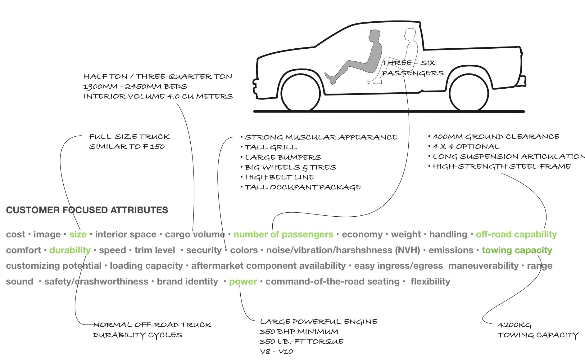
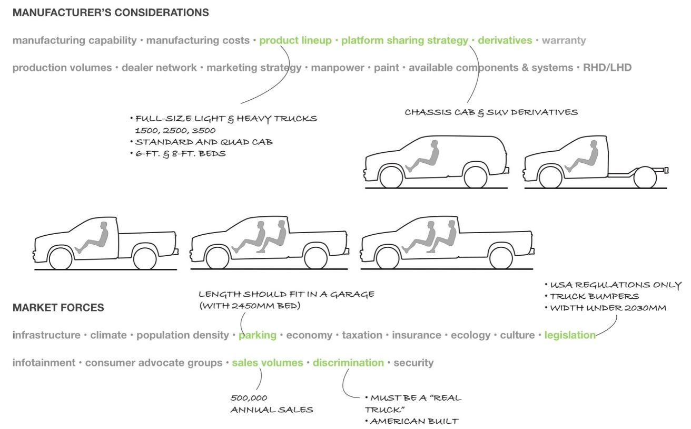
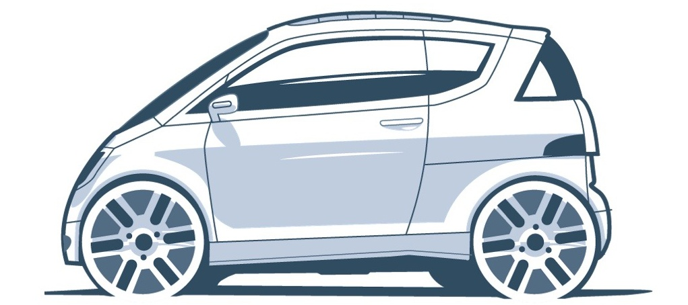
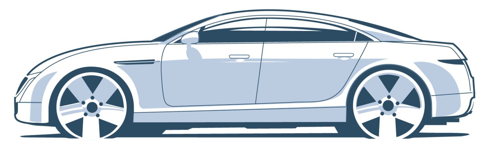
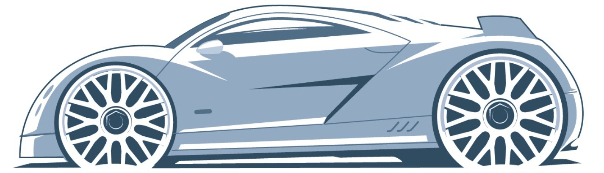
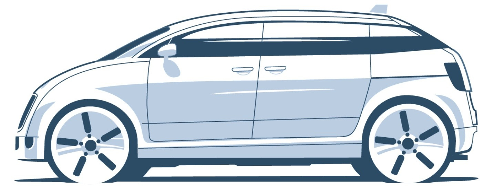

# Chapter 3 Function & Market Seqments

Every vehicle needs to serve a purpose otherwise no one would buy it. The market segments are set up by function and the vehicle architecture is designed to meet the needs of the customers, manufacturers andthe environment.

## Section 3.1 Introduction

A design team is only given one chance to start a project. One of the biggest mistakes they can make is not to consider the functional objectives of their concept in enough depth early enough in the life of the project

Every product must serve a purpose for its customer and manufacturer. These need to be thought through really well before the first line is drawn on the package or design. At fir it may feel that focusing on this aspect of the process wil grind a project to a halt, but the truth is the functional objectives are going to make each team member stop and think about what they are doing and approach the design with a fresh perspective.

The best approach is to start with all the right questions and not necessarily the answers.Every so often the auto industry. goes through a revolution, often brought about by advances in technology,economic pressure, ecology or political issues

Three main areas need to be considered when setting out the objectives for the project: the customer, the manufacturer, and. the market or environment.See page 69 for more details.

Ihese will drive the basic architecture of the project, and technology will make it work. The customer will usually have. special needs that the vehicle should meet. These may be physical or emotional. The customer demographics and lifestyle should be examined very carefully. It will be difficult t understand why some elements in the architecture are desirable to a certain customer. Classic examples of this are people who drive off-road vehicles but never go off-road, or buy a pickup truck but never carry a load in the bed.There is obviously something else about the architecture that attracts these buyers.

### SETTING CLEAR OBJECTIVES

The environment or market the customer lives in will have a great effect on the design, which may be influenced by the climate, terrain, infrastructure, economy, or legislation. This is significant because any given customer will need a different vehicle depending on their geographical location.

Ideally, the manufacturer's limiting parameters should remain unnoticed by the customer. The overwhelming fact remains that automobiles are very complicated to build and require a massive investment of capital, so taking care of business will be a primary consideration for any successful designer. This often involves working within many constraints, including a budget,. timing schedule and developing a concept that is feasible for manufacture that fits into a long range strategy.. Making compromises is always difficult. The section illustrated below shows a typical "fastback" coupe rear head environmen. which is clearly not good.Deciding how much to compromise the headroom to achieve desirable exterior proportions is a decision that the design team and product planninq will need to make toqether.

### COMPROMISE

Most specialist cars, by nature, perform well in one aspect at. the expense of another. Some functional objectives can be. polarizing leading to tension within the design team, making it even more important to be very clear about prioritizing them.If each team member clearly understands the functional objectives, difficult decisions will be easier to rationalize.

Interpreting this intormation is largely the responsibility ot the studio engineers. Their job is to understand the physical and emotional needs of the customer, and convert them into architecture using the most appropriate technology. They also need to understand the limitations of the intended markets ang the business model of the manufacturer.Finally, they have to b able to communicate this clearly to the rest of the design team

The considerations described on the next page represent the factors that will influence the design of a car or truck.Not all of these apply to every vehicle but they should be thought through before crossing them off the list.

These examples ot current production car rear occupant head environments are often the cause of tension within a design. team. Clearly the headroom dimensions illustrated are not. good, but are typical in many 2+2 sports coupes and SUVs. For. the packaging and styling teams to agree on an acceptable roof profile, the concept objectives and competitive market examples need to be clearly understood

### REQUIREMENT SUBJECTS TO CONSIDER
The lists below contains the key factors that should be considered before the functional objectives are set up. 

**CUSTOMER FOCUSED ATTRIBUTES**

**cost . image . size . interior space . cargo volume . number of passengers . economy . weight . handling . speed . flexibility . comfort . durability . off-road capability . trim level . security . colors . noise/vibration/harshshness (NVH) . emissions . towing capacity . customizing potential . loading capacity . aftermarket component availability . easy ingress/egress . maneuverability . range . sound . power . safety/crashworthiness . brand identity . command-of-the-road seating**

**MANUFACTURER'S CONSIDERATIONS**

**manufacturing capability . manufacturing costs . product lineup . platform sharing strategy . derivatives . production volumes . dealer network . marketing strategy . manpower . paint . available components & systems . warranty . Right-hand drive (RHD)/Left-hand drive (LHD)**

**MARKET FORCES**

**infrastructure . population density . parking . economy . taxation . insurance . ecology . culture . legislation . security . climate . consumer advocate groups . sales volumes . discrimination . infotainment**

### MAKING NOTES
As the concept sketches develop, take notes associated with the objective subjects

### POSITIONING THE CONCEPT

No vehicle is ever designed in isolation, so it is important to look at other vehicles that it will compete against, or sold. alongside.The market positioning graphic below can provide a clear illustration of how the new concept stacks up against. other products.It also shows where holes or"white space" exist in the product portfolio. Each chart or graph can be set up with polarizing attributes on each side..

### VEHICLE POSITIONING GRAPH

This graphichelps tovisualizewhere the concept falls within the manufac- turer's showroom. It can also be used to position the concept against the competition and highlight areas of opportunity.

The example graph shows on-road versus off-road vehicles.The car and SUVs are positioned from one extreme to another from top to bottom. From left to right is economy vs prestige, so the vehicle can. slide across the page according to its cost. Other subjects can be. pulled from the list of factors on page 69 to make up several charts,. ensuring that the concept does not clash with other products in the showroom. 

Ultimately, whatever you design will be sold in a branded showroom environment. Each brand will sell products that fit into the strategy that is set out by the product planning team with vehicles that meet the functional requirements and brand image without overlapping products in other market segments

## Section 3.2 Market Segments

At some point early in the design process, the concept will need to be classified as a particular category of vehicle, for instance a car or a light truck or a commercial vehicle. This is because most countries have specific legislation for each vehicle category, which can affect design decisions.

This legislation might range from specific design criteria and taxation policies to use limitations and emissions standards.

For a variety of reasons, most governments want to control the types of vehicles that use their nation's infrastructure. In addition, there are many other organizations that have vested interests in classifying vehicles. Consumer groups need to test and compare cars and trucks and organize their data Insurance companies need to assess the risk for different types of products. Local authorities may apply operating limits on certain types of vehicles

The vehicle design can be affected by factors that range from crash requirements and overall dimensional. limitations, to the number of wheels and lighting. specifications. Taxation classes are often determined by. engine size and power output but may also be affected by overall size, value and the number of wheels.

Use regulations are usuallyset up to permit vehicles with specific functions to excel in their duties

A good example is the off-road vehicle, which USA regulations allow to be designed without the same bumper regulations that apply to cars. This enables then to achieve good approach and departure angles in extreme off-road conditions.Neighborhood electric vehicles are allowed to drive on the main roads without passing 40mph crash regulations. This helps to reduce their size, weight and cost, effectively reducing their fuel consumption and emissions 

### MICRO CARS

This is the smallest type of passenger car allowed to drive on all roads. Micro cars are usually designed to meet specific dimensional and performance targets which allow them to fit a certain type of vehicle classification. They are often designed for only two occupants and with a minimum amount of cargo space. A small (unorthodox) powertrain package and small tire. envelopes also help to minimize the vehicle's size and weight. The body is designed for light-. weight, low-cost, and high-volume production but must still meet all local government impaci regulations. They are usually configured with two conventionally hinged doors and a lift gate.

### ECONOMY CARS

This group represents the largest share of the global passenger car market and is often referred to as the B, C and D segment of vehicles.The objective is to provide inexpensive 5- passenger-plus-cargo transportation, so the packaging needs to be very efficient. Designers look to achieve the largest interior space within the smallest exterior box dimensions to minimize cost, weight and aerodynamic drag.The powertrain and suspension systems are optimized for space efficiency, rather than performance.The body structures are designed to meet very high production volumes and low-cost targets.

### LUXURY CARS

This segment is often referred to as the executive or E class. Interior space, refinement, speed handling and a prestigious appearance are high priorities. The powertrain, occupant package and tire envelopes are usually generous which result in large overall dimensions. The body is designed for high-quality and often high-volume production, with attention to noise reduction through optimized aerodynamics and structural stiffness.The suspension systems are uncompromised to ensure the handling and ride comfort are also fully optimized.

### HIGH PERFORMANCE CARS

The main objectives tor this segment are high pertormance and exotic design. Uncompromise powertrains, body structures, suspension, tires, aerodynamics and a low center of gravity are. priorities. The occupant environment is minimized and cargo space is generally compromised. Customers of extreme, high-performance sports-cars are usually affluent enthusiasts, so high. purchase price is not usually an issue. This allows these cars to be built by hand in low. Volumes.

### MINIVANS

This is a relatively young segment, detined by a passenger-oriented package, usually tor seve or eight. They are designated as trucks in the US market due to their cargo-carrying capability Powertrains need to be large enough to pull the vehicles when fully loaded but packaged to. have a minimum impact on the occupant environment. The unibody construction is designed. for very high production and closures usually include sliding rear doors. Suspension systems. should be economical and efficiently packaged with the rear suspension designed for load. carrying and ride-height variance. Typically, the interior will have a flat floor with the capability to reconfigure and stow the seats. Additionally, the occupants will sit high for security and a commanding view of the road

### SUVS

The sport-utility segment has grown rapidly in recent years, offering the feeling of security, a strong image and flexibility, while being able to accommodate 4 to 8 passengers. The majority of SUVs have longitudinal powertrains with 4WD and high ground clearance for off-road and bad weather driving.This is complemented by suspension systems with long travel, good articulation and aggressive tires. The body construction may be of "body-on-frame" type for large SUVs which are usually derived from pickup trucks designed for serious off-road duties. Some SUVs and "crossovers" are designed for road and light trail use only, which is reflected in their passenger-car-like systems and typically unibody construction.

### TRUCKS

Pickup trucks are used for both commercial and personal applications. Their durable construction, powerful, high-torque engines and 4WD are designed to carry and tow heavy loads in all types of environments. Suspension systems must be able to support a wide range of loading conditions and offer various ride-height options.

Pickup trucks are used for both commercial and personal applications. Their durable construction, powerful, high-torque engines and 4WD are designed to carry and tow heavy loads in all types of environments.Suspension systems must be able to support a wide rang of loading conditions and offer various ride-height options.. The body construction is traditionally body-on-frame and often is the basis for an SUV. derivative. Trucks come in numerous length configurations depending on cab and bed-size requirements.

The body construction is traditionally body-on-frame and often is the basis for an SUV derivative. Trucks come in numerous length configurations depending on cab and bed-size requirements.

### COMMERCIAL VANS

Principally designed to provide economical cargo transportation for businesses, the architecture of these vehicles needs to be very flexible to create a wide variety of derivatives Usually, a unibody construction that can be adapted to include a strong framework for open bed versions and a platform for coach builders.The body design should also facilitate dimensional variants with closures that are sized for loading standard-sized objects. Powertrains and suspension systems are designed for heavy load carrying with minimum intrusion into the cargo space. The footprint of the vehicle should be kept as small as possib to improve maneuverability in urban environments.