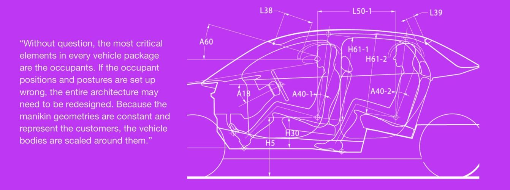
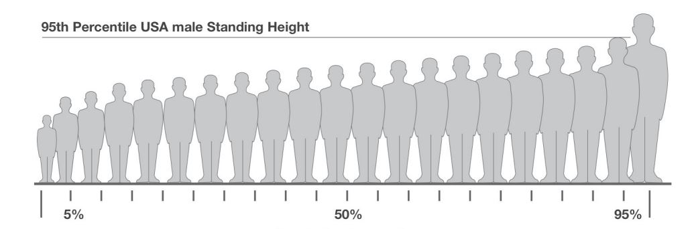
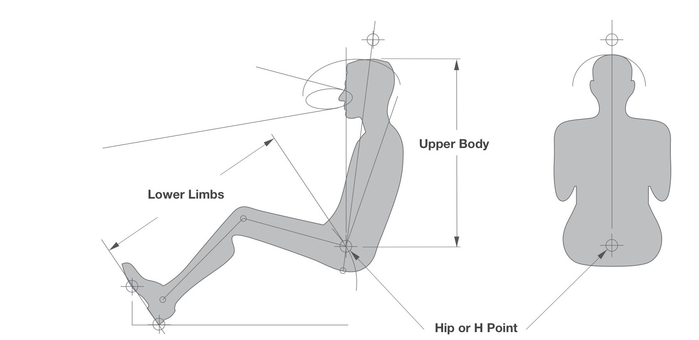
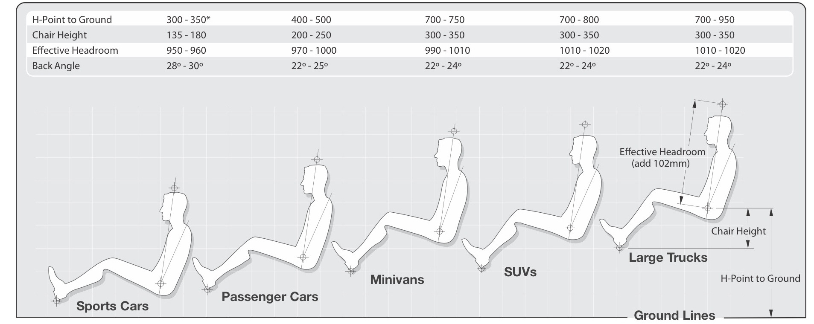
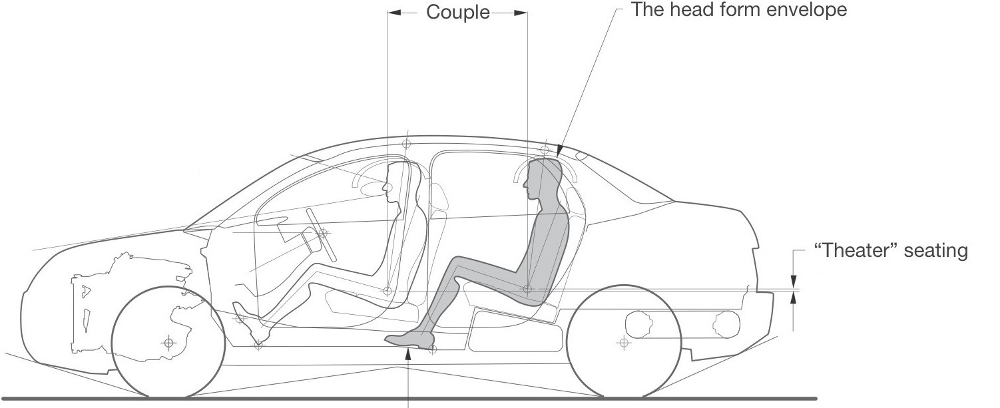
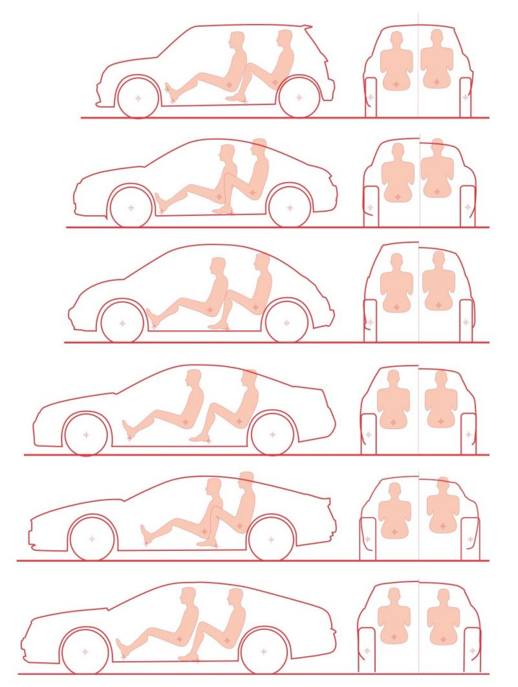
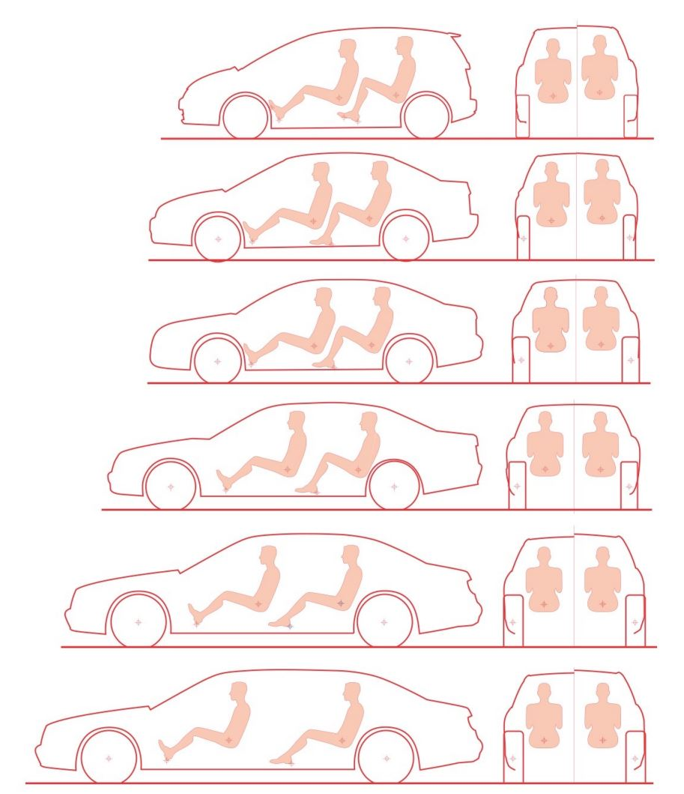
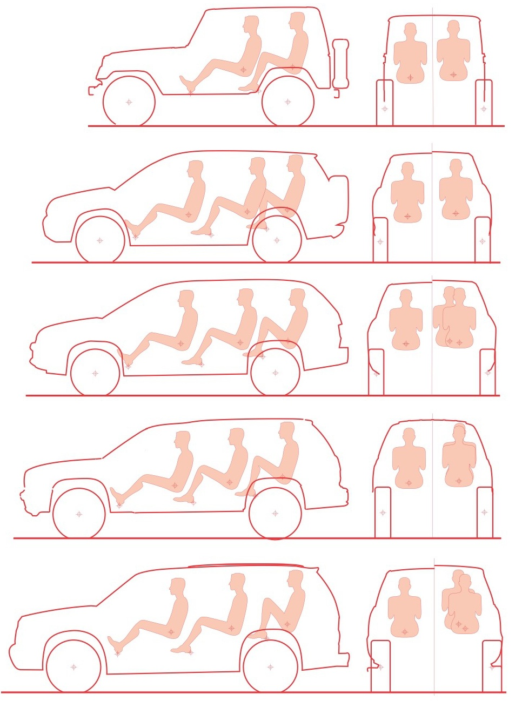
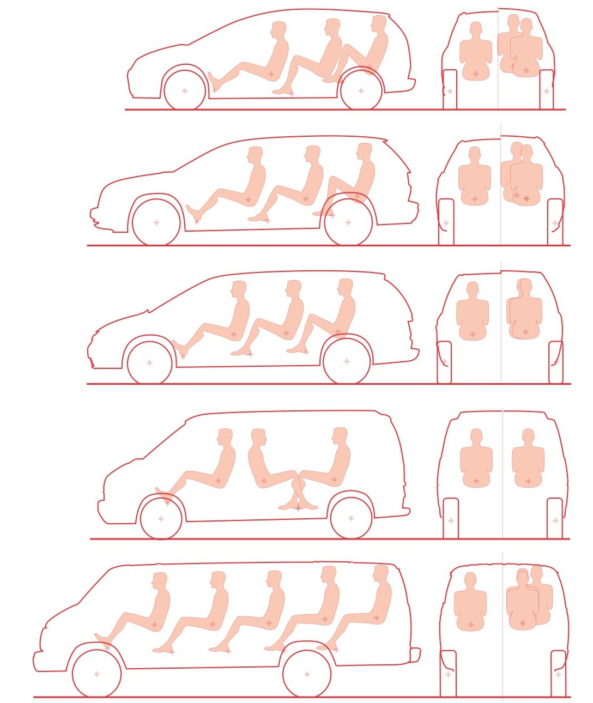

# Chapter 6 Occupant Packaging

## Section 6.1 Driver Introduction
It cannot be overemphasized how critical the driver and passenger packaging is to the overall architecture. The occupants directly or indirectly influence every aspect of the vehicle's design.
It is often said that cars and trucks should be designed from the inside out. This refers more to the occupant package than the interior systems. The main objective is to set up the driver and passengers to be comfortable and safe, then create an envelope around them and use key reference data within their geometries to set up the rest of the vehicle package. The most important reference point in the package is the driver's hip or H point.

This may be shown in several locations in the package drawings (because of seat adjustment) but the primary location is referred to as the Seating Reference Point or SgRP. Almost every element of the package will be influenced by its location and if modified, the effects may be seen throughout the vehicle.
Each car company will use several manikins that suit their purpose. One of the most popular occupant packaging tools is the SAE 95th percentile male manikin, which is ideal for setting up the initial interior space, ensuring that the vast majority of the global population will fit into the occupant package envelope.

### GEOMETRY OF THE 95TH PERCENTILE MALE DRIVER

The SAE has worked with various groups to establish. anthropomorphic (size, proportion and movement) data which represent the volumes occupied by drivers and passengers as they sit and operate vehicles. The results of this data have been converted into sets of geometry that represents the stature of a 95th percentile US male (97.5% of the total US population,. including females) sitting in a car seat.

This geometry can be used to set up the interior systems, locate controls, execute vision studies, position the powertrain establish the wheel/tire package and even determine the bumper beams locations

The limbs, torso and head of the population sample are. measured individually to create a manikin that is built from 95th percentile male parts.The sitting manikin can be utilized in two halves, from the H-point to the feet (to establish leg room and seat height) and from the H-point to the head (to set up the head environment)

Aftertheinitialpackagehasbeen built,othersmaller manikins (5th percentile female and 50th male) are used to ensure that. smaller people will be able to drive in comfort and safety..

### ANATOMY OF THE SAE(J826) 95th PERCENTILE MALE DRIVER MANKIN

The height variation limited by the accommodation curve only applies to passenger cars and light trucks. Other vehicles such as golf carts, NEVs, and delivery trucks, which are designed for easy ingress/egress and short-distance driving, may require a taller seating posture. In these cases the H-point-to-heel vertical dimension may be as high as 530mm.
This also often applies to Class B vehicles (heavy trucks) which usually have 150mm of vertical seat travel to accommodate shorter drivers. Seat adjustment in passenger cars is mostly horizontal.

**H-POINT (HIP POINT) or SgRP (SEATING REFERENCE POINT)**
The main reference point for the occupants and one of the major datum points for the vehicle package. Often referred to as the 'Seating Reference Point" (SgRP or R-point in Europe), it is always located on the accommodation curve.

**ACCOMMODATION CURVE (SAE J1516-1517)**
This curve maintains the correct relationship between the H-point and foot to ensure a comfortable posture for the driver's legs while operating the foot pedals.

**ACCELERATOR HEEL POINT**
The heel-point location is often referenced to define the floor and step-in height

**BALL OF FOOT POINT**
Located on the accelerator plane.A main reterence point tor frontal impact crush space measurement.

**ACCELERATOR FOOT PLANE**
This plane rotates about the ankle pivot and is usually locked at 87 to the shin centerline.

**95th PERCENTILE EYE ELLIPSE (J941)**
The 95th eye ellipsoid represents a three-dimensional volume within which 95 percent of drivers' eyes will be contained. Its Iocation remains constant to the head contour.

**95th PERCENTILE HEAD CONTOURS (SAE 1052)**
The head contours are defined by three-dimensional surfaces and represent the areas within which the 95th percentile occupant heads are contained. They incorporate seat-track travel and head movement. The position of the head contour is determined by the H-point and back angle.

**TORSO LINE**
Defines the back angle inclination

**VISION ANGLES**
The upper and lower vision angle lines are constructed tangentially to the 95th percentile eye ellipse and touch the first elements in front of the driver which obscure upward and downward vision. These are instrumental in the set up of the windshield aperture.

**EFFECTIVE HEADROOMPOINT (SAE J11O0)**
The intersection of the headliner trim and a line 8o from vertical through the H-point. These are used to set up hard points on. the roof surface above the headliner trim or sunroof..

**LOWER LIMBS**
The leg geometry consists of the shin and thigh centerlines, which are constrained by the ankle pivot and the H-point. Thei. configuration is automatically updated as the H-point to heel relationship is changed.The thigh centerline is used to set up the steering wheel location and the shin determines the knee-. blocker surface on the instrument panel.

### SETTING UP THE DRVER HEIGHT & POSTURE
The driver's height and posture are governed by several factors, namely: center of gravity, aerodynamics, ingress/egress, comfort and visibility. The vehicle height should be established by a. combination of these factors. The graphic on the following page. shows how the driver height and posture varies with the. functionality of each vehicle type. The dimensions provide an. approximate range to help set up the driver in a traditional packa

For crossover vehicles, think about combining the attributes. For example a sporty off-road vehicle may have a high heel point for. ground clearance and structure, but may need a low chair. height to keep the roof height as low as possible. If the engine is. in the rear, forward visibility over the hood won't be a problem.

### APPROXIMATE REFERENCE DIMENSIONS

The table below contains some examples of dimensions tak from current production cars.Use these to set up an initial package, assuming that the criteria that has driven these. numbers is similar to your concept. As the design develops and key elements in the package evolve, these may change. As you work through the process, develop an understanding of the factors that govern these interior environment dimensions

|-|Heel to Ground|Chair Height|H point to ground|Back Angle|Effective Head Room|Upward Vision Angle |Downw'd Shoulder Vision Angle |Room |Hip Room |Lateral Location |Couple |Chair Height |Back Angle |Effective Head Room |Shoulder Room|Hip Room|Lateral Location|
|--|--|--|--|--|--|--|--|--|--|--|--|--|--|--|--|--|--|
|-|(Ref)|H30|H5|A40|H61|A60|A61|W3|W5|W20|L50|H30-2|A40-2|H61-2|W3-2|W5-2|W20-2|
|NEV| 325| 400| 725| 15.0| 1075|11.0|10.0|-|-|275|-|-|-|-| -| -| |
|SPORTS CAR|175|150|325|28.0|950|8.0|5.0|1350|1275|325/400|-|-|-|-|-|-|
|MICRO CAR|350|275|625|21.0|1000|14.0|11.0|1200|1150|300|-|-|-|-|-|-|
|SMALL CAR|225|250|475|24.0|975|15.0|7.0|1350|1325|350|750|275|27.0|950|1350|1325|325|
|MEDIUM CAR|250|250| 500|24.0|975|14.0|7.0|1475|1400|350|850|275|27.0|950|1475|1400|325|
|MEDIUM COUPE|250|175|425|24.0|950|13.0|5.0|1375|1325|350|750|200|27.0|875|1375|1325|325|
|LARGE CAR|275|250|525|24.0|975|14.0|6.0|1500|1450|375|900|275|27.0|975|1500|1450|400|
|LARGE LUXURY CAR|275|275|550|22.0|975|15.0|7.0|1550|1500|400|975|300|28.0|975|1550|1450|375|
| MINIVAN| 425|350|775|20.0|1010|19.0|11.0|1575|1525|425|850|375|22.0|1000|1575|1525|400
|SMALL SUV|400|350|775 |20.0 |1010 1010| 15.0| 9.0| 1425| 1400|425|850|375 | 24.0| 1000| 1425|1375|375|
|MEDIUM SUV|450|300|750|22.0|1010|14.0|6.0|1500|1450|400|825|325|24.0|1025|1650|1600|425|
|LARGE SUV|450 |325|775|22.0|1025|14.0|7.0|1650| 1600|375|875|350|24.0| 1025| 1650| 1600|375|
|SMALL TRUCK|400| 300|700|22.0|1010|14.0|7.0 | 1475|1450|375 | 625| 325|18.0|950|1475|1425| 400|
|LARGE 4x4 TRUCK|600|350|950|22.0|1025|15.0|8.0|1700|1650|475|950|375|18.0|1025|1700|1650|475|
|COMMERCIAL VAN|725|350|1075|22.0|1010|10.0|10.0|1675|1625| 525|900|425|19.0|1000|1675|1625|500|

### OCCUPANT ENVIRONMENT DIMENSIONS

Below is an illustration of the major dimensions that set up the interior environment around the occupant package. These are part of the SAE J1100 measurement index. Using the same measurement system for every project ensures that there is no confusion and the package database remains consistent.

 Dimensions")

## Section 6.2 Rear Occupants

The rear occupant size and geometry is similar to the driver, but because the rear occupants do not control the vehicle, their leg posture is not controlled by the accommodation curve. Notice how the knee angle is quite different to the driver and their feet are flat on the floor. The demographics for the rear occupants may be different to the front occupants. They may be children q people who are shorter in stature to the driver, so headroom, for example, may be less.Lastly, the function of the rear compartment will often be quite different to the front, so space may be needed for reclining passengers, swiveling or stowing. seats, video monitor viewing, etc. These will all affect the spacia requirements and H point location. Other factors to consider are roof height, fuel tank size, rear cargo, three across seating, rear suspension and rear tire requirements.

**The "couple" dimension** is used extensively in the initial package process to gauge the amount of leg and knee room the rear occupant has. This is a horizontal measure between the H points.Later in the process, when the package is more mature, specific measurements for knee and leg room are also recorded.

**The head form envelope** does not nclude seat track travel unless the seats slide fore and aft..

**"Theater" seating** elevates the rear occupant to improve visibility over the driver.

*Note: The posture of the lower limbs are quite different to the driver. These are not constrained by the SAE accommodation curve.*

### REAR OCCUPANTS - TWO DOOR AND 2+2 COUPE

The expectation for the rear occupant package in two door cars is often less than for four door cars, so couple, legroom headroom, ingress and egress are often compromised to allow the designers to create the desired roof profile. Finding the appropriate amount of compromise is always subjective and making the right decisions can be tough.

The packages on this page shows several two door cars tha are in production and clearly illustrate the compromised accommodation. Often smaller manikins will be included in the drawings to determine what size (percentile) person will fit comfortably in the rear compartment, but the 95th. percentile male manikin should be shown to communicate how the space relates to other vehicles. As always, it's important to benchmark existing products to help determing how much the key dimensions can be reduced.

Some creative packaging is often required to increase the rear headroom. For example, the rear header structure may be shifted away from the passenger's head to improve the head environment, but this will affect exterior glass boundary styling.For cars with a lift gate, the rear header structure will be larger to accommodate the closure panels and hinges and also provide additional strength. It is not unusual to package the rear head forms under the glass to optimize the available space.

### REAR OCCUPANTS - FOUR DOOR CARS
Compromise is usually unacceptable in the rear compartment of four door family passenger cars.

Generally the headroom will be no less than 985mm and the couple distance on the smallest cars will be a least 750mm. As the car gets larger, the headroom wil increase a small amount but shouldn't be unnecessarily large because a high roof will increase drag and raise the center of gravity. The car may get wider and provide more hip and shoulder room and also accommodate a fifth passenger, but again the width needs to be controlled to the right dimension to minimize drag, weight and ease of parking.

The couple is usually the most noticeable dimension change as larger cars are designed to offer more comfort and space for the rear passengers. This is particularly important in luxury cars that may be chauffeur driven and the owner or customer rides in the rear.

In smaller sedans, toot swing past the base ot the B Pillar is often tight and needs to be evaluated as the. body side apertures are designed. This issue goes. away with a longer couple distance as the seat is pushed further away from the B Pillar.

### REAR OCCUPANTS - SPORT UTILITY VEHICLES
The rear occupant expectations may be similar to sedans but the packaging will be quite different. First of all the H points will be higher from the ground ang the seat height (H point to Heel) will often be taller. Additionally, the head room may be higher to provided extra clearance for the occupants bouncing while driving. on rough terrain. Usually at least 1010+ mm is required.. Often the wheelbase of the SUV will be short to improve the ramp over angle and the suspension travel (jounce) w be more than road cars, so the rear occupants will be pushed further forward than in a normal passenger car of a similar size.

*Note:Many SUVs have high rear floors over the axles and this may create a low chair height for the rearmost passengers and also compromise the headroom.*
*Some largeSUVs with three rows ot passengers otten have very compromised rear seating that is only designed for children, small adults or pets*

### REAR OCCUPANTS - VANS
Vans usually provide the most comfortable rear seating with easy ingress egress, but like the SUVs the third row may be compromised in smaller vehicles. 

The rear suspension is often designed to create a low flat floor so the occupant package should be consistent from front to back. 

Rear seating flexibility is becoming more common so providing the ability to slide, rotate and stow seats should be considered and may affect each seat's location.