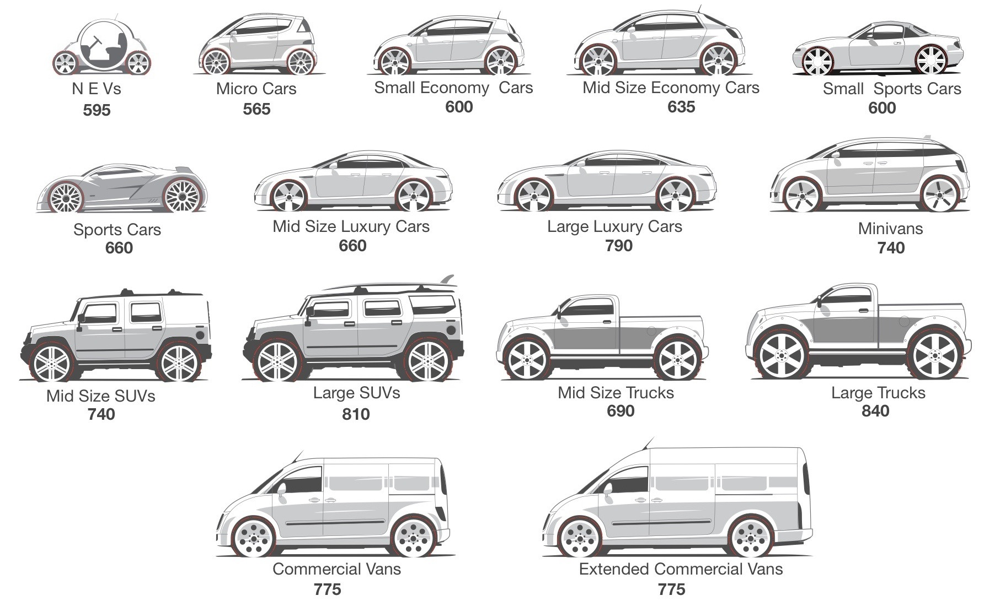
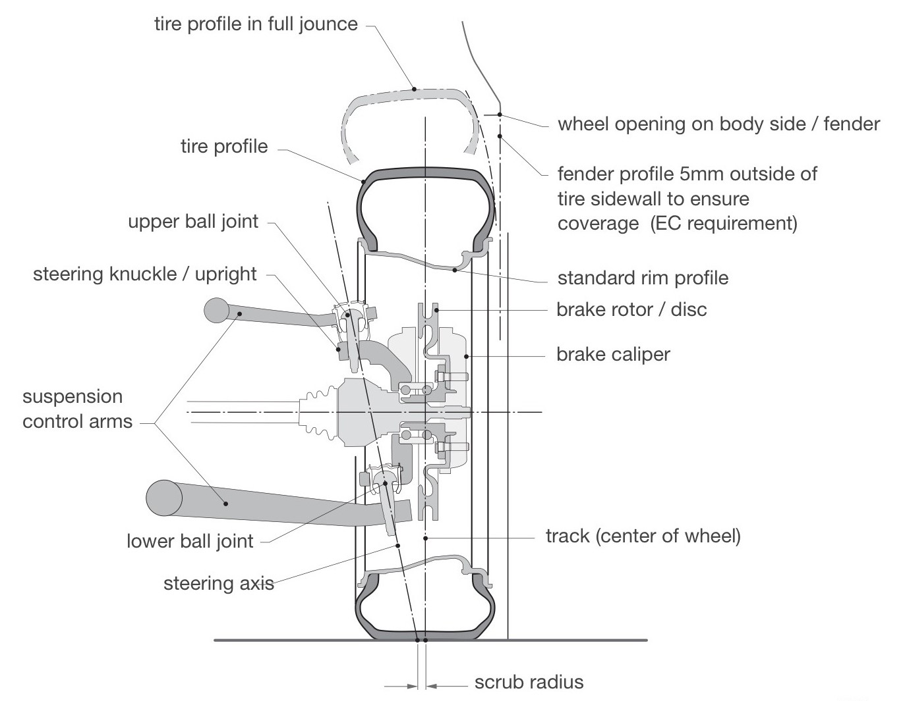
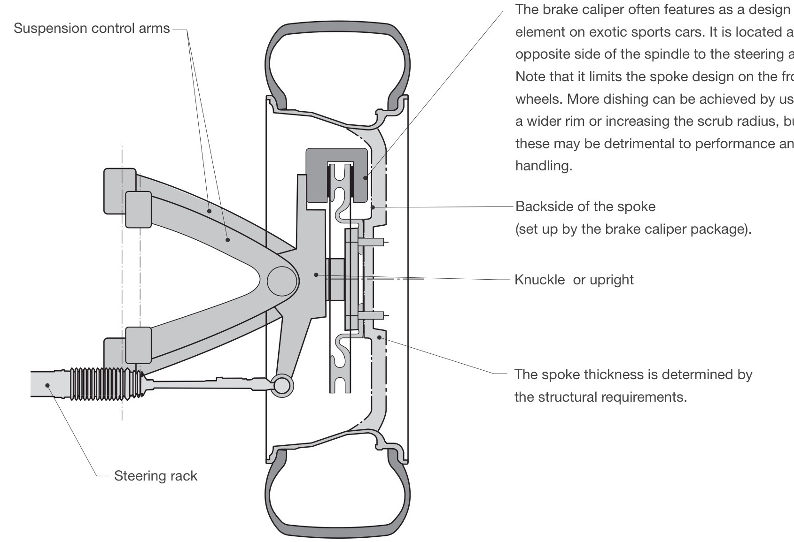
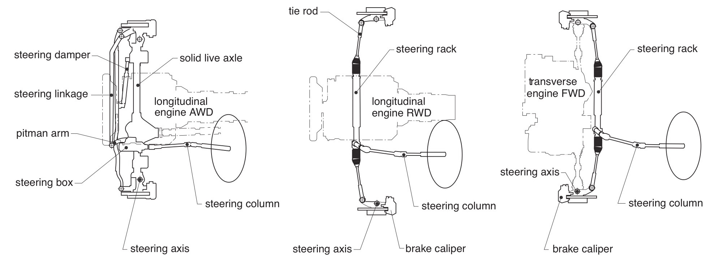
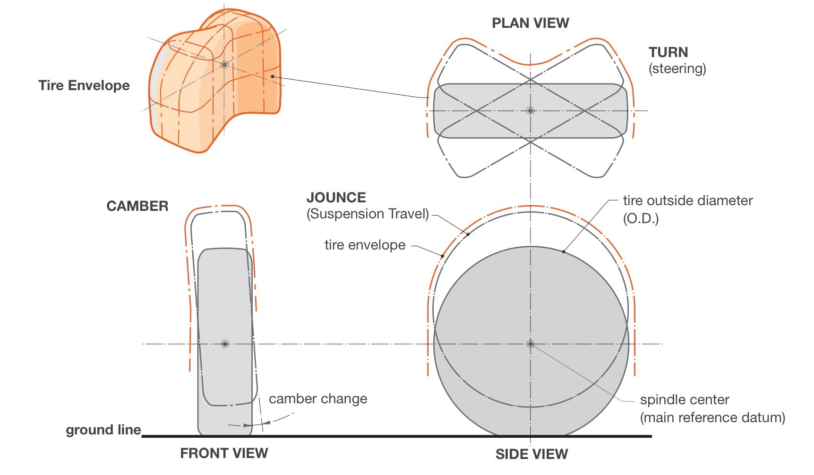
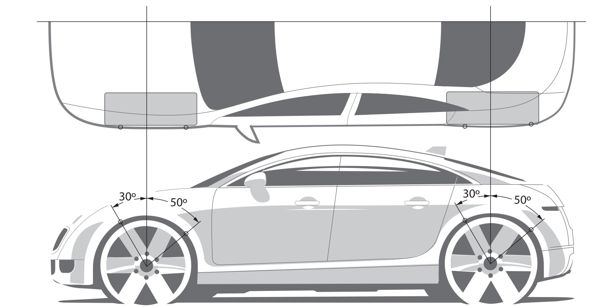
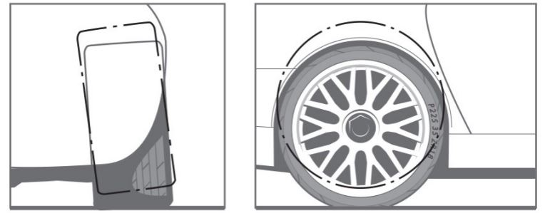

# Chapter 9 Wheels & Tires

>“The correct wheel and tire choice is not only critical to performance, but it is one of the few mechanical assemblies in the package that becomes a significant design element. In addition, their relationship to the body can make or break a great design."

## Section 9.1 Introduction to Wheels & Tires

When the designer chooses the initial wheel and tire package, the main objective is to get a combination that works both aesthetically and functionally. The normal tendency is for designers to want the largest wheel diameter with a very low profile tire. For most cars and trucks this is not good functionally

The outside diameter (O.D.) of the tire will always be limited, so looking at this dimension is the starting point. (see page 181 for examples) Next, the sidewall or profile height should be established based on the loading and performance targets. The wheel diameter will be derived from these two factors.The tire width will depend on traction requirements for acceleration, braking and cornering. Rolling resistance, cost and package space should also be considered. It is not uncommon for high performance cars to have different sized front and rear tires to orovide more traction at the driven wheels

Approximate wheel and tire sizes should be established quite early on in the design process, usually after the preliminary. occupant package has been set up.

Additionally, the suspension travel and steering angles should be predicted to determine the tire envelopes, which identify the total volumes occupied by the tires during extreme use..

Tires are manufactured in incremental sizes described with a formula for the tread width, sidewall aspect ratio and wheel size. The outside diameter is calculated from this.Light-truck tires. use a different formula, part of which includes the O.D.,. simplifying the process.

Tire specifications are somewhat complex because they are a mixture of millimeters, inches and a percentage. After estimating the tire dimensions, the diameter should be adjusted to a correct available size calculated from a typical tire specification as shown on page 200

Sidewall height is governed by load carrying requirements, ride comfort and handling.

Trucks and SUVs will have tall sidewalls to help increase thein gross vehicle weight (GVw) capability and protect the rims or rough terrain.Low-profile tires are preferred on sports cars to minimize sidewall flex during cornering. Narrow tires actually work better in snow, so a winter tire package may be smaller than the one for summer.

Styling also plays a big part in wheel and tire size so getting the wheel diameter to work with the proportions of the car may be the final determining factor on the exact wheel and tire package.

### TIRE SIDEWALL HEIGHTS & PROFILES

**Truck & SUV Tire Profile**
Vehicles that are designed to carry heav. loads or travel over rough terrain require a taller sidewall to distribute the load an protect the rim from rock damage. The drawback of a taller aspect ratio is sidewall flex that will be detrimental to handling but will improve ride comfort.

**Passenger Car Tire Profile**
For cars that require a comfortable ride, an average sidewall height is advisable, providing a balance between comfort and handling. This configuration is usually less expensive than a larger wheel and low profile tire combination.

**Sports Car Tire Profile**
Performance cars will sacrifice comfort to improve cornering capability. The lo profile tire reduces side wall deflection and allows for a larger diameter wheel which provides room for a larger brake rotor, if required. It also improves the exterior appearance. A drawback is that the minimized sidewall height leaves the wheel rim vulnerable to damage from curbs and potholes.Also, the total weight of tire and rim will be higher, which increases the unsprung weight. This will counter against the handling benefits.

**Wheel Flange Diameters**
The flange diameter represents the actual visible wheel sizes. Note: the rim diameter (measured in inches) is 30-35mm smaller than the flange diameter.This difference is shown in this chart.

### TYPICAL TIRE OUTSIDE DIAMETERS
As previously mentioned, the tire diameters and locations are one of the first elements to be considered and will always feature in the early design sketches.Below are example diameters that can be referenced.

Typically, the O.D.s can get larger as the vehicle size increase but there are many other factors to consider such as; interior cargo packaging, suspension travel and packaging, steering angles and overall vehicle proportions, for example.

## Section 9.2 Brake Packaging

**SECTIONAL VIEW THROUGH THE WHEEL ,TIRE, SUSPENSION & BRAKES**

Wheel design is heavily influenced by the chassis components they are bolted to. Suspension arms,steering geometry and brake systems all push the wheel spokes outboard The section shown right illustrates how the steering axis is set up to minimize the“scrub radius.

The steering axis passes through the ball joints which subsequently force the brake rotor and caliper out past the center of the wheel.

Note: The brake caliper in the section limits the amount of "dishing" that can be applied on the spoke design for the front wheel.

The recommended wheelrim widths vary considerably for each tire profile
size, so manufacturer's quidelines should be followed.

### STEERING SYSTEMS

Two types of steering systems are commonly used, these are rack and pinion, and recirculating ball. The steering mechanisms are Iocated just behind or forward of the front spindle, (creating front or rear steer). The steering wheel is directly linked to the mechanism through the input shafts or steering column, which is divided into several segments and angled to reduce steering-column movement in a frontal impact. Rack and pinion is the most common system, and works with most vehicles. Recirculating ball systems are usually applied when a lot of suspension articulation is required.

The long track rods help to reduce "bump steer" (caused by the difference between the suspension and steering geometry) which results in the turn angle changing as the suspension travels in jounce or rebound. Below are three applications of the systems. Designers should note that the steering. mechanism attachment to the knuckle will affect the location of the brake caliper which is often used as a design element. 

*Note: the steering systems may not feature in the initial. package, as they rarely affect the exterior surface*

### TURN CIRCLES

Steering objectives should be addressed at an early stage of the. packaging process. The turn-circle requirements will have a major. influence on the package.The diagrams below show the elements that control the turn circle. The front frame rails that run between the engine and the tires inhibit the steering angle. In the illustration below, if a larger (transverse) engine is required the track will have to be widened to maintain the same turn circle.

The two factors that control the turn circle are the wheelbase and the turn angle. Long-wheelbase vehicles will require a. greater turn angle. This is often made possible by the. Iongitudinal powertrain layout which allows the front frame rails to be moved inboard. Trucks with an extremely long wheelbase. may also require the rear wheels to steer to get the turn circle tc an acceptable diameter.

*Turn circles are usually about 10 met for small cars and 12 meters for large. cars.Large trucks and limosines with long wheelbases may have turn circl up to 15 meters. To achieve these. diameters the front wheel turn. angle will be approximately 30°.*

## Section 9.3 Tire Envelopes

These 3d surface represent the sweep of the tire profile in turn, jounce and camber, with clearances & other tolerances added.The igned to wrap around the four tire envelopes.

# Section 9.4 Spare Tire Packaging

Hopefully, spare tires will soon be a thing of the past and run-flat or airless tire technology will eliminate the need for vehicles to have 5 wheels.Until then, most cars and trucks will have a full-size or space-saving spare packaged somewhere in the architecture

The example shown below is a typical sedan spare-tire package beneath the trunk load floor, between the rear suspension and bumper beam. This is a common location, allowing easy access in the event of a puncture.

It's worth noting that the rear overhang of some vehicles may be determined by the spare tire package.

Many customers want a full-size spare, and if the vehicle has a large tire O.D., packaging this may be challenging. Often space saver tires are used, but these can be no smaller than 80% of the original diameter to prevent wear on the differential.

Vehicles with higher floors (minivans and trucks) may package the spare further forward under the passenger compartment floor. SUVs often mount the spare on the rear swing gate.

## Section 9.5 Tire Coverage

European legislation requires that the tires must be inboard of the body work in the zones shown below, 30 forward of the spindle center and 50 rearward

The opening between the tire profile and the wheel arch will vary greatly depending on the function of the vehicle. This is mainly due to the geometry, jounce travel and tolerances built into each suspension system. Large openings and inset wheels are bad for aerodynamics and are not usually regarded as a desirable styling feature.

**TRUCKS & sUVS**

Suspension will have long travel (125-150mm+) and if a solid axle type is used the tire will move up and down. vertically without camber change when the vehicle is. loaded.Because of this, the tire sidewall will be set in from the body and have a large open space at the top of the tire.

**PASSENGER CARS**

These will have less travel (100-120mm) and often employ suspension systems that cause camber change. The. relationship between tire and body can be reduced substantially in these cases. If trailing arm or McPherson strut systems are used, the tire will need to be set in more..

**SPORTS CARS**

These will often have negative camber at curb attitude anq this will increase during jounce travel. The travel is usually limited (75-90mm) so it is easier and more desirable to keep the openings to a minimum