# Chapter 12 Mobility

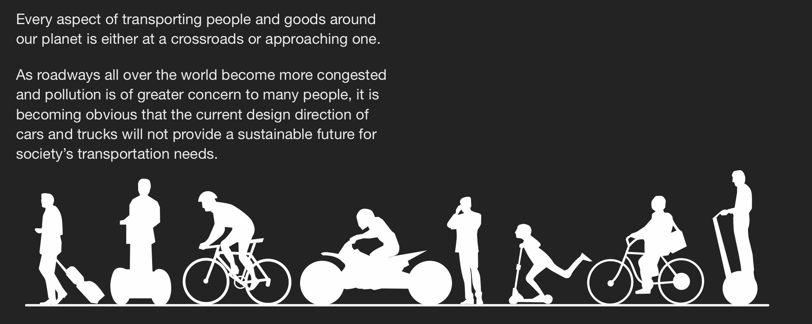
>Every aspect of transporting people and goods around our planet is either at a crossroads or approaching one As roadways all over the world become more congested and pollution is of greater concern to many people, it is becoming obvious that the current design direction of cars and trucks will not provide a sustainable future for society's transportation needs

## Section 12.1 Introduction

Transportation solutions have always been diverse, but with increased personal wealth and populations spreading out of cities into the suburbs, many people. have made their cars and trucks the only form of mobility, but this trend is changing.With migration back into city centers, a greater understanding and concern for the environment and breakthroughs in communication technologies, many people are looking for and accepting other modes of transportation.. Naturally, with these cultural changes, car designers will need to shift their focus to cater for the demands of modern total mobility solutions.

Vehicle architectures will need to cater for all of the curren situations in addition to new senerios, where exterior proportions will need to meet a variety of limitations and take advantage of emerging opportunities. Small vehicles may be carried long distances on trains and "last mile' devises, designed to carry people for short distances, may be stowed onboard. Currently about 80% of drivers. typically travel alone to and from work so it makes sense to develop vehicles that meet that need efficiently. Electriq powertrains, autonomous drive technologies and. infotainment possibilities will need to be fully exploited.

If designers are totally comfortable with using the packaging tools in this book for familiar kinds of road vehicles, they car. make a huge contribution to innovation within the industry with exciting new kinds of transportation that people really want. The ability to successfully package a complete car or truck is really about understanding a vehicle as a system, seeing the complete product as a complex arrangement of interrelated subsystems. Car designers, indeed designers in all disciplines, will increasingly hear the term "systems thinking." As the world within which we live becomes more interconnected and more complex, professional car designe can no longer think just about the specific product that they are working on. They are increasingly required to understang the context within which their vehicle is qoing to operate.

whether that relates to the need for alternative solutions to personal mobility and transportation. The illustration below outlines some of the modes of transportation that could work i combination to provide exciting opportunities for futuristic transportation systems.For each mode-Segways, bicycles, motorcycles, electric scooters, neighborhood electric vehicles. the list is endless-there is an opportunity for designers to create exciting-looking products that fit into a total system and are hugely fun to use. The truth is that most transportation devices that are not cars or trucks do not get designed in automotive studios-and they look like it! Car designers have abundant possibilities to apply their skills and passions to all these other kinds of transportation products as well as to cars.

Thinking about advanced mobility systems is fascinating. involves thinking about human needs in a holistic way, anq. then reinventing urban and suburban landscapes without the baggage of past eras.These total solutions require an understanding of not only the vehicle designers'. knowledge, but the skills and wisdom of others too: urban. planners, infrastructure engineers, energy experts, government policy makers to name just a few.. Transportation designers need to be right in the middle of all this, thinking and using their passions to inspire. everyone else involved. Of course, we often have to walk backwards into the future, settling for compromises forceq on us by the redundant elements in our environment

The Industrial Revolution has been an enormous science experiment from which have grown some massive cities.. Many of these cities are beginning to contract and decay as the world moves into a new era, driven by an increased. understanding of the need for sustainability and supported by advanced technologies, communications and constantly changing political will. Centralized manufacturing and. employment, as well as inefficient use of rapidly depleting oil. reserves, belong to our past.

### NARROW CARS EXAMPLE

Small cars are ideal for minimizing cost and impact on the environment, but a huge advantage can be gained from dramatically reducing the overall width. With most inner city infrastructures currently overloaded, both on the roads and parking spaces, narrow vehicles allow urban planners to be more creative, dividing highways and parking lots to accommodate a greater number of vehicles which as we kn are only carrying one person for most of the time

Most tamilies need a large vehicle to carry 4 or five people and cargo but often have a second car just for commuting. This often leads to problems with parking and the cost of running a second car.The ultra narrow solution may solve both problems

One of the greatest challenges to the designer is to create an aspirational product. Most drivers are turned off by the size of small cars and if their appearance is not appealing, people. simply won't buy or rent them..

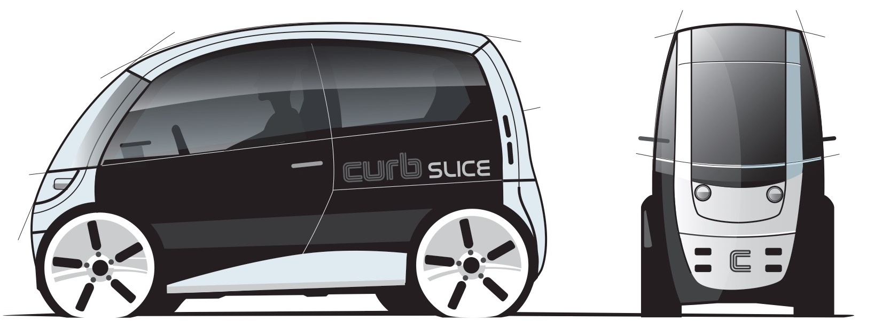

A car full of people provides very efficient transportation and full sized vehicles will continue to offer a versatile solution for most. people, but if the roads simply can't handle the volume of full sized cars and trucks, society will need to consider more effective. oackages when driving alone.Ultimately there may not be choice

The illustration below shows approximately how much of a typical passenger car footprint is required for a commuter. vehicle. The overall silhouette is just over half the width of a. medium sized car, similar to a large motorcycle

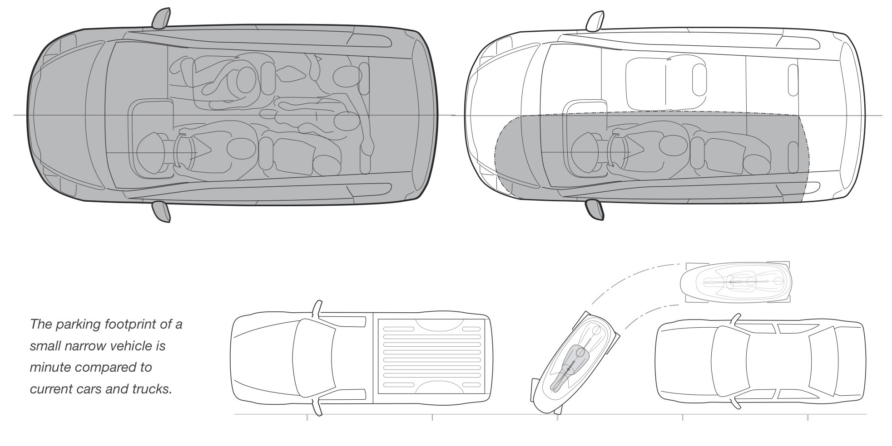

So a primary goal with this concept is to create a. package similar in size to a touring motorcycle, able to accommodate two full-size adults and if possible a sma amount of cargo. The vehicle could be considered a more protective and secure option to riding a motorcycle. 

**Large touring motorcycle**
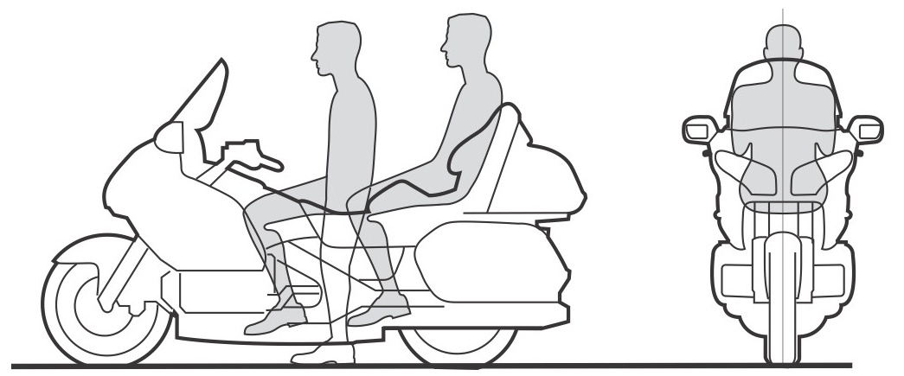

**Small narrow vehicle package**
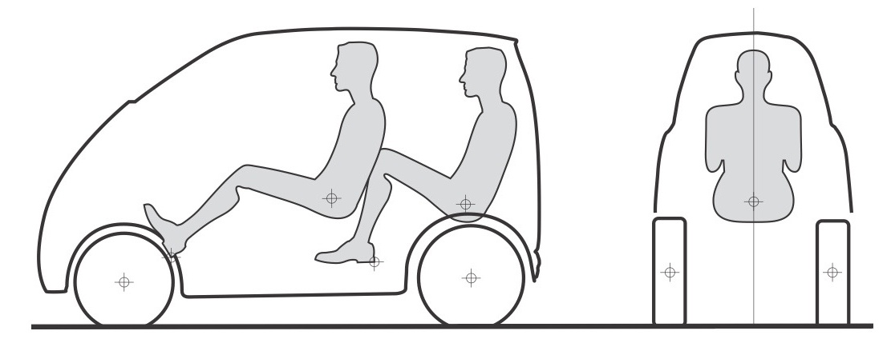

Fortunately, with emerging electric powertrains, packaging the motors and batteries will be easier than incorporating a traditional engine and fuel tank.

Significantly, the weight of the battery pack packaged under the floor will also lower the center of gravity and improve the rollover threshold, critical for a narrow track vehicle if it is not designed to lean when cornering.

**Rollover threshold similar to a typical sports car**
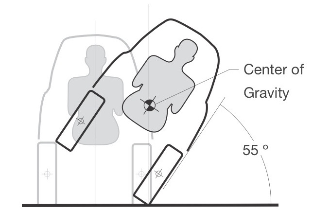

For most major cities the greatest challenges are to find space and funding for additional roadways.

The solutions shown here are inexpensive and use existing space. They are also very flexible, allowing the narrow lanes to be introduced as the number of vehicles increase. The lanes can also be repurposed during rush hours versus low traffic times.

For inner city areas, the scenario is similar, simply painting road markings to accommodate narrow vehicles.

**Typical US Freeway lane divisions**
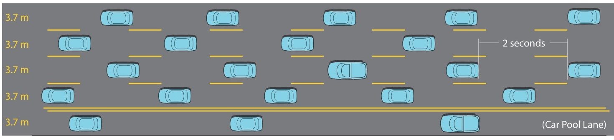

**Freeway with ultra narrow lane divisions, increasing vehicle capacity by about 80%**
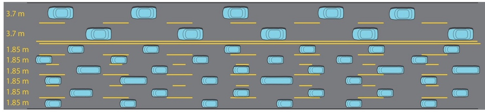

**Typical side street with curb side parking.( Ultra narrow shown lower)** 
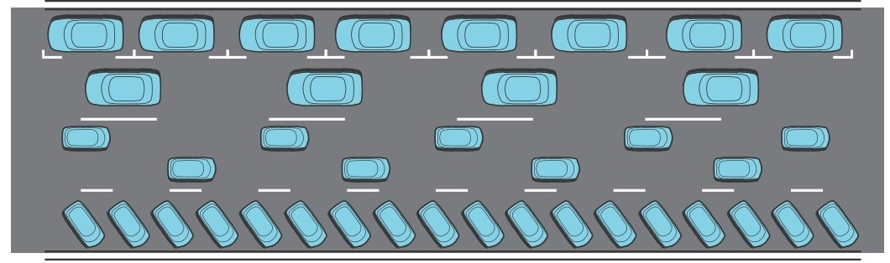

### AUTONOMOUS LUXURY-NARROW

Many car owners simply don't want to own or drive a small car,so longer, more luxurious narrow cars may be needed v illustrates how an autonomous self driving 2 passenger concept may look.With both occupants being passeng a windshield. The owners can lay back and relax or work while the car drives its self through congested traffic.

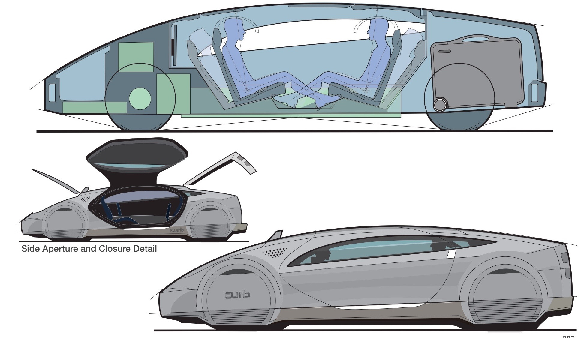

**NARROW AUTONOMOUS PACKAGE STUDY**

The point to emphasize here is that both technology breakthroughs and environmental pressures require designers to deconstruct what we know about cars today and reconstruct the architecture to provide vehicles that fulfill new demands.

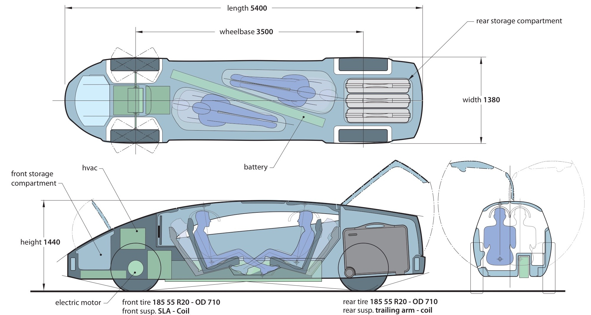

**PACKAGE CONFIGURATION OPTIONS**

The interior can be configured for ultimate luxury commuter travel. While the owner is at work, the vehicle can run errands in autonomous mode, swallowing up large amounts of cargo in the long, flexible interior volume.

* **DAILY COMMUTE MODE Single Passenger - Semi or Fully Autonomous Drive**
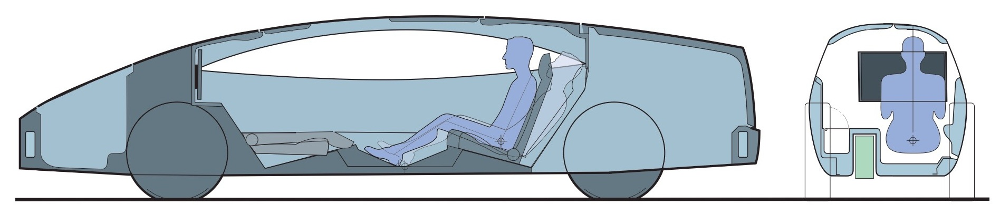

* **PICK UP MODE Cargo Only - Fully Autonomous Drive**
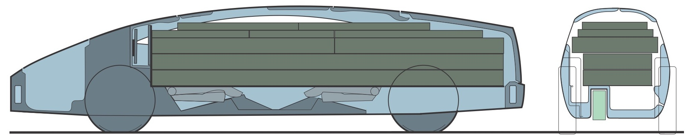